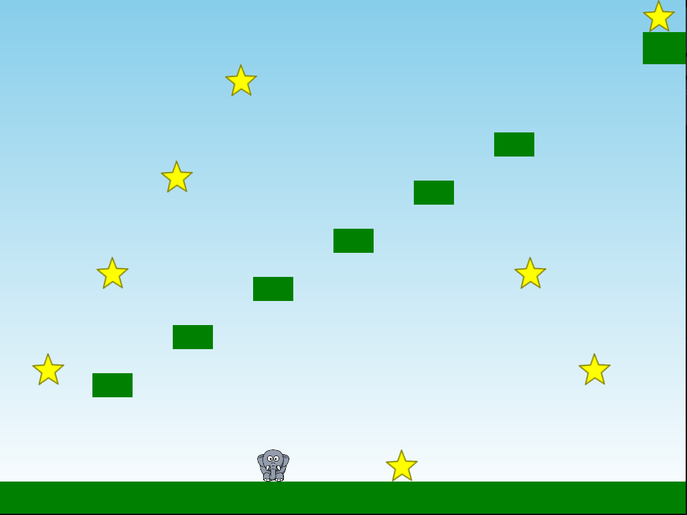

Täydennä aliohjelma LuoTaso sellaiseksi että se luo parametreinä annettuhin koordinaatteihin dokumentaation mukaisen tason.

Lisää aliohjelmaan Begin kutsuja aliohjelmaan LuoTaso siten että pääset hyppimään pelihahmolla kentän oikeassa yläreunassa näkyvään maaliin.

Ratkaisu voi olla esimerkiksi alla olevan kuvan mukainen.

**Arviointi:** Käytä *Set custom points* -toimintoa TIMissa.
Tee itsearvio pistemäärästäsi ja syötä omat pisteesi väliltä 0-1.
Jos teit tehtävän mielestäsi täysin oikein, 1 piste, puoliksi oikein 0.5 pistettä jne.

