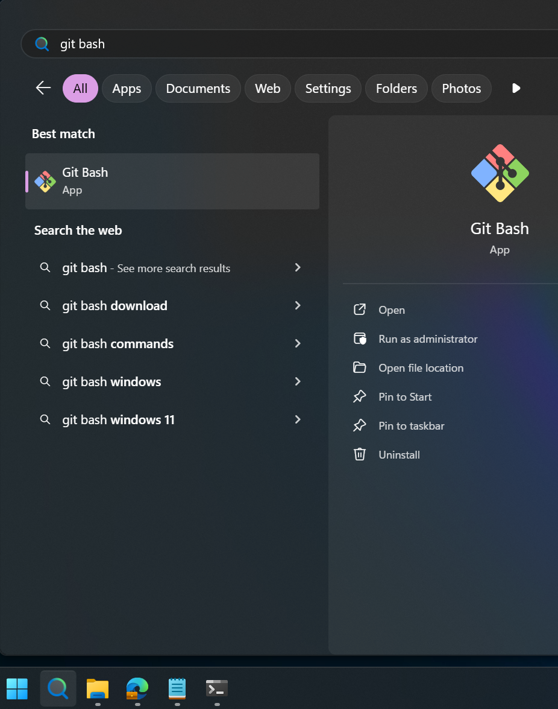
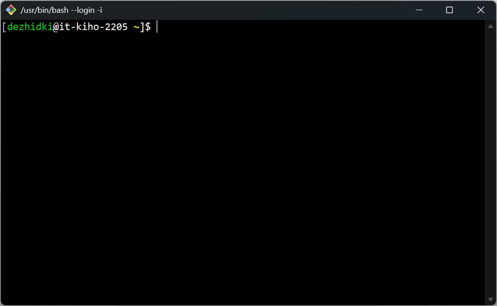
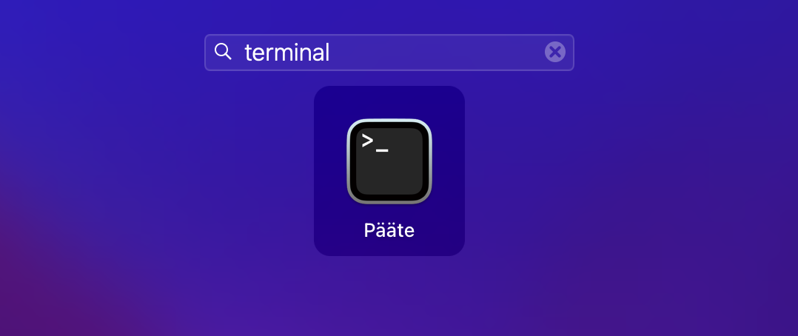
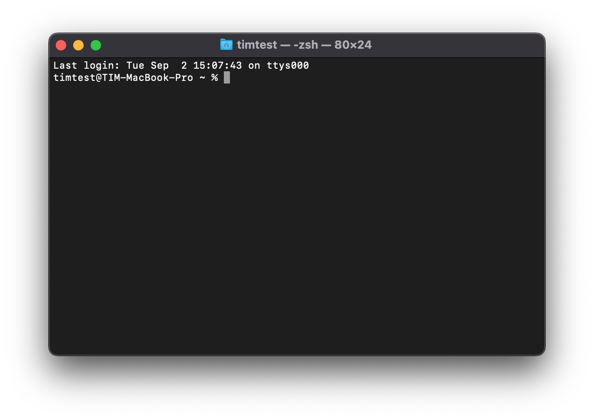
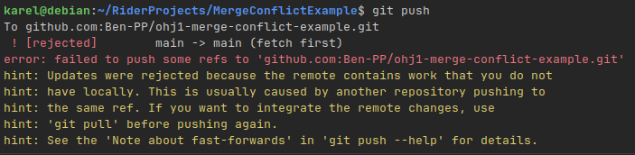
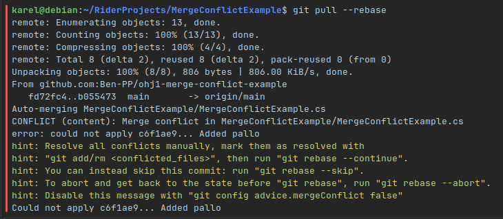
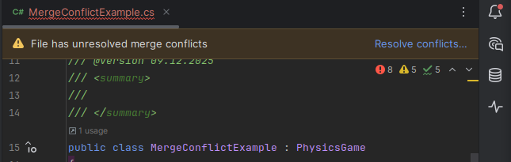
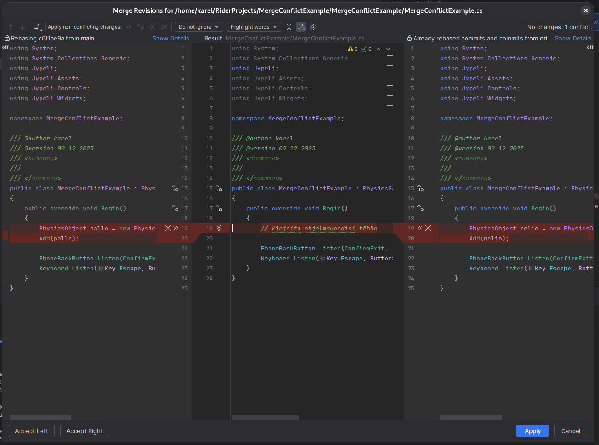
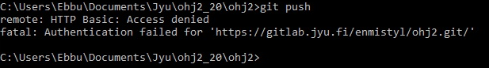
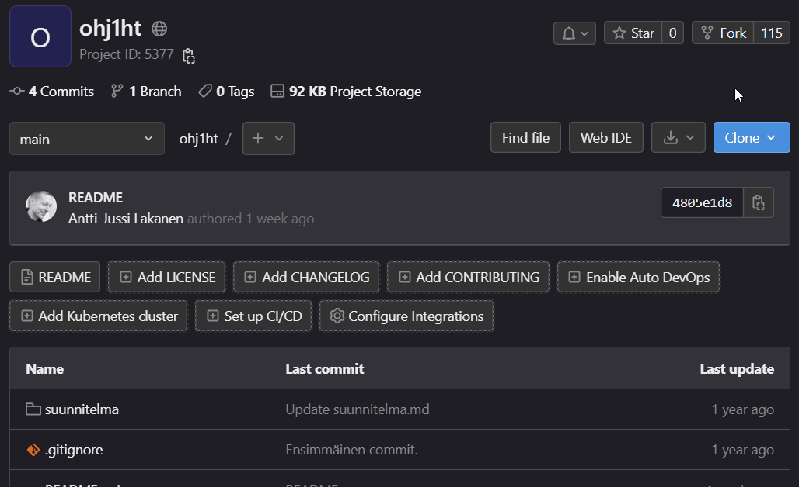

# Git-versiohallinta

*Ohjeet Ohjelmointi 1 -opintojaksolle*

Tässä dokumentissa kerrotaan miten harjoitustyön suunnitelmaa, lähdekoodia sekä
muita tiedostoja (mm. kuvat) käsitellään Git-versiohallinnan avulla Ohjelmointi
1 -opintojaksolla.

Tämä ohje koskee vain niitä opiskelijoita, jotka palauttavat harjoitustyönsä
Git-etävarastoon. Jos haluat palauttaa harjoitustyön ZIP-pakettina, voit ohittaa tämän
ohjeen. **Palauttaminen Git-muodossa on erittäin suositeltavaa niille, jotka
jatkavat seuraaville ohjelmointikursseille.**

Ohje on pitkän puoleinen, mutta on tärkeää, että luet sen huolellisesti.
Git-versiohallinnan käyttö on olennainen osa ohjelmistokehitystä, ja sen
perusteiden ymmärtäminen on tärkeää paitsi tällä opintojaksolla, myös
myöhemmissä tietojenkäsittelyn opinnoissa ja ohjelmistoalan työssä.

## Ennen kuin aloitat

Asenna [kehitystyökalut ja Git-versiohallinta](tyokalut.md), ellet ole vielä tehnyt niin.

Jos olet Jyväskylän yliopiston opiskelija, sinun tulee tietää
JY-käyttäjätunnuksesi jotta voit käyttää gitlab.jyu.fi-palvelua. Varmista,
että tiedät käyttäjätunnuksesi, ja kirjoita se muistiin ennen kuin aloitat
tämän ohjeen seuraamisen. Tässä ohjeessa viitataan toistuvasti
käyttäjätunnukseen tunnisteella `kayttajatunnus`. Korvaa tämä aina omalla
käyttäjätunnuksellasi.

## Mikä Git on

*Git* on ohjelmisto, jolla voidaan toteuttaa tiedostojen *versiohallintaa*.
Ohjelmistotyössä on erityisen tärkeää, että jokainen ohjelmistoon tehty muutos
versioidaan selkeästi. Versiohallinnan käyttäminen yhteistyöskentelyyn ja
muutosten jäljittämiseen on normi niin teollisessa ohjelmistotuotannossa,
vapaan/avoimen lähdekoodin projekteissa kuin myös monien harrastajien
henkilökohtaisissa töissä. 

Versiohallinta mahdollistaa myös saman koodin parissa työskentelyn eri
tietokoneilta, mikä sopii hyvin tälle kurssille, koska usein tehdään töitä eri
tietokoneilta (mikroluokka, kotikone jne.). 

*Git-varasto* (engl. *repository*) sisältää sekä kooditiedostot että koko
projektin muokkaushistorian. GitLab ja GitHub ovat eräitä suosittuja
internetissä toimivia palveluita, joissa Git-varastoja voidaan säilyttää. 

Tällä kurssilla emme käytä Dropboxia, muistitikkuja, sähköpostia tai vastaavia
palveluita kooditiedostojen jakamiseen, koska ne eivät sovellu todelliseen
yhteistyöskentelyyn. Vaikka työskentelisitkin yksin, käytä versiohallintaa
ohjaajien työn helpottamiseksi sekä harjoitustyön esittelyn mahdollistamiseksi. 

Voit hyödyntää versiohallintaa opinnoissa muutenkin, esimerkiksi tutkielmien
kirjoittamisessa.

## Miten saan Gitin auki

Git on komentoriviohjelma, eli sitä ei varsinaisesti avata vaan käytetään komentoriviltä. Gitille on tarjolla myös graafisia käyttöliittymiä (ks. [Luku 11. Tapoja käyttää Gitiä](#tapoja-käyttää-gitiä)), jotka käytännössä suorittavat tarvittavia komentorivikomentoja puolestasi. Ohjelmointi 1 -kurssilla harjoittelemme käyttämään Gitiä komentoriviltä nk. *bash*-komentokehotteesta. 

Valitse alta käyttöjärjestelmäsi mukainen käyttötapa.

### [Windows](#tab/windows)
 
1. [Asenna Git-työkalu](tyokalut.md#git) mikäli et ole vielä tehnyt niin.
2. Paina *Käynnistä*-painikkeen vieressä olevaa *Haku-ikonia*
3. Kirjoita hakupalkkiin *git bash*
4. Valitse löytyvistä tuloksista *Git Bash*

<animation scenes="images/git-ht-ohje/scenes.js" scene="avaa-windows">



Tuloksena pitäisi avautua seuraava bash-komentorivipääte:



</animation>

Voit testata, että Git-työkalu löytyy suorittamalla komento

```bash
git --version
```

Jos komento palauttaa versionumeron, niin git on asennettu oikein.

> [!VAROITUS]
>
> Git Bash -tulkissa liittäminen **ei toimi** tavallisella <kbd>Ctrl</kbd> + <kbd>V</kbd> tai <kbd>Cmd</kbd> + <kbd>V</kbd>-näppäinyhdistelmällä!
> Sen sijaan käytössä on seuraavat pikanäppäimet:
> - Liitä kopioitu teksti bashiin: <kbd>Shift</kbd> + <kbd>Insert</kbd> 
> - Kopioi valittu teksti bashista: <kbd>Ctrl</kbd> + <kbd>Insert</kbd> (<kbd>Cmd</kbd> + <kbd>Insert</kbd> macOS:ssa)
> 
> Vaihtoehtoisesti voit oikeaklikata päätteen kursorista ja valita *Paste* tai *Copy*.

***

### [macOS](#tab/macos)

 1. [Asenna Git-työkalu](tyokalut.md#git) mikäli et ole vielä tehnyt niin
 2. Avaa *Launchpad*
 3. Kirjoita ylhäällä olevaan hakupalkkiin *Pääte* (tai *Terminal* jos käyttöjärjestelmän kieli on englanti)
 4. Avaa hakutuloksena löytyvä *Pääte* tai *Terminal*-sovellus



Tuloksena pitäisi avautua seuraava pääteikkuna:



Voit testata, että Git-työkalu löytyy suorittamalla komento

```bash
git --version
```

Jos komento palauttaa versionumeron, niin git on asennettu oikein.

***

### [Linux](#tab/linux)

 1. [Asenna Git-työkalu](tyokalut.md#git) mikäli et ole vielä tehnyt niin
 2. Käytä jakelun omaa päätettä. Pääte yleensä löytyy sanalla *Terminal* tai *Terminal Emulator*. Tämä usein avaa bash-päätteen, joka on sopiva tämän ohjeen kannalta.

Voit testata, että `git`-työkalu löytyy suorittamalla komento

```bash
git --version
```

Jos komento palauttaa versionumeron, niin git on asennettu oikein.

***

### [Valitse](#tab/default)

Valitse käyttöjärjestelmäsi yllä olevista vaihtoehdoista.

***

## Muistilista 

Alla on lyhyt muistilista tyypillisimmistä tällä kurssilla vastaan tulevista tilanteista gitin kanssa. Lue kuitenkin **ensin** tarkemmat kuvaukset tämän dokumentin seuraavista luvuista.

| Tavoite                                                                           | Toimenpide                                                                                                               | Komento                                                                | Linkki ohjeeseen                                                     |
| --------------------------------------------------------------------------------- | ------------------------------------------------------------------------------------------------------------------------ | ---------------------------------------------------------------------- | -------------------------------------------------------------------- |
| Aloitan harjoitustyön                                                             | Teen **fork**-toiminnolla gitlab.jyu.fi-palvelussa uuden etävaraston.                                                    |                                                                        | [Hyppää ohjeeseen](#fork)                                            |
| Menen koneelle, jossa sisältöä ei vielä ole                                       | Haen GitLabista etävarastoni HTTPS-osoitteen ja kloonaan etävaraston omalle koneelle. Huomaa piste komennon päätteeeksi. | `git clone [etävaraston osoite] .`                                     | [Hyppää ohjeeseen](#clone)                                           |
| Menen koneelle jossa sisältö jo on                                                | Päivitän etävaraston version koneelle.                                                                                   | `git pull`                                                             | [Hyppää ohjeeseen](#pull)                                            |
| Muutan tai lisään tiedostoja (esimerkiksi suunnitelmakuva `suunnitelma`-kansioon) | (1) Lisään muuttuneet ja uudet tiedostot *stage*-tilaan, **ja** (2) siirrän *stage*-tilan tiedon lokaaliin varastoon     | `git add --all`<br /><br />`git commit -m "Muutoksia kuvaava viesti."` | [Hyppää ohjeeseen](#add-commit)                                      |
| Lähetän muutokset etävarastoon                                                    | Luon tarvittaessa pääsytunnuksen GitLabiin. Sitten lähetän paikallisen varaston muutokset etävarastoon.                  | `git push`                                                             | [Hyppää ohjeeseen (token)](#token), [Hyppää ohjeeseen (push)](#push) |

Nämä samat ohjeet pätevät myös ryhmätyössä, mutta silloin kannattaa kiinnittää erityistä huomiota siihen, että tekee `pull`, `commit`- ja `push`-toimintoja riittävän usein konfliktien välttämiseksi. 

`git status`-komentoa voi viljellä missä tahansa välissä. Se kertoo paikallisen varaston tilasta, muun muassa mitä tiedostoja on muutettu, poistettu tai lisätty.


> [!HUOMAUTUS]
> 
> Harjoitustyön pohjan viemisestä versiohallintaan 
> on myös [vaiheittainen kuvitettu ohje](git-ht-ohje.md). Voit seurata joko tätä tekstipohjaista ohjetta tai
> kuvitettua ohjetta. Molempia ei tarvitse lukea.

## Oman etävaraston luominen GitLab-palveluun {#fork}

Tässä vaiheessa luodaan henkilökohtainen etävarasto (engl. *remote repository*) [gitlab.jyu.fi](https://gitlab.jyu.fi)-palveluun. Etävarastosta käytetään jatkossa nimitystä `origin`. Kunkin opiskelijan (tai ryhmätyön) etävarasto perustuu valmiiseen pohjaan, josta tehdään kopiohaara, eli GitLab-terminologiassa *fork*. Forkkauksen ansiosta saadaan uuteen Git-varastoosi kurssin alkuasetukset.

**Tämä vaihe tehdään kurssilla <u>yhden kerran</u>.** 

 1. (a) Jos sinulla on JY-tunnukset: Kirjaudu gitlab.jyu-palveluun (<https://gitlab.jyu.fi/>) JY-tunnuksilla. 
    (b) Jos sinulla ei ole JY-tunnuksia: Tee tunnukset GitHub-palveluun (<https://github.com>), ja kirjaudu sisään.
 2. (a) JY: Avaa Ohj1-kurssin pohjaprojekti selaimessa:
   <https://gitlab.jyu.fi/tie/ohj1/ohj1ht>
    (b) Ei-JY: Avaa Ohj1-kurssin pohjaprojekti selaimessa:
   <https://github.com/ITKP102-Ohjelmointi-1/ohj1ht.git>
 3. (a) JY: Valitse oikeasta ylänurkasta `fork`
    (b) Ei-JY: Vastaavasti.
 4. Valitse omaa tunnustasi vastaava `namespace` (ryhmä).
 5. Valitse näkyvyydeksi `public`. 
 6. Tarkista, että `Project slug` kohdassa lukee `ohj1ht`. Jos muutat tätä, niin tämän ohjeen myöhemmät kohdat eivät toimi oikein. 

Projektisi etävaraston URL-osoite on nyt (jos sinulla on JY-tunnukset):

```
https://gitlab.jyu.fi/käyttäjätunnus/ohj1ht.git
```

tai (jos sinulla ei ole JY-tunnuksia):

```
https://github.com/käyttäjänimi/ohj1ht.git
``` 

Tallenna URL-osoite [TIMiin Harjoitustyö -sivulle](https://tim.jyu.fi/view/kurssit/tie/itkp102/eteneminen#harjoitusty%C3%B6).

Näet jatkossa oman etävarastosi URL-osoitteen gitlab.jyu.fi-palvelussa kohdasta Clone <i class="bi bi-chevron-right"></i> Clone with HTTPS. Käytä oman etävarastosi URL-osoitetta tulevissa ohjeissa.

<details closed><summary><i class="bi bi-stars jyu-gold"></i> Valinnaista lisätietoa: Mikä fork on?</summary>

*Tämä teksti kannattaa lukea, kun ymmärrät, mitä commit, push ja pull tarkoittavat.*

Fork on itsenäinen kopio olemassa olevasta git-varastosta. Fork säilyttää aikaisemman historian (commitit), ja jatkaa omaa elämäänsä irrallaan alkuperäisestä projektista. Tähän kopioon (fork-projektiin) tehtävät commitit eivät mene alkuperäiseen projektiin, eivätkä alkuperäisen projektin commitit tule kopioon. 

Käytännön elämässä fork-projekti tehdään usein tilanteessa, kun kehittäjä haluaa syystä tai toisesta erottaa oman työnsä alkuperäisen projektin työstä. Kehittäjä voi esimerkiksi olla pettynyt projektin suuntaan ja haluaa jatkaa itsenäisesti eteenpäin. Yksi esimerkki tästä ovat striimausohjelmistot OBS Studio ja Streamlabs Desktop: [OBS Studio](https://github.com/obsproject/obs-studio) on maksuton, vapaan lähdekoodin (Gnu GPL v2) projekti. Streamlabs forkkasi OBS-projektin vuonna 2014, ja on siitä eteenpäin tuonut omaan forkkiinsa yhä enemmän kaupallisia ominaisuuksia, kun taas OBS jatkaa edelleen ilmaisohjelmiston periaatteella. 

Tällä kurssilla forkkaaminen mahdollistaa opiskelijalle helpon tavan perustaa oma Git-repo GitLabiin, ja toisaalta forkin ansiosta opettaja voi samalla jakaa opiskelijoille projektin pohjakoodit (suunnitelmien pohjat jne.) valmiiksi. 

Älä sotke fork-termiä branch-termiin. Brancheja käytetään Gitissä aivan eri tarkoitukseen, vaikka myös branch usein suomennetaan *haaraksi*.

Fork-projektista on viite alkuperäiseen projektiin, siis siihen, josta fork otettiin, 
jotta alkuperäisestä projektista käsin voidaan seurata mitä haaroja siitä on tehty.

Lisätietoa kiinnostuneille: <https://help.github.com/en/github/getting-started-with-github/fork-a-repo>

</details>

## Oikeuksien antaminen muille ryhmäläisille

*Jos teet harjoitustyön yksin, voit ohittaa tämän kohdan.*

Forkin tekijä antaa oikeudet muille ryhmäläisille. Tämä tapahtuu projektin vasemman reunan kohdasta *Members*. Syötä kohtaan *GitLab member or Email address* ryhmän jäsenet yksi kerrallaan. Huom! Kaikkien jäsenten tulee olla tätä ennen olla kirjautunut gitlab.jyu.fi-palveluun vähintään kerran.

Kaikki ryhmäläiset käyttävät samaa etävaraston osoitetta. Tämä on otettava huomioon alempana olevissa ohjeissa, joissa tällöin näkyy "väärän" henkilön tunnus.

## Omien tietojen (nimi, sähköposti) asettaminen {#gitconfig}

**Tämä vaihe tehdään yhden kerran <u>jokaisella</u> tietokoneella jolla harjoitustyötä työstetään.** 

Versiohallinta liittää jokaiseen muutokseen tiedot muutoksen tekijän nimestä ja sähköpostiosoitteesta. Tästä syystä Git-ohjelmalle täytyy antaa nimi ja sähköposti. Aseta omat tietosi Git-asiakasohjelmaan seuraavasti.

Mene komentoriville ([miten avaan komentorivin?](#miten-saan-gitin-auki)) ja aseta tietosi antamalla alla olevat komennot:

(Korvaa lainausmerkkien sisällä olevat tiedot omilla tiedoillasi. Lainausmerkit tulee pitää mukana komennossa.)

```bash 
git config --global user.name "Olli Opiskelija"
git config --global user.email "olli.o.opiskelija@student.jyu.fi"
```

Jos ei tulostu virheviestiä, niin komennot ovat onnistuneet.

Lisätietoa kiinnostuneille: [git config](https://git-scm.com/book/en/v2/Getting-Started-First-Time-Git-Setup)

## Etävaraston hakeminen omalle tietokoneelle (clone) {#clone}

**Tämä vaihe tehdään yhden kerran <u>jokaisella</u> tietokoneella jolla harjoitustyötä työstetään.** 

Seuraavaksi haetaan etävarasto omalle paikalliselle tietokoneelle. Tästä käytetään termiä *kloonaaminen* (engl. *clone*). Kloonattuun paikalliseen tietovarastoon tehdyt muutokset voi aikanaan lähettää takaisin etävarastoon; tästä kerrotaan lisää [myöhemmässä kohdassa](#push). 

Kloonaus tehdään **tyhjään** hakemistoon.

<details closed><summary>Entä jos hakemisto ei ole tyhjä?</summary>

Mikäli haluat kloonata ei-tyhjään hakemistoon, on tähän ohjeet [Gitin keskustelupalstalla](https://gist.github.com/davisford/5039064),
mutta melkein helpompi on tässä vaiheessa:

 - nimeä olemassa oleva hakemisto uudelleen
 - tee uusi työhakemisto
 - tee sinne clone
 - siirrä sisältö vanhasta hakemistosta
 - poista vanha hakemisto
 - jatka kuten muuten kloonin jälkeen

</details>

**Valitse** alta käyttöjärjestelmästi mukainen käyttötapa.

### [Windows](#tab/windows)

1. Avaa `git bash`, Pääte, tai `cmd`-komentorivi. Suosittelemme git bashia. 
1. Tee uusi hakemisto, jonka haluat menevän versionhallintaan, ts. jossa
   harjoitustyösi tulee sijaitsemaan. Kansion nimi voisi olla esimerkiksi
   `C:\Users\MunKayttaja\ohj1\ht`. Alla on esimerkki uuden kansion
   luontikomennosta. Vaihda `MunKayttaja`-sanan kohdalle todellinen
   kotihakemistosi nimi omassa käyttöjärjestelmässäsi. Se ei ole sama kuin
   JY-käyttäjänimesi. Jos et tiedä mikä kotihakemistosi nimi on, kirjoita
   avattuasi git bash aivan ensimmäiseksi komento `pwd`, joka tulostaa koko
   kotihakemistosi polun. Sitten kirjoita: 
   
        mkdir /c/Users/MunKayttaja/ohj1/ht

1. Siirry tekemääsi kansioon `cd`-komentoja käyttämällä esimerkiksi seuraavasti:

        cd /c/Users/MunKayttaja/ohj1/ht

    Voit halutessasi vaihtaa `ht`-sanan paikalle valitsemasi sanan
    `harjoitustyo´ tai pelin nimen. Kansion nimen voi vaihtaa myöhemminkin.
    Kyseinen kansio toimii nyt projektin juurikansiona. Jatkossa kaikki komennot
    annetaan tässä kansiossa. Paina tarkasti mieleen kansion sijainti, sillä
    tulet tarvitsemaan sitä useita kertoja harkkatyötä tehdessä! 

 2. Anna komentoriviltä tässä kansiossa komento. Huomaa välilyönti ja piste lopussa, nekin on annettava.

        git clone https://gitlab.jyu.fi/käyttäjätunnus/ohj1ht.git .

 3. Antamalla komennon 

        ls -la

    näet, että hakemistoon haettiin pohjaprojektin tiedostot `.gitignore`, `README.md` sekä kansio `suunnitelma`. 

     - `.gitignore`-tiedosto sisältää tiedot sellaisista tiedostoista, joita ei 
    oletusarvoisesti viedä versionhallintaan. 
    Näitä ovat muun muassa erilaiset väliaikaistiedostot sekä 
    käännetyt tiedostot. 
     - `README.md` sisältää projektin kuvauksen Markdown-formaatissa. 
     - `suunnitelma`-kansioon laitetaan pelin suunnitelmakuva (tai -kuvat).

*** 

### [macOS ja Linux](#tab/macos)

1. Avaa komentorivi, Pääte tai Terminal.
1. Tee uusi hakemisto, jonka haluat menevän versionhallintaan, ts. jossa
   harjoitustyösi tulee sijaitsemaan. Järkevintä lienee tehdä hakemisto
   kotihakemiston alle. Alla on esimerkki uuden kansion luontikomennosta. Vaihda
   `MunKayttaja`-sanan kohdalle todellinen kotihakemistosi nimi omassa
   käyttöjärjestelmässäsi. Se ei ole sama kuin JY-käyttäjänimesi. Jos et tiedä
   mikä kotihakemistosi nimi on, kirjoita avattuasi Pääte aivan ensimmäiseksi
   komento `pwd`, joka tulostaa koko kotihakemistosi polun. Sitten kirjoita:

        mkdir /Users/MunKayttaja/ohj1/ht

1. Siirry tekemääsi kansioon `cd`-komentoja käyttämällä esimerkiksi seuraavasti:

        cd /Users/MunKayttaja/ohj1/ht

    Voit halutessasi vaihtaa `ht`-sanan paikalle valitsemasi pelin nimen. Hakemiston
    nimen voi vaihtaa myöhemminkin.

    Kyseinen kansio toimii nyt projektin juurikansiona. 
    Jatkossa kaikki komennot annetaan tässä kansiossa. Paina tarkasti mieleen 
    kansion sijainti, sillä tulet tarvitsemaan sitä useita kertoja harkkatyötä tehdessä! 

1. Anna komentoriviltä tässä kansiossa komento. Huomaa välilyönti ja piste lopussa, nekin on annettava.

       git clone https://gitlab.jyu.fi/käyttäjätunnus/ohj1ht.git .

1. Tarkista `ls -la`-komentoa käyttämällä
että hakemistoon tuli tiedostot `.gitignore`, `README.md` sekä kansio `suunnitelma`. 

  - `.gitignore`-tiedosto sisältää tiedot sellaisista tiedostoista, joita ei 
    oletusarvoisesti viedä versionhallintaan. 
    Näitä ovat muun muassa erilaiset väliaikaistiedostot sekä 
    käännetyt tiedostot. 
  - `README.md` sisältää projektin kuvauksen Markdown-formaatissa. 
  - `suunnitelma`-kansioon laitetaan pelin suunnitelmakuva (tai -kuvat).


***

### [Valitse](#tab/default)

Valitse käyttöjärjestelmäsi yllä olevista vaihtoehdoista.

***

Lisätietoa: 
Git-ohje: [clone](https://www.git-tower.com/learn/git/commands/git-clone), 
reference: [clone](https://git-scm.com/docs/git-clone)

## Tiedostojen vieminen paikalliseen tietovarastoon (add, commit) {#add-commit}

Kun tiedostoja lisätään, muokataan tai poistetaan, tulee kaikki nämä muutokset lisätä paikalliseen tietovarastoon.

**Tämä vaihe tehdään <u>joka kerta kun olet tehnyt muutoksia</u> koodiin tai muihin tiedostoihin.**

Esimerkki: Suunnitelman kuvan tallentaminen. Tallenna harjoitustyösi suunnitelman sekä luonnoskuvan `suunnitelma`-kansioon. Ole tarkkana, että kuva menee oikeasti juuri tuohon kansioon. Sekä suunnitelmatekstiä varten että kuvaa varten on olemassa esimerkit `suunnitelma`-kansiossa. 

Kuvan pikselikoon tulee olla enintään 1920 x 1080 pikseliä. Kuvan tiedostokoon
tulee mielellään olla enintään 1 megatavu. 

Avaa Pääte (macOS), Git Bash (Windows) tai muu komentorivi, siirry `cd`-komentoja käyttämällä harkkatyökansioosi ja anna seuraavat kaksi komentoa:

    git add --all 
    git commit -m "kuvaava viesti miksi muutokset on tehty"
    
Ensimmäinen komento lisää kaikki muokatut tiedostot ns. index/stage-alueelle,
ja seuraava komento tekee varsinaisen tietovarastoon tallentamisen.

**On tärkeää**, että aina `add`-komennon jälkeen tarkistat `git status`-komennolla mitä tiedostoja 
tietovarastoon on menossa. Älä lähetä tietovarastoihin suuria tiedostoja.

Mikäli et halua lähettää tietovarastoon kaikkia muutoksia, vaan esimerkiksi
vain yhden tiedoston, laita `--all`-option tilalle haluamasi tiedoston nimi:

    git add TIEDOSTONNIMI   (hakemistoineen, /-viiva hakemistomerkkinä)

Jotkut pitävät parempana luetella kukin lisättävä tiedosto erikseen edellä mainitulla komennolla. Kummassakin tavassa (`all`-vipu, tai kukin tiedosto erikseen) on puolensa.

Huomaa, että `.gitignore`-tiedosto sisältää tiedot sellaisista tiedostoista, joita ei lähtökohtaisesti viedä versiohallintaan. Jos kuitenkin ehdottomasti haluat lisätä tällaisen, esimerkiksi `.jar`-päätteisen tiedoston, niin silloin on käytettävä `-f` -optiota, jolla pakotetaan lisäys. Esimerkiksi:

    git add -f kerho.jar

Toinen vaihtoehto on erikseen sallia vastava `jar` lisäämällä `.gitignore`-tiedostoon
rivin `.jar` perään rivi:

    !kerho.jar

## Pääsytunnuksen (token) luominen GitLabiin {#token}

GitLabin etävarastoon ei voi lähettää muutoksia ilman tunnistautumista. Jotta
GitLab tietää, kuka olet, luodaan *pääsytunnus* (engl. *personal access token*),
jonka annat ensimmäisellä pushilla (seuraava vaihe) salasanan sijaan. GitLabiin
ei voi enää lähettää muutoksia salasanaa käyttäen. 

**Tämä vaihe tehdään <u>jokaisella</u> tietokoneella ennen ensimmäistä pushia.**

 1. Kirjaudu gitlab.jyu.fi-palveluun ja valitse oikeasta yläkulmasta oman
    kuvakkeesi alta **Preferences**.
 2. Valitse vasemmasta valikosta **Access › Personal access tokens**.
 3. Avaa **Generate token** -valikko ja valitse **Legacy token**.
 4. Anna tunnukselle nimi, josta tunnistat koneen, esimerkiksi `ohj1-kotikone`.
 5. Vaihda **Expiration date** -kohtaan päivä noin vuoden päähän. Oletuksena
    tunnus vanhenee jo kuukauden kuluttua.
 6. Valitse oikeuksista (**Select scopes**) **read_repository** ja
    **write_repository**.
 7. Vieritä lomakkeen loppuun ja paina **Generate token**.
 8. Kopioi tunnus leikepöydälle kentän vieressä olevalla kopiointipainikkeella.
    GitLab näyttää tunnuksen vain tämän kerran, joten pidä sivu auki, kunnes
    push on onnistunut. Et voi kopioida tunnusta myöhemmin, vaan joudut
    luomaan uuden.

Tunnusta ei tarvitse tallentaa minnekään: Windowsissa ja macOS:ssä Git muistaa
sen tällä koneella ensimmäisen pushin jälkeen. Jos hävität tunnuksen, taikka
teet harjoitustyötä myös toisella koneella, luot uuden tunnuksen samalla
tavalla kuin yllä. Jos kone katoaa, poista sen tunnus GitLabin tunnuslistasta
(**Revoke**); muiden koneiden tunnukset toimivat edelleen.

> [!VAROITUS]
> Pääsytunnus on kuin salasana. Älä kirjoita sitä tekstitiedostoon,
> suunnitelmaan, koodiin tai viestiin.

## Tehtyjen muutosten lähettäminen etävarastoon (push) {#push}

Tässä vaiheessa paikalliseen tietovarastoon lähetetyt muutokset 
lähetetään etävarastoon.

**Tämä vaihe tehdään <u>joka kerta kun olet tehnyt muutoksia</u> koodiin tai muihin tiedostoihin.** Älä unohda tehdä tätä työskentelyn päätteeksi. Muutoin tiedot jäävät vain paikalliseen tietovarastoon.

Avaa Pääte (macOS), Git Bash (Windows) tai muu komentorivi. Siirry harjoitustyökansioosi cd-komentoja käyttämällä ja anna sitten komento

    git push

Ensimmäisellä kerralla Git kysyy käyttäjätunnustasi ja
[pääsytunnusta](#token). Anna käyttäjätunnus **lyhyessä muodossa**
`käyttäjätunnus` ilman @-merkkiä ja loppuosaa.

- **Windows**: Git Credential Manager avaa kirjautumisikkunan. Valitse
  **Token** ja kirjoita käyttäjätunnuksesi. Pääsytunnusta ei kirjoiteta vaan
  liitetään: napsauta **Personal access token** -kenttää hiiren oikealla
  painikkeella ja valitse **Paste** (tai paina <kbd>Ctrl</kbd> + <kbd>V</kbd>).
  Kenttään tulee pelkkiä pisteitä. Windows muistaa tunnuksen, eikä sitä kysytä
  uudelleen.
- **macOS**: kirjautumisikkunaa ei ole, eikä tunnuksen ja salasanan välillä
  valita. Pääte kysyy ensin `Username`, johon kirjoitat käyttäjätunnuksesi, ja
  sitten `Password`, johon liität pääsytunnuksen (<kbd>Cmd</kbd> +
  <kbd>V</kbd> ja <kbd>Enter</kbd>). Liitetty tunnus ei näy ruudulla. macOS
  tallentaa sen avainnippuun, eikä sitä kysytä uudelleen.
- **Linux**: kuten macOS:ssä, mutta Git kysyy tunnukset jokaisella pushilla,
  ellei tunnusten tallennusta ole otettu käyttöön.

Mikäli annat tunnukset väärin, joudut muokkaamaan kirjautumistietojasi, ks.
[Push ei onnistu (remote: HTTP Basic: Access denied)](#credentials). Sama
virhe tulee, kun pääsytunnus vanhenee vuoden päästä. Luo silloin uusi tunnus ja
vaihda se vanhan tilalle.

Tarkista tämän jälkeen Gitlab-osoitteestasi, että sieltä löytyy lähettämäsi
tiedostot (alkukurssista ne kuvat).

## Muutosten hakeminen etävarastosta paikalliseen varastoon (pull) {#pull}

Kun sinä tai joku muu on muuttanut tiedostoja ja vienyt muutoksia etävarastoon, niin muutokset tulee hakea omalle koneelle. Yhteistyöskentelyssä on syytä aina työskentelyä aloittaessa antaa `pull`-komento.

Siirry hakemistoon, johon olet kloonannut projektin (ks. [clone](#clone))
ja anna komento: 

    git pull

Tässä kohti voi tulla kysymys siitä, että miten käyttäjä haluaa pull-komennon jatkossa
toimivan. Ohj1-kurssin osalta toimiva vaihtoehto on

    git config pull.rebase false

Lue tästä lisää esimerkiksi [StackOverflowsta](https://stackoverflow.com/questions/62653114/how-to-deal-with-this-git-warning-pulling-without-specifying-how-to-reconcile/62653400#62653400).

## Git ja ryhmätyöskentely

Kun työskennellään ryhmässä esimerkiksi jos teet harjoitustyön parityönä, tulee eräisiin Git-toimintoihin kiinnittää erityistä huomiota, jotta välttyy turhalta työltä. Kun useampi työstää samaa tiedostoa, tulee helposti tilanne, jossa on tehty eri muokkauksia samoille riveille. Tällöin Git ei tiedä mitä tehdä ja konfliktit täytyy ratkaista käsin. Tälläistä tilannetta kutsutaan nimellä *merge conflict* ja se ilmaantuu, kun omia muutoksia yrittää puskea tai kun muutoksia koitetaan hakea omalle koneelle.

Alla on esitetty tärkeimmät tavat, joilla vältytään ongelmilta, kun työstetään samaa haaraa ryhmänä.

- Kommunikoikaa selkeästi mitä työstätte ja milloin.
- **Aina** ennen kuin aloittaa koodaamisen, haetaan muutokset etävarastosta `--rebase` lipulla, jonka ansiosta omat muutokset asetetaan paikalliseen varastoon vasta etävarastosta haettujen muutosten jälkeen. 
  ```bash
  git pull --rebase
  ```
- Kun viette (*push*) muutoksia etävarastoon, ilmoittakaa siitä muulle ryhmälle.

<details closed>
<summary>Esimerkki merge conflict -tilanteesta</summary>

Vaikka noudattettaisiin hyviä käytänteitä, niin välillä merge conflict tulee vastaan silti. Tätä ei kuitenkaan kannata pelätä ja se saadaan ratkaistua esimerkiksi Riderissa. Tässä skenaariossa kaksi kehittäjää muokkaa samaa tiedostoa ja molemmat ovat haarassa `main`.

**Kehittäjä A** puskee etävarastoon seuraavan koodin:
```csharp
public override void Begin()
{
    PhysicsObject nelio = new PhysicsObject(100, 100, Shape.Rectangle);
    Add(nelio);
}
```
Tämän jälkeen **Kehittäjä B** luo oman kommitin ja yrittää puskea (*push*) oman koodinsa, jossa luodaan pallo, etävarastoon:
```csharp
public override void Begin()
{
    PhysicsObject pallo = new PhysicsObject(50, 50, Shape.Circle);
    Add(pallo);
}
```
Tämä pusku ei onnistu, sillä **Kehittäjä A** on puskenut oman muutoksensa etävarastoon ja **Kehittäjä B** ei ole hakenut näitä muutoksia itselleen lokaaliin varastoon. Komento `git push` johtaa tämän näköiseen tulosteeseen.


**Kehittäjä B** hakee muutokset itselleen komennolla `git pull --rebase`. Tämä komento epäonnistuu kuvassa näkyvällä tulosteella.


Jos tämä komento ajettiin Riderin terminaalissa, niin Rider näyttää ylälaidassa varoituksen merge conflictista. Tästä ilmoituksesta voi klikata *Resolve conflicts...* nappia, jolloin avautuu Riderin näkymä konfliktien ratkomiseen.


#### Konfliktin ratkaiseminen editorissa

Riderin *Merge conflict editor* näkymä näkyy alla olevassa kuvassa. Editorissa on kolme ikkunaa. Vasemmalla puolella on **Kehittäjän B** lokaalit muutokset, eli hänen, joka yritti hakea muutoksia etävarastosta. Oikealla puolella taas näkyy etävarastosta haettu tiedosto. Keskimmäinen ikkuna taas näyttää lopputuloksen.


Nyt **Kehittäjän B** tulee päättää, säilytetäänkö lokaalit muutokset vai etävarastosta haetut muutokset. Tämä tapahtuu painamalla muutoksen eli punaisella näkyvän alueen kohdalla ikkunoiden välissä näkyvää nuoli symbolia joko vasemmalta(lokaali) tai oikealta(etävarasto) puolelta. Tämän jälkeen valittu muutos siirtyy keskimmäiseen ikkunaan. Kun kaikki konfliktit on ratkaistu tällä tavoin ja lopputulos(keskimmäinen ikkuna) näyttää oikealta, voidaan painaa alakulmasta *Apply* nappia ja sitten *Apply Changes and Mark Resolved*.

Tehdään tämä vielä muille mahdollisille tiedostoille, joissa on konflikteja. Lopuksi kun yhtään konfliktiä ei ole enää jälellä, painetaan Riderin yläreunasta vihreää nuolikuvaketta *Continue Rebase*. Tämän jälkeen *Merge conflict* on ratkaistu ja **Kehittäjä B** voi jatkaa työskentelyä normaalisti.
</details>

## Huomioitavaa 

### Tiedostojen koko 

Versionhallintajärjestelmä ei sovi suurten tiedostojen tallennukseen. Älä lähetä versiohallintaan esimerkiksi suuria kuva-, musiikki- tai videotiedostoja. Myöskään `bin`, `obj` ja vastaavat kansiot (sis. käännetyt ohjelmat ja muut IDE:n tuottamat käännöksen oheistiedostot) eivät kuulu versiohallintaan. Täydennä tarvittaessa `.gitignore`-tiedostoa.

### Älä laita salaisuuksia versiohallintaan

Älä lisää projektisi commiteihin mitään salaista, kuten salasanoja tai henkilötietoja.
Vaikka poistaisit tiedon seuraavassa commitissa, se jää Gitin projekti-historiaan, 
ja on löydettävissä julkaisun jälkeen. Mikäli kuitenkin lähetit etävarastoon
jotain, jonka haluat poistaa myöhemmin, se onnistuu esimerkiksi [BFG Repo-Cleaner-työkalun avulla](https://rtyley.github.io/bfg-repo-cleaner/).

## Tapoja käyttää Gitiä

Aluksi ehdottomasti suositeltavin tapa on käyttää Gitiä komentoriviltä. On olemassa kuitenkin myös graafisia ympäristöjä Gitin käyttämiseen. Myös IDEissä on nykyään varsin asialliset Git-asiakasohjelmistot (eli käyttöliittymä Git-komentojen käyttämistä varten), joskin jokainen on aina vähän omanlaisensa ja vaatii totuttelua. Kaikkia alla mainittuja työkaluja voit kuitenkin käyttää ristiin. Kannattaa kokeilla eri tapoja. Mikroluokista löytyy ainakin komentorivityökalut, Eclipse sekä TortoiseGit.

## Git termejä 

- **repository**, suom. säilytyspaikka, tietovarasto tai arkisesti "repo" = Paikka jossa versioitava tieto tallennetaan, 
   voi olla paikallinen (`local`) tai etä (`remote`). Periaatteessa samasta projektista voi olla samasta projektista useita säilytyspaikkoja niin paikallisesti kuin etänä.
  `local repository` on käytännössä hakemistossa oleva `.git`-hakemisto.
  Repository koostuu loogisesti commiteista, jotka muodostavat kokoelman projektin
  eri vaiheista.  Näin mihin tahansa commitoituun kohtaan
  voidaan viitata tai tarvittaessa myös palata.
- **fork** = projektista tehty "kopiohaara", joka elää omaa elämäänsä irrallaan alkuperäisestä projektista. Fork ei
           ole Gitin toiminto, mutta useat ulkoiset Git-palvelimet (kuten GitHub ja GitLab) tarjoavat
           tämän toiminnon.
- **origin**  = lyhenne käytettävän etävaraston osoitteelle (`remote repository`). Jos etäsäilytyspaikkoja on useita, tulee näitäkin useita. 
- **project** = jokin selkeä projekti, joka tähtää esimerkiksi jonkin yhden ohjelmatuotteen tekemiseen
- **working directory** (tai **workspace**) = työhakemisto, 
   lokaali työhakemisto (kaikki tiedostot ja versiot löytyvät tämän alla olevasta .git -hakemistosta, jos ne on koneelle haettu (fetch))
- **index** = varastoon seuraavalla commitilla siirrettävien tiedostojen luettelo 
              (versioitavien, *staging area* joissakin lähteissä, koska tiedosto laitetaan "näytille").
              Käytännössä tiedosto `.git/index`.
- **main** = projektin päähaaran oletusnimi, joka pyritään pitämään toimivana koodina. Aikaisemmin päähaaran oletusnimi oli `master`.


Vaativampaan käyttöön ja viimeistään Ohjelmointi 2 -kurssilla tarvittavia termejä:

- `branch` = kehityshaara jossa kehitetään uutta koodia.  Kehityshaaroja voi olla useita. Kun koodi on hyväksi todettu,
             se voidaan yhdistää (`merge`) päähaaraan.
- `tag` = jäädytetty haara (esimerkiksi ohjelman tietty versio), jota ei aktiivisesti kehitetä, mutta johon voi tulla esimerkiksi
         tietoturvapäivityksiä
- `HEAD` = viite aktiivisen haaran "päähän" tietyssä lokaalissa

Kurssilla käytettäviä Git-komentoja:

    git config --global user.name "käyttäjätunnus"
    git config --global user.email "tunnus@student.jyu.fi"    
    git clone https://gitlab.jyu.fi/käyttäjätunnus/ohj1ht.git .
    git status  # tätä komentoa kannattaa käyttää ahkeraan vaikka joka välissä
    git log     # samoin tätä, kunhan opit lukemaan sen sisältöä
    # tee tarvittavia muutoksia
    git add --all
    git commit -m "Vaihe 1, kuvat"
    git push    # kaverin pitää tämän jälkeen tehdä kotona tehdä git pull
    git pull

## Ongelmia? 

Yleisimpiä ongelmia on lueteltu alla.

<details collapsed>
<summary>remote: The project you were looking for could not be found or you don't have permission to view it.</summary>

Annoit git clone -komennolle väärän etävaraston URL-osoitteen. Tarkista
etävarastosi osoite gitlab.jyu.fi-palvelussa oman projektisi 
kohdasta Clone <i class="bi bi-chevron-right"></i> Clone with HTTPS. Anna tämä osoite git clone -komennon perään. 

Syy, miksi näin kävi, johtuu todennäköisesti siitä, että forkkia tehdessäsi
muutit Project slugia, eli projektin tunnistetta, joka muuttaa etävaraston
URL-osoitetta.
</details>
<details collapsed id="credentials">
<summary>Push ei onnistu (remote: HTTP Basic: Access denied)</summary>

**Ongelma:** Git ei anna viedä mitään etävarastoon (push ei onnistu). Antaa virheilmoituksen:

`remote: HTTP Basic: Access denied`
`fatal: Authentication failed for 'https://gitlab.jyu.fi/NIMI/ohj1ht.git'`



Huomaa, että virheilmoitus voi näyttää hieman erilaiselta riippuen siitä
käytätkö komentoriviä vai jotain muuta Git-asiakasohjelmaa.

**Syy (vaihtoehto 1):** Yrität pushata käyttäen JY-salasanaasi. GitLab ei enää
hyväksy salasanoja, vaan sinun tulee käyttää [pääsytunnusta](#token), eli token-kirjautumista.

**Syy (vaihtoehto 2):** Etävaraston url-osoitteesta puuttuu lopusta osa `.git`.

**Korjaus:** Anna git bashissa / Päätteessä komento `git remote -v`

Jos fetch- ja push-urlien lopussa **ei ole** `.git`-osaa, käy kopioimassa
GitLab-palvelussa varastosi HTTPS-url-osoite, ks. kuva alla.



Anna sitten alla oleva komento, ja **pasteta URL-kohtaan** äsken kopioimasi osoite.

```
git remote set-url URL
```

Kokeile nyt tehdä git push.

</details>

<details collapsed>
<summary>fatal: destination path ‘.’ already exists and is not an empty directory</summary>

`git clone` komennon jälkeen antaa tälläisen:

    fatal: destination path ‘.’ already exists and is not an empty directory.
    
**Korjaus:** Kun tehdään clone, pitää olla tyhjässä hakemistossa.
</details>

<details collapsed>
<summary>'[ht]/' does not have a commit checked out, fatal: adding files failed</summary>

Poista *projektin* hakemistosta `.git`-kansio. (Huom. älä poista ylätason hakemistosta.)
Piilotetut kansiot eivät välttämättä näy tiedostonhallinta-ikkunassa (macOS:lla Finder).
Komentorivillä tuon poisto onnistuu esim

```
rm -rf .git
```
</details>
<details collapsed>
<summary>You can't push or pull repositories using SSH until you add an SSH key to your profile</summary>

**Syy:** Kloonatessasi etävarastoa olet todennäköisesti valinnut SSH-osoitteen HTTPS-osoitteen sijaan. 

Suositellaan, että otat tässä kohden työstäsi varmuuskopion.

**Korjaus, tapa 1**: 

 1. Kopioi Gitlab-palvelusta (tai muusta palvelusta) tietovarastosi HTTPS-osoite. 
 2. Avaa komentorivi.
 3. Siirry cd-komentoja käyttäen harjoitustyösi kansioon. 
 4. Anna komentorivillä komento `git remote`. Näyttöön pitäisi tulostua teksti `origin`. Mikäli tulostuu jotain muuta, korvaa seuraavassa kohdassa `origin`-sana sillä, mitä sinulle tulostui. 
 5. Anna komentorivillä alla oleva komento ja **korvaa** `UUSIOSOITE` kohdassa 1 kopioimallasi osoitteella

```
git remote set-url origin UUSIOSOITE
```

**Korjaus, tapa 2**: Jos tapa 1 ei toimi, voit tehdä uuden clonen uuteen kansioon käyttäen HTTPS-osoitetta, ja
kopioida aikaisempaan kansioon tekemäsi muutokset tähän uuteen kansioon.
Tämän jälkeen pitää tehdä add- ja commit-komennot uudestaan, sen jälkeen push pitäisi onnistua.
</details>

Joskus käy niin että Gitissä tulee touhuttua jotakin mikä saa hommat ihan solmuun.
Joihinkin probleemiin vastauksia voi löytyä 
täältä: <https://ohshitgit.com/>. Ko. saitin kielenkäyttö ei ehkä sovi 
perheen pienimmille mutta varsinaiset vinkit voivat pelastaa kiperistä tilanteista.

## Lisätietoa kiinnostuneille

- [Git reference](https://git-scm.com/docs): Git-yhteisön ylläpitämä dokumentaatio Git-komennoille.
- [A curious tale - from snaphots to git](https://matthew-brett.github.io/curious-git/curious_journey.html) - tämä ja
  sen [jatko-osa](https://matthew-brett.github.io/curious-git/curious_git.html) kannattaa lukea, ne selvittävät hyvin Gitin ideaa.
- [Pro Git book](https://git-scm.com/book/en/v2): Git-yhteisön ylläpitämä Git-kirja. 
- [Git - Tutorial / Lars Vogel](https://www.vogella.com/tutorials/Git/article.html)
- [Git Handbook](https://guides.github.com/introduction/git-handbook/)
- [git - the simple guide](https://rogerdudler.github.io/git-guide/)
- [Helsingin yliopiston Git-kurssi](https://tkt-lapio.github.io/git/)
- [git cheatsheet](https://gist.github.com/hofmannsven/6814451)
