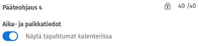

# ITKP102 Ohjelmointi 1

Tämä on Jyväskylän yliopiston järjestämän **ITKP102 Ohjelmointi 1** -opintojakson oppimateriaali.

*Tervetuloa opiskelemaan ohjelmointia!* 😍

Tällä opintojaksolla käsitellään ohjelmoinnin perusteita C#-kielellä. Opintojaksolla opit

- rakenteisen ohjelmoinnin perusperiaatteita,
- ratkaisemaan yksinkertaisia ongelmia sopivilla algoritmeilla ja tietorakenteilla,
- suunnittelemaan ja toteuttamaan pienimuotoisen pelin C#-kielellä ja siihen tarkoitetuilla työkaluilla.

Et tarvitse aiempaa ohjelmointikokemusta.

## Miten aloitan?

Ennen kuin aloitat opintojakson suorittamisen, tee seuraavat asiat:

 * Tutustu opintojakson suorittamisen periaatteisiin (ks. [Suorittaminen](suorittaminen.md)).
 * Suosittelemme, että asennat valmiiksi tarvittavat [ohjelmistot ja työkalut](tyokalut.md). Voit kuitenkin selailla materiaalia jo ennen työkalujen asentamista.
 * Pyydämme, että käyt vastaamassa [alkukyselyyn](https://tim.jyu.fi/view/kurssit/tie/itkp102/kyselyt/esitietokysely).

Voit palauttaa tehtäviä vain, jos olet ilmoittautunut opintojaksolle Sisu- tai
Ilpo-järjestelmässä. Oman etenemisesi tilanteen (harjoitustehtävien pisteet,
harjoitustyön hyväksyminen, tenttitulokset) näet
[TIM-järjestelmästä](https://tim.jyu.fi/view/kurssit/tie/itkp102/koti).

## Uutiset

<details><summary>1. tammikuuta 2026: Kurssimateriaalia uudistetaan keväällä 2026</summary>

Teemme kokonaisvaltaisen uudistuksen oppimateriaaliin sekä tehtäviin kevään 2026
aikana. Osa materiaalista julkaistaan kurssin edetessä, osa on vielä TIMissä ja
osa siirretty uuteen materiaaliin. Uudistamisesta johtuen sisällössä voi olla
myös keskeneräisyyksiä ja virheitä. Pahoittelemme tästä mahdollisesti aiheutuvaa
haittaa. Pyydämme, että ilmoitat virheistä tai parannusehdotuksista GitHubin
kautta (katso tämän sivun alareuna) tai suoraan opettajien sähköpostiin
<ohj1-opet@jyu.onmicrosoft.com>.

</details>

## Tuki ja palaute

Ajalla 24.4.-31.5. ohjausta on saatavana vain ajanvarauksella.

| Ohjaaja | Ajanvarauslinkki                                                                                                 |
| ------- | ---------------------------------------------------------------------------------------------------------------- |
| Tatu    | [Varaa aika](https://outlook.office.com/book/AjanvarausTatuKauhanen@bookings.jyu.fi/?ismsaljsauthenabled)        |
| Santtu  | [Varaa aika](https://bookings.cloud.microsoft/book/OhjAjanvarausSanttuSalo@bookings.jyu.fi/?ismsaljsauthenabled) |
| Karri   | [Varaa aika](https://book.ms/b/ks@bookings.jyu.fi)                                                               |

<!-- 

Kevään 2026 on 12. tammikuuta &ndash; 24. huhtikuuta välisenä aikana tarjolla
lähiohjausta Agoralla, etäohjausta Teamsin kautta, sekä sähköpostitukea. 

Pääsiäistauon aikana (30.3. &ndash; 6.4.) ei kuitenkaan ole ohjausta tarjolla.

Sisu vaatii ilmoittautumisen yhteydessä valitsemaan ohjausryhmän. Voit kuitenkin
täysin vapaasti käyttää kaikkia ohjausaikoja ja -kanavia riippumatta siitä,
mihin ohjausryhmään olet ilmoittautunut. 

--> 

<!-- 
Ohjausajat 7.4. alkaen:

| Tukikanava                                           | Aika                        | Paikka/Linkki                                                                                                                   |
| ---------------------------------------------------- | --------------------------- | ------------------------------------------------------------------------------------------------------------------------------- |
| Lähiohjaus                                           | ke 10-18, to 10-18, pe 8-14 | Agoralla luokat [Ag B212.1 Finland](https://navi.jyu.fi/space/m118988) ja [Ag B211.1 Sovjet](https://navi.jyu.fi/space/m118987) |
| Etäohjaus                                            | ke 10-18, to 10-18, pe 8-14 | [Ohjelmointi 1 Teams-kanava](#teams-jy)                                                                                         |
| Vastuuopettajien ja tuntiopettajien sähköpostiosoite | Jatkuva                     | ohj1-opet@jyu.onmicrosoft.com                                                                                                   |

(Ke klo 8-10 ja to 8-10 pudotettu pois 30.3. alkaen.)
-->

<!--
| Tukikanava                                           | Aika                        | Paikka/Linkki                           |
| ---------------------------------------------------- | --------------------------- | --------------------------------------- |
| Etäohjaus                                            | ke 10-16, to 8-18, pe 10-16 | [Ohjelmointi 2 Teams-kanava](#teams-jy) |
| Vastuuopettajien ja tuntiopettajien sähköpostiosoite | Jatkuva                     | ohj2-opet@jyu.onmicrosoft.com           |

Ohjaukset ovat yhteisiä TIEP111 Ohjelmointi 2, ITKP102 Ohjelmointi 1- ja
ITKA2004 Tietokannat ja tiedonhallinta -opintojaksojen kanssa. Ohjaajat auttavat
kaikkien kolmen kurssin opiskelijoita.

Ohjausaikoja saatetaan lisätä tai poistaa kysynnän mukaan; kerro aikatoiveistasi
opettajille sähköpostitse. 

24.4. jälkeen ohjausta on saatavilla ajanvarauksella. Linkki ajanvaraukseen
tulee myöhemmin saataville. 

--> 

<details closed><summary>Miten saan Sisun kalenteriin ohjausaikoja näkyviin? (Avaa ohje klikkaamalla) </summary>

1. Kirjaudu Sisuun
2. Jos olet jo ilmoittautunut kurssille, klikkaa ylhäällä välilehteä *Opintokalenteri* tai klikkaa sitä hampurilaisvalikosta
3. Selaa oikealla oikea kurssi näkyville, eli tässä tapauksessa Ohjelmointi 1
4. Klikkaa oikealla olevaa oikealle osoittavaa väkästä Ohjelmointi 1 -kurssin kohdalla

   

5. Skrollaa alaspäin, kunnes tulee alaotsikko *Pääteohjaus*
6. Jos ei vielä näy, niin skrollaa alaspäin, kunnes näkyy *Muiden ryhmien tiedot* ja klikkaa sitä
7. Nyt voit skrollaamalla alaspäin haluamiesi pääteohjauksien kohdalta klikata nappulaa *Näytä tapahtumat kalenterissa*. 

   

8. Nyt kyseisen ryhmän ohjausajat näkyvät sinulla automaattisesti. Tarvittaessa voit poistaa ryhmän tapahtumia viikkokohtaisesti Tapahtumakalenterista. 

</details>

## Ohjeet Teams-ohjauksiin liittymiseksi (tutkinto-opiskelijat) {#teams-jy}

1. Kirjaudu yliopiston tunnuksellasi Microsoft Teamsiin osoitteessa
    <https://teams.microsoft.com>. Käyttäjätunnus on muotoa `käyttäjätunnus@jyu.fi` (esim.
    `mameikal@jyu.fi`). Tunnuksen muoto `student.jyu.fi` ei käy. 
    Tunnuksen toimiminen vaatii, että olet hyväksynyt Office
    365 -palvelut OMA-palvelussa (<https://sso.jyu.fi>).

 2. Lataa Teams-sovellus (suositus) tai käytä nettiversiota. Saatavilla on
    myös mobiilisovellus. Jos selaimella liittymisessä on ongelmia, tarkista
    ensin tukeeko Microsoft sitä 
    [täältä](https://learn.microsoft.com/en-us/microsoftteams/teams-client-web#prerequisites).

 3. Teams-sovelluksessa klikkaa *Teams* <i class="bi bi-chevron-right"></i> *Join or create team* <i class="bi bi-chevron-right"></i> *Join a team with a code*

 4. Syötä koodi `fb8q3qa` 

 5. Testaa kaverin kanssa, että puhelu ja ruudun jakaminen toimii. Sinun tulee
tarvittaessa sallia oikeudet käyttöjärjestelmäsi asetuksista. 

## Ohjeet Teams-ohjauksiin liittymiseksi (avoin yliopisto, erilliset opinto-oikeudet) {#teams-avoimet}

Lähetä sähköpostilla alla oleva pyyntö osoitteeseen `ohj1-opet@jyu.onmicrosoft.com`.

```plain
Hei,

opiskelen Ohjelmointi 1 -kurssilla ei-tutkintoon johtavassa koulutuksessa.
Pyydän liittämään minut Ohjelmointi 1 -kurssin Teams-ryhmään vieraana. 
Teamsissa käyttämäni sähköpostiosoite on: [oma sähköposti tähän].

Terveisin, [oma nimi]
```

Liitämme sinut viimeistään seuraavana arkipäivänä.

## Etäohjauksiin osallistuminen ilman Teamsia {#zoom}

Jos et millään onnistu kirjautumaan Teamsiin tai et halua olla Teams-kanavalla,
voit pyytää etäohjausta Zoomin kautta seuraavasti: 

 1. Asenna Zoom sovellus koneellesi osoitteesta <https://zoom.us/download> (muut kuin tutkinto-opiskelijat) tai <https://jyufi.zoom.us> (tutkinto-opiskelijat; Valitse Download Client ihan alhaalta)
 2. Kirjaudu Zoomiin valitsemallasi tilillä, esim. Google-kirjautumista käyttäen (muut kuin tutkinto-opiskelijat) tai Single Sign-on / SSO -toiminnolla (tutkinto-opiskelijat; käytä company domainia `jyufi`)
 3. Aloita kokous New meeting toiminnolla
 4. Testaa Audio <i class="bi bi-chevron-right"></i> Test speaker & mikrofone toiminnolla että äänet pelittää
 5. Ota kokouslinkki talteen Participants <i class="bi bi-chevron-right"></i> Copy invite link
 6. Avaa ohjauspyyntölomake: <https://forms.gle/5QULUPBHjjqS4ndf6>
 7. Täytä omat tietosi ja HUOM Pasteta lisätietokenttään kohdassa 5 kopioimasi linkki
 8. Odota että ohjaaja tulee huoneeseesi. Saatat joutua hyväksymään hänen sisäänpääsyn (riippuu kokoushuoneesi asetuksista)


## Navigointi tässä materiaalissa

Tässä muutama pikavinkki tässä materiaalissa navigoimiseen:

 * Sisällysluettelon saat auki ja kiinni sivupalkki-kuvakkeesta <i class="bi bi-layout-sidebar"></i>.
 * Voit selata materiaalia eteen- ja taaksepäin nuolikuvakkeista sivun vasemmassa ja oikeassa laidassa (tai ihan sivun alalaidassa, jos käytät mobiililaitetta) <i class="bi bi-arrow-left-circle"></i> <i class="bi bi-arrow-right-circle"></i>.
 * Hakutoiminnon saat auki suurennuslasista oikeasta yläreunasta tai painamalla S-kirjainta näppäimistöltä <i class="bi bi-search"></i>.

## Palaute ja kehittäminen {#palaute}

Olemme erittäin kiitollisia kaikesta palautteesta, joka auttaa meitä kehittämään
opintojaksoa edelleen! Voit antaa palautetta ja kehitysehdotuksia opintojaksosta
kolmella tavalla:

 1. Jyväskylän yliopiston **tutkinto-opiskelijat** voivat antaa jatkuvaa palautetta
    opintojakson aikana
    [Norppa-järjestelmässä](https://norppa.jyu.fi/targets/7839/feedback). Nyt,
    kun olemme kehittämässä opintojakson sisältöjä ja toteutusta, tämä jatkuva
    palaute on erityisen tärkeää. 

 2. **Kaikki opiskelijat** voivat ilmoittaa havaitsemistaan virheistä,
    epäselvyyksistä, tai muista ongelmista tässä oppimateriaalissa. Raportoi
    havaintosi GitHubissa klikkaamalla kunkin sivun alareunassa olevia linkkejä.
    Voit myös ilmoittaa puutteista suoraan opettajille sähköpostitse
    osoitteeseen `ohj1-opet@jyu.onmicrosoft.com`.
 
 3. Opintojakson lopuksi kaikki **Sisussa** (tai **Ilpo-portaalissa**)
    ilmoittautuneet (tutkinto, avoin, erilliset opinto-oikeudet, lukiolinjat)
    saavat henkilökohtaisen linkin kurssipalautekyselyyn, jossa voit antaa
    anonyymisti palautetta koko opintojaksosta.
