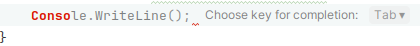
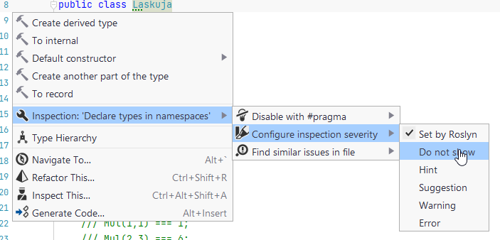
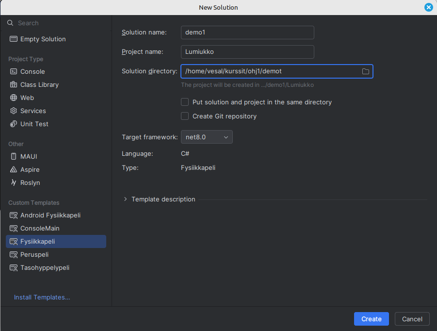
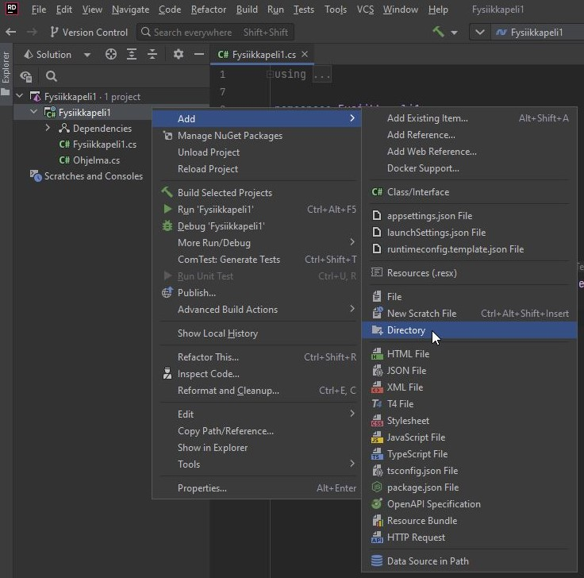

# <span class="part-icon">🛠️</span> Ohjelmointiympäristö kuntoon

Ensimmäisten viikkojen tehtävät voi periaatteessa suorittaa verkkoselaimessa, mutta varsin pian on tarpeen saada oma ohjelmointiympäristö toimimaan tietokoneella. 

Oman tietokoneen käyttöönottaminen ohjelmointia varten on tärkeä askel kohti itsenäisempää ohjelmointia. Se mahdollistaa esimerkiksi koodin kirjoittamisen, tallentamisen ja suorittamisen ilman internet-yhteyttä. Lisäksi omaa ympäristöä on helpompi mukauttaa omien tarpeiden mukaan, kuten vaihtaa värejä, fontteja ja muita asetuksia. Myöhemmin opit käyttämään versionhallintaa sekä debuggausta, jotka vaativat ohjelmointiympäristön omalla tietokoneellasi. 

## Rider

Ohjelman koon kasvaessa kannattaa ottaa käyttöön sovelluskehitin eli IDE (Integrated Development Environment). IDE on ohjelma, joka yhdistää yhteen paikkaan kaikki ohjelmien kehittämiseen tarvittavia ominaisuuksia, kuten:

 * koodin kirjoittaminen
 * koodin kääntäminen ohjelmaksi
 * virheiden ja ongelmien etsiminen koodissa
 * koodin navigointi- ja refaktorointityökaluja (esim. "Etsi koodista", kirjoittamisen aikaiset ehdotukset, koodin massamuokkaaminen)
 * ohjelman virheiden jäljitys eli debuggaus
 * samaan asiakokonaisuuteen liittyvän koodin hallinta ("projektit")
 * versionhallinnan tuki (esim. Git)

IDE-ympäristöjä on useita eri ohjelmointikielille ja ympäristöille. Ohjelmointi 1 -opintojaksolla käytetään JetBrains-yhtiön tekemää Rider-kehitysympäristöä, joka on erityisesti C# ja .NET-ajoympäristölle tarkoitettu IDE. Riderilla voi tehdä niin tekstipohjaisia sovelluksia kuin Jypeli-pelejäkin. 

>Riderin asennusohjeet löytyvät [Työkalut-sivulta.](../tyokalut.md) 

Sivuhuomiona mainittakoon, että kaikenlaiset pilvipalvelut ovat yleistyneet, ja myös pilvipohjaisia kehitysympäristöjä on olemassa. Kuitenkin edelleen yleinen käytäntö ohjelmoinnin opiskelussa, kuten myös Ohjelmointi 1 -kurssilla, on asentaa kehitysympäristö omalle paikalliselle tietokoneelle. Oman kehitysympäristön käyttö on yleensä nopeampaa, edullisempaa ja joustavampaa kuin pilvipohjaiset ratkaisut. Myös työelämässä paikalliset kehitysympäristöt ovat yleensä vallitseva käytäntö.

## Konfigurointi ja laajennokset

### Rider-asetusten muuttaaminen opintojaksolle sopivaksi

Oletusasetukset koodin muotoilulle ja analysoinnille ovat 
tämän kurssin näkökulmasta usein turhan aggressiivisia (ts.
auttavat turhan innokkaasti tai väärään suuntaan), joten
muutetaan asetuksia tämän kurssin suositusten mukaisiksi. 

Jos haluat varmuuskopioida nykyiset asetuksesi, tee se valikosta *File* $\rightarrow$ *Manage
IDE Settings* $\rightarrow$ *Export Settings*.

- Lataa [asetuspaketti
(settings.zip)](https://gitlab.jyu.fi/tie/ohj1/2024s/esimerkit/-/raw/main/mallit/RiderSettings/settings.zip?r=1) (Linuxissa voi joutua vaihtamaan tarkentimen `.jar` latauksen jälkeen)
- Avaa Rider ja valitse *Welcome to JetBrains Rider*-ikkunassa vasemmasta alalaidasta *Configure* $\rightarrow$ *Import Settings...*
- Etsi ja valitse äsken haettu tiedosto
- Klikkaa OK, sitten Import and Restart
 
Vaihtoehtoisesti voit mukauttaa asetuksia yksitellen alla olevien ohjeiden mukaisesti. 

Ja uusimmassa Riderissa joudut joka tapauksessa alla olevalla manuaaliohjeella poistamaan
**oikoluvun** käytöstä (ainakin toistaiseksi).

>Pro tip: Jos käytät Rideria usealla tietokoneella, voit synkronoida asetuksesi
valitsemalla *File* $\rightarrow$ *Manage IDE Settings* $\rightarrow$ *Settings sync*.


#### Sisäänrakennetun tekoälytäydennyksen kytkeminen pois

Riderissa on sisäänrakennettu tekoälypohjainen täydennys, joka
yrittää täydentää kirjoitetun rivin loppuun ympäröivän koodin perusteella:



Aivan opintojakson alussa tämä täydennys ei haittaa, mutta myöhemmin täydennys pikemmin häiritsee
sen rajoittuneisuuden vuoksi. Siispä suosittelemme kytkemään se pois seuraavasti:

- Avaa Rider *Welcome to JetBrains Rider* -näkymään
- Valitse vasemmasta alalalaidasta *Configure* $\rightarrow$ *Settings*
- Mene asetuksissa kohtaan *Editor* $\rightarrow$ *General* $\rightarrow$ *Inline Completion*
- Ota ruksi **pois** kohdasta *Enable local Full Line completion suggestions*
- Tallenna asetukset *Save*-painikkeella

<details>
<summary>
Kurssin koodin muotoilu- ja analyysiasetusten ("settings.zip") selitykset (valinnaista lisätietoa)
</summary>
Seuraavassa on muutamia esimerkkejä varoituksista, joita settings.zipissä on otettu pois
päältä. Näistä varoituksista on enemmänkin haittaa kuin hyötyä tämän kurssin kannalta. 
Ajatus on, että on parempi, että varoituksia tulee vain niistä asioista, jotka 
on oikeasti syytä ottaa huomioon. Kun opit ohjelmointia lisää, on noista 
edistyneemmistä varoituksistakin enemmän hyötyä. Kannattaa avata Riderissa joku solution,
jos säädät seuraavia käsin.

- **Oikoluku:** Poistetaan valitukset suomenkielisistä nimistä: 
  `File/Settings`, kirjoita hakukentään `spell` 
  ja mene `Spelling` ja `.NET Languages` (tai `ReSpeller` versiosta riippuen) ja ota sen
`Enable` pois.
- **Huomatus nimiavaruudesta:** Kurssilla ei aina käytetä nimiavaruuksia: 
  kirjoita asetusten hakukentään `inspection severity` ja mene asetuksissa `Editor/Inspection Settings/Inspection
Severity/C#` valitsemalla `Inspection Severity` alla olevista kielistä C#. Pitäisi tulla näkyviin uusi valikko C#:n kielikohtaisia asetuksia.
Kirjoita tämän uuden valikon omaan hakuun `namespace` ja ota ruksi pois kohdasta 
`Namespace does not correspond to file location`, joka löytyy uudesta valikossa `Constraints violations`-
alaotsikon alta.
- **Luokasta ole luotu oliota:** Kurssilla luokkia käytetään (myös) tallentamaan
  joukko staattisia aliohjelmia, joten tämä varoitus ei ole relevantti. Samaan tapaan 
kuin edellisessä kohdassa, mene ensin C#:n kielikohtaisiin asetuksiin: `Editor/Inspection Settings/Inspection Severity/C#` ja
kirjoita avautuvan valikon hakukentään `instantiated` ja ota ruksi
  pois kohdasta `Non-private accessibility`, joka on alaotsikon `Potential Code Quality Issues` ja 
`Class is never instantiated`-asetuksen alla.
- **Metodi voisi olla private:** Yleiskäyttöiseksi tarkoitetut funktiot kannattaa tehdä
julkisiksi, mutta koska niitä ei ole vielä mistään kutsuttu, tätä ei huomata. 
Mene taas C#:n kielikohtaisten asetusten valikkoon `Editor/Inspection Settings/Inspection Severity/C#` edellisen kohdan tavoin.
Hae `member` ja etsi `Common Practices and Code Improvements` alaotsikon alta `Member can be made private`-asetuksen
alla oleva asetus `Non-private accessibility`, josta ota ruksi pois.
- **Luokkaa ei ole määritelty nimiavaruudessa:** Koska kurssilla ei aina käytetä nimiavaruuksia:
  Jos koodissa on jossakin kohti alleviivattuna `class`-sanan jälkeinen nimi, niin mene
sen nimen alkuun,
  paina nimeä ja vasemmalle syttyy vasaran kuva. Klikkaa vasaraa ja valitse valikosta `Inspection:
'Declare types in namespaces'/Configure inspection severity/Do not show` kuten kuvassa alla: 

Tämän `Context Actions`-valikon saa auki myös klikkaamalla hiiren oikealla painikkeella alleviivattua
kohtaa ja valitsemalla valikosta `Show Context Actions`. Joissain tapauksissa valikon saa auki rivinumeroiden 
vieressä olevasta hehkulampun kuvasta.`Context Actions`-valikon saa auki kursorin kohdalla 
myös painamalla `Alt + Enter`. Tällä samalla menetelmällä on helppo säätää pois häiritseviä alleviivauksia, 
**mutta ensin on varmistuttava, että kyseinen asetus/alleviivaus/vihje ei ole itselle tarpeellinen tai huomionarvoinen**.
- **`var`-sanan käyttö:** Pyritään oppimaan tyyppien merkitystä. Toimi kuten edellä
silloin kun ehdotetaan esimerkiksi `int ika` tyyppisessä lausessa `int` sanan kohdalle
että `use var`, eli poista tämä huomautus käytöstä.

- `Editor/General/Code Completion` poista ruksi "Preselect the best match to
insert it by pressing dot, parantheses, and other keys"
- `Editor/Inlay Hints` poista ruksi "Enable Inlay Hints in .NET languages"

- Muita huomautuksia joita saa poistaa:  
    - attribuuttien nimiin vaatii alleviivan alkuun, tämä ei ole kurssin
koodauskäytänteiden mukaista (eli nimentään `pelaaja`, ei `_pelaaja`)
    - tarvittaessa vakioiden nimeäminen (kurssilla on käytetty muotoa `VAKIO`, Rider
haluaa `Vakio` => saa vaihtaa valituksen pois)
        - muista kuitenkin välttää turhia attribuutteja (sitten kun tiedät mitä
attribuutti tarkoittaa :-)

Vesan muuttamat asetukset DO NOT SHOW-asentoon:
```
BuiltInTypeReferenceStyle
CheckNamespace
ClassNeverInstantiated_002EGlobal
ConvertIfStatementToReturnStatement
ConvertIfStatementToSwitchStatement
InconsistentNaming
JoinDeclarationAndInitializer
MemberCanBePrivate_002EGlobal
SuggestVarOrType_005FBuiltInTypes
SuggestVarOrType_005FElsewhere
SuggestVarOrType_005FSimpleTypes
UseCollectionExpression
UseObjectOrCollectionInitializer
```
</details>
<br>

<details>
<summary>
Suositeltavat käyttöliittymän asetukset (valinnaista lisätietoa)
</summary>
Tässä on lueteltu muutamia asetuksia, joita luentojen esimerkeissä käytetään
tai on käytetty. Jokainen voi toki rakennella ympäristöstään haluamansa, mutta 
näistä voi olla sinulle hyötyä jos haluat seurata täsmälleen luennolla 
käytettyjä asetuksia. 

**Siirrä alaosan paneelit yhteen reunaan.**  Tämän
ansiosta esimerkiksi tulosteita on helpompi tarkastella hieman leveämmässä näkymässä. Joissakin tilanteissa
(esimerkiksi debugatessa) joitakin paneeleja voi olla hyvä siirtää tarvittaessa oikeallekin. Voit
myös piilottaa turhia paneeleja näkyviltä kun klikkaat hiiren oikealla kuvakkeen päällä ja sitten Hide.

**Paneeleita voi "unpinnata"** eli piilottaa näkyvistä silloin kun ne eivät ole aktiivisia. Klikkaa paneelista kolmea pistettä ja valitse View Mode -> Dock Unpinned. Jos unpinnaat esimerkiksi Debug-paneelin, voit ajaa ConsoleMain-sovelluksen (Debug-tilassa), ja painaa ajon jälkeen Esc-näppäintä. Paneeli sulkeutuu ja fokus siirtyy takaisin editoriin. (Ei tarvitse koskea hiireen, JES! :))

**Piilota onnistuneen käännöksen "balloon"-ilmoitus.** Omasta mielestäni tämä ilmoitus on täysin turha ja vain tiellä. Valitse Settings $\rightarrow$ Notifications $\rightarrow$ Build messages $\rightarrow$ No popup. Suosittelen myös poistamaan valinnan kohdasta *Show in tool window*, koska harvemmin on tarvetta tietää tarkkoja kellonaikoja milloin käännös on onnistunut tai epäonnistunut. 

**Koko ruudun tilan** saat käyntiin View $\rightarrow$ Appearance $\rightarrow$ Enter Full Screen. Minulla näppäinoikotie on Ctrl+Shift+Enter, mutta 
kuten mitä tahansa näppäinoikoteitä, tätäkin voi muuttaa kohdasta Settings $\rightarrow$ Keymap. Myös *Distraction Free Mode* on mielestäni mukava, vaikkakin se piilottaa jotain 
hyviäkin käyttöliittymäelementtejä, kuten koodialueiden supistamiseen liittyvät pikkukolmiot. 

**Ns. Uuden käyttöliittymän** saat valittua Settings $\rightarrow$ New UI $\rightarrow$ Enable New UI. On kuitenkin täysin makuasia kummasta tykkää enemmän, vanhasta vai uudesta UI:sta. 

**Debug/release-valikon näyttäminen New UI:ssa.** Jos käytät uutta käyttöliittymävaihtoehtoa (Settings New UI), kannattaa ns. debug/release-käännösvalikko ottaa käyttöön [tässä ohjeessa kuvatulla tavalla](https://youtrack.jetbrains.com/issue/RIDER-83004/No-Edit-Solution-Configuration-and-Build-button-in-new-UI).

**Ulkoisen konsoli-ikkunan käyttäminen**: En itse tätä käytä, mutta jos haluat konsoliohjelman aukeavan ulkoiseen konsoliin katso 
[How to launch console app in external window?](https://rider-support.jetbrains.com/hc/en-us/community/posts/115000162270-How-to-launch-console-app-in-external-window-)

</details>

## Riderin peruskäyttö: solution ja projekti
> [!VAROITUS]
> Jos olet Jyväskylän yliopiston opiskelija, sinun tulee tietää JY-käyttäjätunnuksesi, jotta voit käyttää gitlab.jyu.fi-palvelua. Varmista, että tiedät käyttäjätunnuksesi, ja kirjoita se muistiin ennen kuin aloitat tämän ohjeen seuraamisen. Tässä ohjeessa viitataan toistuvasti käyttäjätunnukseen tunnisteella `<käyttäjätunnus>`. Korvaa tämä aina omalla käyttäjätunnuksellasi.

Rider käyttää ns. *solution-projekti*-rakennetta koodin organisointiin. 

*Projekti* sisältää yhteen ohjelmaan (peliin tai konsolisovellukseen) 
liittyvän koodin ja grafiikka- ja musiikkitiedostot.

Projekti kuuluu aina johonkin *solutioniin*. Yksi solution voi sisältää
yhden tai useampia projekteja.

>**Sivuhuomio:** Solution on 
[Microsoftin keksimä nimi](https://learn.microsoft.com/en-us/visualstudio/ide/solutions-and-projects-in-visual-studio?view=vs-2022#solutions) 
tällaiselle projekteja koostavalle kapistukselle. Sana ei varsinaisesti
tarkoita mitään.

Esimerkiksi yksi demokerta voi olla yksi solution joka sisältää useita 
projekteja (demotehtäviä). Useiden projektien lisäämisessä samaan solutioniin 
on se etu, että silloin voi pitää samaan demoon liittyvät tehtävät yhtä aikaa 
näkyvillä ilman että niitä tarvitsee jatkuvasti avata tai sulkea.

Riderissa tehdyt solutionit ja projektit ovat yhteensopivia Visual Studion kanssa.


### Suositeltava hakemistorakenne

Kurssilla kannattaa kaikki kurssin asiat tehdä esimerkiksi
alikansion (hakemiston) `ohj1` alle.  Tuo ohj kansio `ohj1`
voi alla käyttötarkoituksesta riippuen eri paikassa:

Mikroluokan koneessa 

    c:\MyTemp\<käyttäjätunnus>\ohj1
    
ja omassa kannettavassa esimerkiksi:

    Windows: `/c/kurssit/ohj1`    
    Mac ja Linux: `~/kurssit/ohj1` 


ja sitten tuon kansion alla on alikansiota tyyliin:

```
ohj1
 |
 +-demot 
 |  +-demo1
 |  | +-HelloWorld
 |  | +-Lumiukko
 |  | 
 |  '-demo2
 |    +-Lumiukko2
 |    +-LukujenLaskemista
 |
 '-ohjaukset
    +-paate1
    | +-HelloWorld
    | +-Lumiukko
    '-paate2
```

Eli esimerkiksi `demo1` on yksi solution jonka alla on useita
projekteja.  Usein projekti on yksi demotehtävä.

### Uusi solution

Luodaan uusi solution ja siihen projekti. Tässä esimerkissä luodaan 
demo1-niminen solution ja siihen Lumiukko-niminen projekti `demot`-alikansioon: 

Mikäli haluat lisätä projektin olemassa
olevaan solutioniin, katso luku [Uusi projekti olemassa olevaan solutioniin](#uusiprojekti).

* Valitse `New Solution`. 
     - Mikäli joku vanha solution on jo auki, niin sama onnistuu yläpalkista  `File/New Solution`. 

* Valitse vasemmalta templates-listasta `FysiikkaPeli`.
* Anna solutionin nimeksi `demoX`, esimerkiksi `demo1`
* Anna projektin nimi, esimerkiksi `Lumiukko` tai `Teht3Lumiukko` (Huom **Iso** alkukirjan!). 
* Kirjoita tai selaa poluksi (`<käyttäjätunnus>` tilalle oma käyttäjätunnuksesi jos se on eri):
    * oma Windows kone: `C:\kurssit\ohj1\demot`
    * Mac: `/Users/<käyttäjätunnus>/kurssit/ohj1/demot`
    * Linux: `/home/<käyttäjätunnus>/kurssit/ohj1/demot`
    * mikroluokssa `C:\MyTemp\<käyttäjätunnus>\ohj1\demot` 
  
  HUOM! Yliopiston mikroluokissa projekti tulee tehdä ensin tietokoneen kiintolevylle, esim. `C:\MyTemp\<käyttäjätunnus>\...`. Siirrä lopuksi tiedostot U-asemallesi tai muualle talteen. 
* Jätä `Put solution and project in the same directory`-boksi tyhjäksi.
* `Framework`-kohtaan `net8.0`
* Klikkaa `Create`.
* Levylle syntyy nyt hierarkia:
  ```
        kurssit                    - kaikkien kurssien hakemisto
          ohj1                     - ohj1 kurssin hakemisto
            demot                  - demojen hakemisto
              demo1                - demo1:n hakemisto
                demo1.sln          - solutionintiedosto jossa luetellan mitä projekteja
                Lumiukko           - hakmeisto jonka alla Lumiukko-projekti     
                  bin              - hakemisto jonne tulee ajettavaa koodia
                  obj              - hakemisto jonne tulee käännettyjä tiedostoja
                  Lumiukko.cs      - C#-tiedosto johon tulee lumiukon piirtävä koodi
                  Ohjelma.cs       - C#-pääohjelma
                  Lumiukko.csproj  - projektin tiedosto jossa kerrotaan mitä tiedotoja
                                     projektiin liittyy
  ```
* Klikkaa Solution Explorerissa `Lumiukko.cs`-kooditiedostoa.  Koodissa pitäisi näkyä:

  ```csharp 
  public class Lumiukko : PhysicsGame
  {
      public override void Begin()
      {
          // Kirjoita ohjelmakoodisi tähän
  
          PhoneBackButton.Listen(ConfirmExit, "Lopeta peli");
          Keyboard.Listen(Key.Escape, ButtonState.Pressed, ConfirmExit, "Lopeta peli");
      }
  }
  ```

* Kokeile käynnistää ohjelma `Run/Run 'Lumiukko'`, jolloin pitäisi näkyä uusi ikkuna vaaleansinisellä taustalla. Jos kaikki toimii, sulje ikkuna.
* Pyyhi pois koko se rivi jossa lukee "`Kirjoita ohjelmakoodisi tähän`" ja kirjoita tilalle
    
  ```csharp
          Level.Background.Color = Color.Black;
          PhysicsObject pallo = new PhysicsObject(200, 200, Shape.Circle);
          pallo.Color = Color.White;
          Add(pallo);
  ```

* Käynnistä ohjelma uudestaan ja tarkista että ohjelma muuttui.

* Kirjoita luokan dokumentaatiokommentti näppäilemällä **luokan** esittelyrivin (eli`public class...`) yläpuolelle kolme kauttaviivaa
  `///`.  Kirjoita `<summary>`-tagien väliin selvitys luokan toiminnasta (eli että
  piirretään lumiukko)
* Kirjoita vastaavasti `Begin`-metodin dokumentaatiokommentit.

### Uusi projekti olemassa olevaan solutioniin

Oletetaan, että solution on jo olemassa. 
Lisätään siihen toinen projekti olemassa olevan lisäksi. 
Tässä esimerkissä luodaan uusi ConsoleMain-projekti olemassa olevaan `demo1`-solutioniin. 

- Klikkaa Explorer-paneelissa solutionin `demo1` nimeä hiiren oikealla (Macissa kahdella sormella).
- Valitse `Add -> New Project`
- Valitse vasemmalta `ConsoleMain`-projektimalli
- Anna nimeksi `HelloWorld`
- Paina `Create`.
- Ensimmäisellä kerralla projekti ajetaan klikkaamalla Explorerissa sen nimeä `HelloWorld`
  hiiren oikealla ja valitse `Run HelloWorld`. Myöhemmillä kerroilla voit
  käynnistää projektin käynnistämällä yläpalkista haluamasi projektin.


### Jypeli-projektit

Jypeli-projektin voi tehdä valitsemalla solutionia tai projektia luodessa `Custom Templates` -kohdasta oikean projektimallin.

- `ConsoleMain` (Konsolisovellukset, joissa on Ohj1 kurssin pohja)
- `Fysiikkapeli` (Fysiikkaa käyttävät pelit ja muut graafiset sovellukset)
- `Tasohyppelypeli` (Esimerkkipeli)
- `Android Fysiikkapeli` (Android-alustaa varten)

#### Pääohjelma Jypeli-projekteissa (Main)
Jypeli-projektissa Main-pääohjelma menee Ohjelma.cs-tiedostoon, joten jos copy-pastetat
koodin, joka sisältää Main-pääohjelman, niin **poista Main-pääohjelma** `Portaat`-luokan (tms. projektisi nimeä vastaava luokka)
sisältä. Projektissa ei saa olla kahta Main-pääohjelmaa.


#### Sisällön tuominen Jypeli-projektiin (Content-kansio)

Kuvat ja äänet lisätään peliprojektin Content-kansioon, joka näkyy editorin tiedostolistauksessa.

Content-kansion voi luoda klikkaamalla hiiren oikealla projektia $\rightarrow$ *Add* $\rightarrow$ *Directory*



 1. Lisää tiedosto klikkaamalla kansiota hiiren oikealla napilla $\rightarrow$ *Add* $\rightarrow$ *Add Existing Item*
 1. Valitse tiedosto(t) jonka haluat lisätä ja paina ok.
 1. Valitse Copy.
 1. Klikkaa tuomaasi tiedostoa Content-kansiossa hiiren oikealla ja valitse Properties
 1. Vaihda *Copy to output directory* -kohtaan "Copy if newer"


## Graafinen sovellus Jypeli-kirjastolla

Jypeli on C#-kielellä kirjoitettu pelimoottori, joka on suunniteltu erityisesti opetuskäyttöön. Jypeli tarjoaa helppokäyttöisen tavan pelien luomiseen, mikä tekee siitä hyvän valinnan tälle kurssille.

Jypelin avulla voi luoda 2D-pelejä, joissa on grafiikkaa ja ääniä. Jypeliin on tarjolla paljon valmiita [ohjeita ja esimerkkejä]() <!--TODO-->**TODO: Linkki**, jotka auttavat sinua pääsemään alkuun pelien tekemisessä. 

Tehdään seuraavaksi pieni Jypeli-esimerkki, jossa luodaan ikkuna ja piirretään siihen ympyrä.

> [!HUOMAUTUS]
> Jos haluat kokeilla tätä koodia itse, sinulla tulee olla kehitystyökalut asennettuna; ohjeet löytyvät [Työkalut-sivulta]() <!--TODO-->**TODO: Linkki**. 
> Luo uusi Fysiikkapeli-projekti Riderissa ja korvaa `Begin`-metodin sisältö yllä olevalla koodilla. Suorita sitten peli painamalla vihreää "Play"-painiketta ikkunan yläreunassa.

```csharp,feature-jypeli
using Jypeli;
public class YmpyraPeli : PhysicsGame
{
    public override void Begin()
    {
        GameObject ympyra = new GameObject(50, 50);
        ympyra.Shape = Shape.Circle; 
        ympyra.Position = new Vector(0, 0); // Asetetaan ympyrä keskelle ikkunaa
        Add(ympyra); // Lisätään ympyrä peliin
    }
}
```

Voit käynnistää pelin yllä klikkaamalla oikean yläreunan vihreää "Play"-painiketta. Ikkunaan pitäisi ilmestyä keskelle pieni ympyrä.

Huh! Siinä oli jo aika paljon uutta. Käydään koodi läpi vaiheittain.

Ensimmäinen rivi luo uuden muuttujan nimeltä `ympyra`, joka on tyyppiä `GameObject`. Sen leveydeksi ja korkeudeksi annetaan `50`.
```csharp,feature-jypeli
//-using Jypeli;
//-public class Lumiukko : PhysicsGame {
    public override void Begin()
    {
        GameObject ympyra = new GameObject(50, 50);
    }
//-}
```

Seuraavaksi asetamme `ympyra` muuttujan muodoksi `Shape.Circle` ja sijainniksi asetetaan vektori, joka osoittaa keskipisteeseen `new Vector(0, 0)`.
```csharp,feature-jypeli
//-using Jypeli;
//-public class Lumiukko : PhysicsGame {
    public override void Begin()
    {
        GameObject ympyra = new GameObject(50, 50);
        ympyra.Shape = Shape.Circle; // Asetetaan muodoksi Shape.Circle
        ympyra.Position = new Vector(0, 0); // Asetetaan ympyrä keskelle ikkunaa
    }
//-}
```

Lopuksi lisäämme `ympyra` muuttujan näkyviin kutsumalla Jypelin `Add` metodia. `ympyra` muuttuja on siis olemassa jo heti ensimmäisen rivin jälkeen, mutta se pitää erikseen vielä lisätä "pelimaailmaan".
```csharp,feature-jypeli
//-using Jypeli;
//-public class Lumiukko : PhysicsGame {
    public override void Begin()
    {
        GameObject ympyra = new GameObject(50, 50);
        ympyra.Shape = Shape.Circle; 
        ympyra.Position = new Vector(0, 0);
        Add(ympyra); // Lisätään ympyrä peliin
    }
//-}
```

## Visual Studio Code

Vaihtoehtoisesti voit käyttää myös **Visual Studio Code** -editoria (lyhyesti VS Code), joka on hyvin suosittu tekstieditori, jota voi käyttää myös IDE:nä. VS Coden asennusohjeet löytyvät myöskin [Työkalut-sivulta](../tyokalut.md#tekstieditori).


## Tehtävät

Asenna Rider ja Jypeli omalle tietokoneellesi [Työkalut-sivulla](../tyokalut.md) olevia ohjeita noudattaen. 