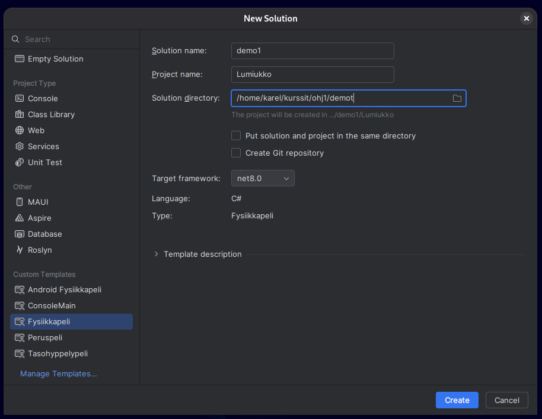

# Ohjelmointiympäristö kuntoon

Ensimmäisten viikkojen tehtävät voi periaatteessa tehdä verkkoselaimessa, mutta
varsin pian on aika ottaa käyttöön oikea työkalu: *sovelluskehitin* eli IDE
(engl. *Integrated Development Environment*). Otamme nyt Riderin käyttöön,
katsotaan projekteille sopiva kansiorakenne, jotta tiedostot löytyvät vielä
marraskuussakin, ja luodaan ensimmäinen solution ja projekti. Projektissa
ajetaan omalla koneella sama Hello World, joka aiemmin ajettiin selaimessa.

Ellet ole vielä asentanut kehitystyökaluja, [tee se nyt](../tyokalut.md).
Jatkossa oletetaan, että .NET, Rider ja Jypeli ovat asennettuina.

## Mihin IDE:tä tarvitaan?

Lähdekoodi on pelkkää tekstiä, joten sen teknisesti ottaen voisi kirjoittaa
Muistiolla. Tämä olisi kuitenkin yhtä miellyttävää kuin gradun kirjoittaminen
kirjoituskoneella. IDE on ohjelmoijan tekstinkäsittelyohjelma:

* **Punainen alleviivaus.** Kun kirjoitat `Console.WriteLine("Moi")` ilman
  puolipistettä, Rider alleviivaa rivin jo ennen kuin ehdit painaa Run.
  Muistio ei huomaa mitään, ja virhe selviää vasta kääntäjän
  virheilmoituksesta.
* **Täydennys.** Kirjoitat `Cons`, painat sarkainta (painike Caps Lockin
  yläpuolella), ja Rider kirjoittaa loput. Kun kirjoitat `Console.`, Rider
  näyttää mitä `Console`-luokalla voi tehdä, joten aliohjelmien nimiä ei
  tarvitse muistaa ulkoa.
* **Yksi nappi.** Kääntäminen ja ajaminen on yksi klikkaus. 
* **Debuggeri.** Kun ohjelma tekee jotakin outoa, debuggerilla sen voi
  pysäyttää kesken kaiken ja katsoa muuttujien arvot. Tähän palataan osassa 5,
  ja siitä on kurssilla jopa oma [näyttönsä](../debuggausnayte.md).
* **Projektit ja versionhallinta.** IDE pitää yhden ohjelman tiedostot koossa
  ja keskustelee Gitin kanssa, jota tarvitaan harjoitustyössä.

Lisäksi itse asennettua IDE:tä voi mukauttaa: vaihtaa värit, fontit ja
näppäinkomennot mieleisikseen. Tämä on itse asiassa monille ohjelmoijille tärkeä
harrastus, josta käydään loputtomia keskusteluja.

### Rider, VS Code ja pilvi

IDE-ympäristöjä on useita. Tällä kurssilla käytetään **JetBrains Rideriä**,
joka on tehty erityisesti C#- ja .NET-kehitykseen. Riderilla voi tehdä niin
tekstipohjaisia sovelluksia kuin Jypeli-pelejäkin, ja kurssin ohjeet ja
ohjaukset perustuvat siihen.

Vaihtoehtoisesti voit käyttää **Visual Studio Code** -editoria (VS Code), joka
on hyvin suosittu, kevyt tekstieditori ja laajennoksilla lähes IDE. Jos
valitset sen, varaudu siihen, että ohjaaja ei välttämättä tunne sen kaikkia
valikoita.

Pilvipohjaisia kehitysympäristöjä on myös olemassa, ja ne yleistyvät.
Esimerkiksi TIM on tällainen "pilvessä" pyörivä ympäristö. 
Ohjelmoinnin opiskelussa, kuten tälläkin kurssilla, kehitysympäristö
asennetaan kuitenkin edelleen omalle tietokoneelle: se on nopeampi, ilmainen
ja toimii junassakin. Työelämässä paikallinen kehitysympäristö on yhä
vallitseva käytäntö.

## Suositeltava hakemistorakenne

Ohjelmointikurssilla syntyy kymmeniä projekteja, ja jokainen niistä on kansio,
jossa on alikansioita. Jos ne luo sinne, minne Rider sattuu ehdottamaan, kahden
kuukauden päästä etsit harjoitustyötäsi kansiosta `RiderProjects/ConsoleApp7`.
Sovitaan siis rakenne heti alussa.

Tämän kurssin tiedostojesi kotipesä on kansio nimeltä `ohj1`.

Sopivia sijainteja `ohj1`-kansiolle ovat esimerkiksi:

 * Windows: `C:\Users\<käyttäjätunnus>\ohj1` tai `C:\Opiskelu\ohj1`
 * Mac ja Linux: `~/ohj1` (tai `/Users/<käyttäjätunnus>/ohj1`)
 * Agoran tietokoneluokassa: `C:\MyTemp\<käyttäjätunnus>\ohj1`

Korvaa `<käyttäjätunnus>` omalla käyttäjänimelläsi. Omalla koneella sen ei
tarvitse olla sama kuin yliopiston tunnus. Kansio voi sijaita muuallakin.
**Tärkeintä on, että itse tiedät, missä kansiossa työskentelet, ja että löydät
sen helposti myöhemmin.**

Tee heti tuohon kansioon kaksi alikansiota: `demot` ja
`harjoitustyo`. Rakenne näyttäisi sitten kutakuinkin tältä: 

```bob
ohj1
 |
 +-demot 
 '-harjoitustyo
```

> [!VAROITUS]
> Vältä projektien sijoittamista pilvisynkronoituun kansioon (OneDrive,
> Dropbox, iCloud), jos voit. Synkronointi ja kääntäjä kirjoittavat samoja
> tiedostoja yhtä aikaa, ja tuloksena on satunnaisia, vaikeasti selitettäviä
> virheitä. Varmuuskopio hoituu paremmin Gitillä, josta kerrotaan sivulla
> [Versiohallinta ja Git](../git/index.md).

## Solution ja projekti

Rider järjestää koodin *solutioneihin* ja *projekteihin*. *Projekti* sisältää
yhden ohjelman (konsolisovelluksen tai pelin) koodin sekä sen kuvat ja äänet.
*Solution* on kokoelma projekteja, jotka halutaan pitää auki yhtä aikaa.
Projekti kuuluu aina johonkin solutioniin, vaikka se olisi solutionin ainoa.

Tällä kurssilla luonteva jako on: yksi demokerta on yksi solution, ja sen
jokainen tehtävä on oma projektinsa. Solution `Demo1` sisältää siis projektit
`HelloWorld`, `Lampotila` ja niin edelleen. Näin saman demon tehtävät ovat yhtä
aikaa näkyvillä ilman jatkuvaa avaamista ja sulkemista.

```bob
 Demo1 "(solution)"
  |
  +-- HelloWorld "(projekti)"
  +-- Lampotila  "(projekti)"
  '-- ...
```

Sivuhuomiona mainittakoon, että "solution" on [Microsoftin keksimä
nimi](https://learn.microsoft.com/en-us/visualstudio/ide/solutions-and-projects-in-visual-studio?view=vs-2022#solutions)
tällaiselle projekteja koostavalle kapistukselle. Sana ei varsinaisesti
tarkoita mitään, eikä sitä kannata yrittää suomentaa.

## Uusi solution

Tehdään nyt solution `Demo1` ja siihen ensimmäinen projekti `HelloWorld`,
joka on konsoliohjelma. Samaan solutioniin lisätään myöhemmin muita
projekteja, muun muassa ensimmäinen Jypeli-peli.

Jos olet jo aiemmin tehnyt solutionin ja haluat lisätä siihen projektin, katso
kohta [Uusi projekti olemassa olevaan solutioniin](#uusi-projekti-solutioniin).

1. Valitse Riderin aloitusikkunasta `New Solution`. Jos jokin solution on jo
   auki, sama löytyy valikosta *File* › *New Solution*.

    <animation scenes="images/rider/scenes.js" scene="uusi-solution">

    

    </animation>

2. Valitse vasemmalta *Custom Templates* -listasta `ConsoleMain`. Listassa
   ovat kurssin omat projektimallit: `ConsoleMain` on konsoliohjelmille ja
   `Fysiikkapeli` Jypeli-peleille. Jos listaa ei näy, projektimalleja ei ole
   asennettu; katso [Työkalut-sivun Jypeli-kohta](../tyokalut.md#jypeli).
3. Anna solutionin nimeksi `Demo1`.
4. Anna projektin nimeksi `HelloWorld`. Projektin nimi alkaa **isolla
   kirjaimella**, koska siitä tulee myös luokan nimi. Tehtävissä nimi voi olla
   myös esimerkiksi `Teht3Lampotila`.
5. Kirjoita tai selaa poluksi kansio, joka juuri äsken tehtiin, esimerkiksi
   `C:\Users\<käyttäjätunnus>\ohj1\demot` (Windows) tai `~/ohj1/demot` (Mac ja
   Linux). Yliopiston mikroluokissa projekti tehdään ensin kiintolevylle
   kansioon `C:\MyTemp\<käyttäjätunnus>\...` ja siirretään lopuksi talteen.
6. Jätä *Put solution and project...* -valinta tyhjäksi.
   Muuten solution- ja projektitiedostot sekoittuvat samaan kansioon, ja
   toisen projektin lisääminen myöhemmin on sotkuista.
7. Valitse `Framework`-kohtaan `net10.0`.
8. Klikkaa `Create`.

### Ensimmäinen ajo

Kaksoisklikkaa ruudun vasemmassa reunassa Explorer-paneelissa
`HelloWorld.cs`-tiedostoa. Koodissa pitäisi näkyä suunnilleen tämä:

```csharp,ignore
using System;
using System.Text;
using System.Linq;
using System.Collections.Generic;

/// @author Omanimi
/// @version 4.10.2026
/// <summary>
/// 
/// </summary>
public class HelloWorld
{
    /// <summary>
    /// 
    /// </summary>
    public static void Main()
    {

    }

}
```

Projektimalli on kirjoittanut valmiiksi ohjelman rungon: luokan `HelloWorld`
ja sen sisällä tyhjän `Main`-aliohjelman. Alussa on neljä `using`-riviä, joista
ensimmäinen on jo tuttu; muut kolme ottavat käyttöön .NET-kirjaston osia,
joita tarvitaan myöhemmin, eivätkä ne haittaa, vaikka niitä ei vielä
käytettäisi. Kolmella vinoviivalla `///` alkavat rivit ovat kommentteja:
kääntäjä ohittaa ne, ja niihin kirjoitetaan tekijän nimi ja lyhyt kuvaus siitä,
mitä ohjelma tekee. Rider on täyttänyt tekijäksi koneesi käyttäjänimen ja
versioksi päivämäärän.

Käynnistä ohjelma valitsemalla *Run* › *Run 'HelloWorld'* tai painamalla
yläpalkin vihreää kolmiota. Ikkunan alareunaan avautuu *Run*-paneeli, jossa
lukee lopuksi *Process finished with exit code 0*. Ohjelma ajettiin, mutta se
ei tulostanut mitään, ja se on tässä vaiheessa täysin oikein: `Main` on vielä
tyhjä.

Kirjoita `Main`-aliohjelman aaltosulkujen väliin rivi:

```csharp,ignore
Console.WriteLine("Heippa, maailma!");
```

Käynnistä ohjelma uudestaan. Nyt *Run*-paneelissa pitäisi lukea
`Heippa, maailma!`. Ohjelma on sama kuin aiemmin selaimessa ajettu, mutta nyt
kääntäjä ja suoritus ovat omalla koneellasi.

Huomasitko täydennyksen? Kun kirjoitit `Console.`, Rider tarjosi listan siitä,
mitä pisteen jälkeen voi kirjoittaa. Tämä on IDE:n parhaita puolia, ja sitä
kannattaa käyttää tietoisesti silloinkin, kun et ole varma, miten jokin asia
kirjoitetaan.

### Mitä syntyi?

Tutki syntynyttä kansiorakennetta tiedostohallinnassa tai Finderissa. Sen
pitäisi näyttää suunnilleen tältä:

```bob
ohj1
 |
 +-demot 
 |  |
 |  '-Demo1         <- tämä tehtiin nyt
 |     |-Demo1.sln  <- tämä tehtiin nyt  
 |     '-HelloWorld <- tämä tehtiin nyt 
 |        |
 |        |- bin            
 |        |- obj            
 |        |- HelloWorld.cs    
 |        '- HelloWorld.csproj
 |
 '-harjoitustyo
```

Lyhyt selitys `Demo1`-kansion sisällöstä:

```text
Demo1                  - kansio, joka sisältää Demo1-solutionin
  Demo1.sln            - solution-tiedosto, jossa luetellaan projektit
  HelloWorld           - kansio, jonka alla HelloWorld-projekti
    bin                - kansio, jonne tulee ajettavaa koodia
    obj                - kansio, jonne tulee käännettyjä tiedostoja
    HelloWorld.cs      - C#-lähdekooditiedosto, johon oma koodi kirjoitetaan
    HelloWorld.csproj  - projektin asetustiedosto, jossa kerrotaan, mitä
                         tiedostoja projektiin liittyy
```

Kansioita `bin` ja `obj` ei koskaan tarvitse avata, muokata eikä palauttaa.
Kääntäjä tekee ne, ja ne voi huoletta poistaa; ne syntyvät uudestaan
seuraavalla ajokerralla. Oma koodisi on tiedostossa `HelloWorld.cs`.

### Eikö pelkkä kooditiedosto riittäisi?

Yhteen tulostettuun riviin tarvittiin ikkunallinen valintoja, solution,
projekti ja kansiorakenne. Miksei koodia voisi vain kirjoittaa tiedostoon ja
käynnistää? Syy on se, että kääntäjä tarvitsee lähdekoodin lisäksi tietoja,
joita koodissa itsessään ei ole:

* **Mitkä tiedostot kuuluvat ohjelmaan?** HelloWorldissa kooditiedostoja on
  yksi, mutta isossa ohjelmassa niitä on satoja. Projekti kokoaa ne yhdeksi
  ohjelmaksi.
* **Mitä kirjastoja ohjelma käyttää?** HelloWorld pärjää .NETin omalla
  kirjastolla, mutta esimerkiksi Jypeli ei kuulu .NETiin, vaan se ladataan
  verkosta. Projektitiedostoon kirjoitetaan, mitä kirjastoa ja mitä sen
  versiota tarvitaan, ja Rider hakee sen itse.
* **Millaiseksi ohjelma käännetään?** Projektitiedostossa on myös esimerkiksi
  .NET-versio, jonka valitsit kohtaan `Framework`.

Kaiken tämän voisi kertoa kääntäjälle komentoriviltä joka kerta erikseen,
mutta komento olisi pitkä, ja siihen olisi helppo tehdä virheitä.
Projektitiedostoon asiat kirjoitetaan kerran, ja sen jälkeen *Run* kääntää
ohjelman oikein. Solution taas on olemassa sinua varten: se pitää saman demon
projektit yhdessä ikkunassa.

Rakenne voi tuntua raskaalta muutaman rivin ohjelmalle, mutta samalla tavalla
on järjestetty myös työelämän ohjelmat, joissa projekteja voi olla kymmeniä ja
kirjastoja satoja. Kun rakenne tulee tutuksi pienillä ohjelmilla, isommassa ei
tarvitse opetella mitään uutta.

Pienen, yhden tiedoston konsoliohjelman voi nykyään tosin ajaa suoraankin
komennolla `dotnet run HelloWorld.cs`. Silloinkin .NET tekee taustalla
projektin, se ei vain näy. 

## Uusi projekti olemassa olevaan solutioniin {#uusi-projekti-solutioniin}

Oletetaan, että solution `Demo1` on jo olemassa ja demon seuraava tehtävä on
toinen konsoliohjelma, vaikkapa lämpötilan muunnos. Lisätään solutioniin
toinen projekti.

1. Klikkaa Explorer-paneelissa solutionin nimeä `Demo1` hiiren oikealla
   painikkeella (Macissa kahdella sormella).
2. Valitse *Add* › *New Project*.
3. Valitse projektimalliksi `ConsoleMain`.
4. Anna nimeksi `Lampotila` ja paina `Create`.
5. Aja projekti ensimmäisellä kerralla klikkaamalla Explorerissa sen nimeä
   hiiren oikealla ja valitsemalla Run 'Lampotila'. Sen jälkeen projektin
   voi valita yläpalkin pudotusvalikosta vihreän kolmion vierestä.

Yläpalkin valikko kertoo, *mikä* projekti käynnistyy, kun painat Run. Jos
muutit koodia yhdessä projektissa, mutta mikään ei näytä muuttuvan, tarkista
ensin, ettet aja toista projektia. 

```bob
ohj1
 |
 +-demot 
 |  |
 |  |-Demo1
 |  |  |
 |  |  |-Demo1.sln 
 |  |  |-HelloWorld  
 |  |  |  |
 |  |  |  '- HelloWorld.cs jne.
 |  |  | 
 |  |  |-Lampotila   <- tämä tehtiin nyt
 |  |  | 
 |  |  '-...         <- vastaavasti voisit tehdä lisää projekteja
 |  |
 |  '-Demo2          <- vastaavasti voisit tehdä lisää solutioneja
 |     |
 |     |-Demo2.sln 
 |     |-Noppa
 |     |-LukujenLaskemista
 |     '-...
 |
 '-harjoitustyo
    |
    '-...
```

## Riderin tärkeimmät toiminnot

Virheet näkyvät koodissa punaisena alleviivauksena ja ikkunan alareunan
*Problems*-välilehdellä (vanhemmissa versioissa *Errors*). Editorin oikeassa
yläkulmassa oleva pieni merkki kertoo tiedoston tilan: vihreä väkänen
tarkoittaa, ettei virheitä eikä varoituksia ole. Harjoitustyössä siihen
tähdätään.

Kurssilla käytetään Riderin koodin muotoiluasetuksia, jotka on kuvattu
[Työkalut-sivulla](../tyokalut.md#rider-settings). Riderin tekoälyavustin
kytketään pois päältä [kurssin ohjeen](../tyokalut.md#rider-ai) mukaisesti;
tekoälyn käytöstä kurssilla kerrotaan sivulla
[Suorittaminen](../suorittaminen.md#eettiset-ohjeet).

<details><summary>Tehokäyttäjälle: Riderin näppäinoikotiet</summary>

Näillä pärjää pitkälle. Näppäinyhdistelmät ovat Riderin oletusasetusten
mukaiset. Voit vaihtaa ne mieleisiksi kohdassa *File* › *Settings* › *Keymap*. 

| Toiminto          | Windows ja Linux                                | macOS                                      | Mitä tekee                                                    |
| ----------------- | ----------------------------------------------- | ------------------------------------------ | ------------------------------------------------------------- |
| Aja ohjelma       | <kbd>Shift</kbd> + <kbd>F10</kbd>               | <kbd>⌃</kbd> + <kbd>R</kbd>                | Kääntää ja ajaa valitun projektin.                            |
| Täydennys         | <kbd>Ctrl</kbd> + <kbd>Space</kbd>              | <kbd>⌃</kbd> + <kbd>Space</kbd>            | Näyttää, mitä tähän kohtaan voi kirjoittaa.                   |
| Siisti muotoilu   | <kbd>Ctrl</kbd> + <kbd>Alt</kbd> + <kbd>L</kbd> | <kbd>⌘</kbd> + <kbd>⌥</kbd> + <kbd>L</kbd> | Reformat Code: korjaa sisennykset. Tee aina ennen palautusta. |
| Nimeä uudelleen   | <kbd>Shift</kbd> + <kbd>F6</kbd>                | <kbd>Shift</kbd> + <kbd>F6</kbd>           | Muuttaa nimen kaikkialla kerralla.                            |
| Kommentoi rivi    | <kbd>Ctrl</kbd> + <kbd>/</kbd>                  | <kbd>⌘</kbd> + <kbd>/</kbd>                | Lisää tai poistaa `//` rivin alusta.                          |
| Etsi mitä tahansa | <kbd>Shift</kbd> <kbd>Shift</kbd>               | <kbd>Shift</kbd> <kbd>Shift</kbd>          | Tiedostot, asetukset, toiminnot.                              |

</details>

## Tyypillisiä ongelmia

**Run-paneelissa lukee vain *Process finished with exit code 0*.** Ohjelma
ajettiin, mutta se ei tulostanut mitään. Tarkista, että tulostava rivi on
`Main`-aliohjelman aaltosulkujen välissä.

**Muutokset eivät näy.** Ajat luultavasti toista projektia. Katso yläpalkin
pudotusvalikko.

**Projekti on väärässä kansiossa.** Ei hätää: sulje Rider ja siirrä koko
solution-kansio (esimerkiksi `Demo1`) oikeaan paikkaan tiedostohallinnassa.
Avaa sitten `.sln`-tiedosto Riderissä uudesta paikasta.

**Ohjelmassa on kaksi `Main`-pääohjelmaa.** Projektissa saa olla vain yksi
aloituspiste. Tyypillisesti uusi tehtävä on kopioitu vanhan projektin sisään
uuden projektin sijaan. Tee jokaisesta tehtävästä oma projekti.

Lisää ongelmatilanteita ja niiden ratkaisuja on koottu
[Työkalut-sivulle](../tyokalut.md#ongelmatilanteita-ja-niiden-ratkaisuja).

## TIM-tehtävien tekeminen Riderissa {#tim-tehtavat-riderissa}

Voit tehdä TIMin harjoitustehtäviä Riderissa. Osassa TIM-tehtävistä on kuitenkin piilotettuja osia: tehtävälaatikossa
näkyy vain se kohta, johon vastaus kirjoitetaan, ja muu ohjelma (esimerkiksi
`using`-rivit, luokan esittely ja pääohjelma) on piilossa. Pelkkä näkyvä osa ei
siksi käänny Riderissa sellaisenaan. Tässä ohjeessa kerrotaan, miten tällaiset
tehtävät kannattaa tehdä Riderissa.

Ideana on kopioida tehtävän koko koodi piilotettuine osineen TIMistä Rideriin,
kirjoittaa ja testata vastaus siellä ja kopioida lopuksi valmis koodi takaisin
TIMiin. Koko koodissa kommentit `BYCODEBEGIN` ja `BYCODEEND` kertovat, mikä osa
koodista on TIMissä näkyvää vastausaluetta.

> [!VINKKI]
> Alla kopioidaan ja liitetään koko tiedoston sisältö kerralla. Kaiken saa
> valittua näppäimillä <kbd>Ctrl</kbd> + <kbd>A</kbd>, kopioitua näppäimillä
> <kbd>Ctrl</kbd> + <kbd>C</kbd> ja liitettyä näppäimillä <kbd>Ctrl</kbd> +
> <kbd>V</kbd>. Macissa käytä <kbd>Ctrl</kbd>-näppäimen sijaan
> <kbd>Cmd</kbd>-näppäintä.

### Komentorivitehtävät {#tim-consolemain}

Komentorivitehtävä tehdään `ConsoleMain`-projektissa.

1. **Riderissa:** Tee uusi projekti ja valitse projektimalliksi `ConsoleMain`.
   Katso tarvittaessa ohjeet kohdasta [Uusi projekti olemassa olevaan
   solutioniin](#uusi-projekti-solutioniin).
1. **TIMissä:** Klikkaa tehtävän palautuslaatikossa olevaa *Näytä koko koodi*
   -linkkiä ja sen jälkeen *Copy*-linkkiä. Tehtävän koko koodi on nyt
   leikepöydällä.
1. **Riderissa:** Avaa juuri tekemäsi projektin `.cs`-tiedosto, valitse sen koko
   sisältö ja liitä TIMistä kopioimasi koodi tilalle.
1. **Riderissa:** Kirjoita vastauksesi. Jos liitetyssä koodissa on kommentit
   `BYCODEBEGIN` ja `BYCODEEND`, tee vastaus **näiden rivien väliin**.
1. **Riderissa:** Kun ohjelma toimii, valitse taas tiedoston koko sisältö ja
   kopioi se.
1. **TIMissä:** Liitä koodi tehtävän palautuslaatikkoon ja palauta tehtävä tavalliseen tapaan.

Vaiheet näkyvät myös alla olevalla esimerkkivideolla, jossa tehtävän koodi
haetaan TIMistä Rideriin ja viedään takaisin (videossa ei ole ääntä).

<video controls muted preload="metadata" width="800" style="max-width: 100%; height: auto;" src="./images/tim_consolemain_rider.mp4"></video>

### Jypeli-tehtävät {#tim-fysiikkapeli}

TIMin Jypeli-tehtävät käyttävät `Fysiikkapeli`-projektimallia, ellei tehtävässä
toisin mainita. Erona komentorivitehtäviin on, että projektin nimen pitää olla
sama kuin tehtävän koodissa olevan luokan nimi, joten luokan nimi katsotaan
TIMistä ennen projektin luomista.

1. **TIMissä:** Klikkaa tehtävän palautuslaatikossa olevaa *Näytä koko koodi*
   -linkkiä ja katso, mikä on koodissa olevan luokan (`class`) nimi.
1. **Riderissa:** Tee uusi projekti. Valitse projektimalliksi `Fysiikkapeli`
   (ellei toisin ohjeisteta) ja anna projektin nimeksi sama kuin tehtävän luokan
   nimi.
1. **TIMissä:** Klikkaa *Copy*-linkkiä. Tehtävän koko koodi on nyt
   leikepöydällä.
1. **Riderissa:** Avaa se projektin `.cs`-tiedosto, jonka nimi on sama kuin
   projektin nimi, valitse sen koko sisältö ja liitä TIMistä kopioimasi koodi
   tilalle.
1. **Riderissa:** Kirjoita vastauksesi. Jos liitetyssä koodissa on kommentit
   `BYCODEBEGIN` ja `BYCODEEND`, tee vastaus **näiden rivien väliin**.
1. **Riderissa:** Kun peli toimii, valitse taas tiedoston koko sisältö ja
   kopioi se.
1. **TIMissä:** Liitä koodi tehtävän palautuslaatikkoon ja palauta tehtävä tavalliseen tapaan.

> [!VAROITUS]
> Rider luo Jypeli-projektiin automaattisesti myös `Ohjelma.cs`-tiedoston, jossa
> on Main-pääohjelma. **Sitä ei tarvitse eikä pidä muokata**, eikä TIMin koodia
> liitetä sinne.

## Yhteenveto

* IDE tekee kirjoittamisesta, kääntämisestä, ajamisesta ja virheiden
  löytämisestä yhden työkalun homman. Kurssilla käytetään Rideriä.
* Pidä kaikki kurssin työt kansiossa `ohj1`, jossa on alikansiot `demot` ja
  `harjoitustyo`.
* Projekti on yksi ohjelma; solution kokoaa projektit. Demo = solution,
  tehtävä = projekti.
* Uusi solution: New Solution, projektimalli (`ConsoleMain` konsoliohjelmalle),
  nimet isolla alkukirjaimella, polku `demot`-kansioon, `net10.0`, Create.
* Run ajaa yläpalkissa valitun projektin, ja konsoliohjelman tuloste näkyy
  *Run*-paneelissa. Reformat Code ennen palautusta.

## Testaa tietosi

Valitse vastaus, niin näet heti, menikö se oikein ja miksi. Pisteitä ei jaeta,
mutta huomaat, mitä asioita kannattaa vielä kerrata.

<visa>

**Totta vai tarua?**

<vaittama vastaus="totta">
Solution voi sisältää monta projektia, ja jokainen projekti on oma ohjelmansa.
<perustelu>
**Totta.** Kurssilla demo on solution ja jokainen tehtävä on projekti sen
sisällä. Solution on siis kansio ohjelmille, ei itse ohjelma.
</perustelu>
</vaittama>

<vaittama vastaus="tarua">
*Run*-painike ajaa aina sen tiedoston, joka on auki editorissa.
<perustelu>
**Tarua.** *Run* ajaa yläpalkin pudotusvalikossa valitun projektin. Jos
muutokset "eivät näy", tarkista ensin, että valittuna on oikea projekti. Tämä
on kurssin epävirallinen perinne, johon jokainen osallistuu ainakin kerran.
</perustelu>
</vaittama>

<vaittama vastaus="tarua">
Projektin voi turvallisesti pitää OneDrive- tai Dropbox-kansiossa, koska silloin
se on aina varmuuskopioitu.
<perustelu>
**Tarua.** Pilvisynkronointi lukitsee tiedostoja kesken kääntämisen ja
aiheuttaa satunnaisia, vaikeasti selitettäviä virheitä. Pidä projektit
tavallisessa kansiossa ja hoida varmuuskopiointi [Gitillä](../git/index.md).
</perustelu>
</vaittama>

**Monivalinta.** Yksi vaihtoehto on oikein.

<kysymys>
Missä kurssin demotehtävien solutionit kannattaa ohjeen mukaan pitää?

- [ ] Työpöydällä, jotta ne löytää helposti
- [x] Kansiossa `ohj1/demot`
- [ ] Riderin asennuskansiossa
- [ ] Kansiossa `bin`

<perustelu>
**b.** Kurssin työt kootaan `ohj1`-kansioon, jossa on alikansiot `demot` ja
`harjoitustyo`. `bin`-kansio on kääntäjän tuotoksia varten, ja sen voi
huoletta poistaa. Omaa koodia sinne ei koskaan tallenneta.
</perustelu>
</kysymys>

<kysymys>
Kääntäjä ilmoittaa, että ohjelmassa on kaksi `Main`-pääohjelmaa. Mikä on
todennäköisin syy?

- [ ] Tiedosto on tallennettu kahdesti
- [x] Samassa projektissa on kaksi tiedostoa, joissa kummassakin on `Main`
- [ ] Rider on vanhentunut
- [ ] Solutionissa on kaksi projektia

<perustelu>
**b.** Projektissa saa olla vain yksi aloituspiste. Tyypillisesti uusi tehtävä
on vahingossa luotu vanhan projektin sisään erillisen projektin sijaan. Kaksi
projektia samassa solutionissa on sen sijaan täysin normaalia, ja juuri niin
demot rakennetaan.
</perustelu>
</kysymys>

</visa>

## Tehtävät

<!-- Vaiheessa B: tehtävä "Ympäristö kuntoon" (palauta kuvakaappaus
     Riderista, jossa Demo1-solution ja HelloWorld-projekti ajettuna). -->

<task>
  <task-title num="1.7">Tekstieditorin käyttäminen <i class="bi bi-stars"></i><points>1 p.</points></task-title>
  <handout>

  {{#include ../tehtavat/1-7-editorin-kayttaminen/handout.md}}

  </handout>
</task>
