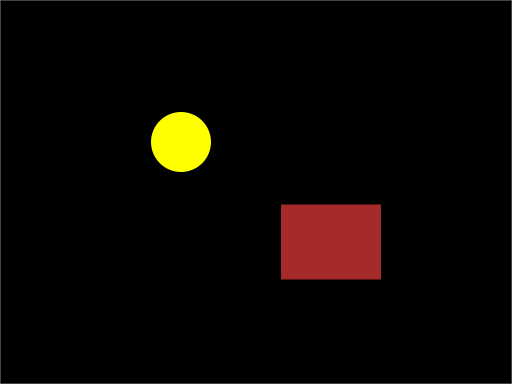

# Ensimmäinen graafinen ohjelma

Konsoliohjelmat ovat hyvä tapa oppia, mutta tunnustetaan: tekstiä tulostava
ohjelma ei ole se, minkä takia useimmat haluavat oppia ohjelmoimaan. Nyt
tehdään ensimmäinen graafinen ohjelma *Jypeli*-kirjastolla: avataan
ikkuna ja piirretään siihen jotakin. Samalla nähdään, mitä *kirjaston*
käyttäminen käytännössä tarkoittaa.

Esimerkeissä käytetään olioita (`new`, ominaisuudet, `Add`) selittämättä niitä
vielä tarkasti. Olioihin palataan kunnolla
[myöhemmin](../osa3/4-jypeli-ja-oliot.md). Nyt riittää, että saat jotakin
näkyviin ja uskallat muuttaa sitä.

## Miksi pelikirjasto?

Ajattele, mitä kaikkea vaaditaan, jotta näytöllä liikkuu pallo: on avattava
ikkuna, piirrettävä pallo pikseli kerrallaan, pyyhittävä se pois ja
piirrettävä uuteen paikkaan kuusikymmentä kertaa sekunnissa, luettava
näppäimistöä ja laskettava, osuuko pallo seinään. Jokainen näistä on
itsessään viikkojen työ, eikä yksikään niistä ole *sinun* pelisi idea.

*Pelimoottori* on kirjasto, joka on tehnyt tämän kaiken valmiiksi. Jypeli on
Jyväskylän yliopistossa kehitetty, C#-kielellä kirjoitettu pelimoottori, joka
on suunniteltu erityisesti opetuskäyttöön. Sillä tehdään esimerkiksi:

* **Fysiikkapelejä**, joissa esineet putoavat, pomppivat ja törmäilevät ilman
  että törmäyksiä lasketaan itse. Linkopeli, jossa ammutaan esineitä kohti
  rakennelmia, on klassinen harjoitustyön aihe.
* **Tasohyppelyitä**, joissa hahmo juoksee ja hyppii kentässä, jonka voi
  piirtää tekstitiedostoon merkeillä `#` ja `*`.
* **Pong-, Breakout- ja Asteroids-tyylisiä klassikoita**, jotka mahtuvat
  muutamaan sataan riviin.

Tämän kurssin [harjoitustyö](../harjoitustyo.md) on Jypeli-peli. Jypeliin on
tarjolla paljon valmiita ohjeita ja esimerkkejä, jotka auttavat sinua pääsemään
alkuun pelien tekemisessä:

* [Jypelin ohjeet](https://jypeli.it.jyu.fi)
* [Jypelin koodidokumentaatio](http://kurssit.it.jyu.fi/npo/material/latest/documentation/html/)

## Ensimmäinen Jypeli-ohjelma

Tehdään pieni Jypeli-peli, jossa luodaan ikkuna ja piirretään siihen ympyrä.
Peli tehdään omaan projektiinsa `YmpyraPeli`, joka lisätään
[aiemmin tehtyyn](./4-ohjelmointiymparisto-kuntoon.md) `Demo1`-solutioniin
`HelloWorld`-projektin rinnalle.

1. Lisää `Demo1`-solutioniin uusi projekti samaan tapaan kuin
   [konsoliprojekti](./4-ohjelmointiymparisto-kuntoon.md#uusi-projekti-solutioniin):
   klikkaa Explorer-paneelissa solutionin nimeä `Demo1` hiiren oikealla
   painikkeella ja valitse *Add* › *New Project*.
2. Valitse *Custom Templates* -listasta `Fysiikkapeli`-projektimalli.
3. Anna nimeksi `YmpyraPeli`. Rider nimeää projektin mukaan myös
   kooditiedoston (`YmpyraPeli.cs`) ja siinä olevan luokan, joten luokan nimi
   on sama kuin alla olevassa koodissa.
4. Paina `Create`. Ensimmäisellä kerralla Rider lataa Jypeli-kirjaston ja muut
   tarvittavat paketit verkosta, mikä voi kestää hetken.

### Ensimmäinen ajo

Kaksoisklikkaa Explorer-paneelissa `YmpyraPeli.cs`-tiedostoa. Koodissa
pitäisi näkyä:

```csharp,ignore
public class YmpyraPeli : PhysicsGame
{
    public override void Begin()
    {
        // Kirjoita ohjelmakoodisi tähän
        PhoneBackButton.Listen(ConfirmExit, "Lopeta peli");
        Keyboard.Listen(Key.Escape, ButtonState.Pressed, ConfirmExit, "Lopeta peli");
    }
}
```

Kaksi viimeistä riviä ovat valmista koodia, jolla peli sulkeutuu
<kbd>Esc</kbd>-näppäimestä. Niihin ei tarvitse koskea.

Käynnistä peli klikkaamalla Explorerissa projektin nimeä `YmpyraPeli` hiiren
oikealla ja valitsemalla Run 'YmpyraPeli'. Näytölle pitäisi avautua ikkuna
vaaleansinisellä taustalla. Ikkuna on tyhjä, ja se on tässä vaiheessa täysin
oikein. Sulje ikkuna.

Pyyhi pois rivi `// Kirjoita ohjelmakoodisi tähän` ja kirjoita tilalle:

```csharp,ignore
GameObject ympyra = new GameObject(50, 50);
ympyra.Shape = Shape.Circle;
ympyra.X = 0; // Asetetaan ympyrä keskelle ikkunaa
ympyra.Y = 0; 
Add(ympyra); // Lisätään ympyrä peliin
```

Käynnistä peli uudestaan. Nyt ikkunan keskellä pitäisi näkyä pieni ympyrä.

Huomasitko täydennyksen? Kun kirjoitit `ympyra.`, Rider tarjosi listan siitä,
mitä kaikkea peliolion kanssa voi tehdä. Jypelin aliohjelmien ja ominaisuuksien
nimiä ei tarvitse opetella ulkoa, kun täydennystä käyttää tietoisesti.

Kokonaisuudessaan ohjelma on tällainen. Voit kokeilla sitä myös suoraan tällä
sivulla klikkaamalla koodilaatikon oikean yläreunan vihreää "Play"-painiketta.
Valmiit <kbd>Esc</kbd>-rivit on jätetty tästä pois; ne saavat jäädä omaan
koodiisi.

```csharp,feature-jypeli
using Jypeli;
public class YmpyraPeli : PhysicsGame
{
    public override void Begin()
    {
        GameObject ympyra = new GameObject(50, 50);
        ympyra.Shape = Shape.Circle; 
        ympyra.X = 0; // Asetetaan ympyrä keskelle ikkunaa
        ympyra.Y = 0; 
        Add(ympyra); // Lisätään ympyrä peliin
    }
}
```

Huh! Siinä oli jo aika paljon uutta. Käydään koodi läpi vaiheittain.

Ensimmäinen rivi ottaa Jypeli-kirjaston käyttöön. Ilman sitä kääntäjä ei
tietäisi, mitä `GameObject` tai `Shape` tarkoittavat.

```csharp,ignore
using Jypeli;
```

Luokka määritellään samoin kuin konsoliohjelmassa, mutta perään on lisätty
`: PhysicsGame`. Se tarkoittaa, että luokkamme *on* Jypelin fysiikkapeli ja saa
käyttöönsä kaiken, mitä Jypeli osaa. `Begin` on aliohjelma, jonka Jypeli
suorittaa, kun peli käynnistyy; se vastaa konsoliohjelman `Main`-aliohjelmaa.

```csharp,ignore
public class YmpyraPeli : PhysicsGame
{
    public override void Begin()
```

`Begin`-aliohjelman ensimmäinen rivi luo uuden muuttujan nimeltä `ympyra`, joka
on tyyppiä `GameObject`. Sen leveydeksi ja korkeudeksi annetaan `50`.

```csharp,ignore
GameObject ympyra = new GameObject(50, 50);
```

Seuraavaksi asetamme `ympyra`-muuttujan muodoksi `Shape.Circle` ja sijainniksi
pelialueen keskipiste (0, 0).

```csharp,ignore
ympyra.Shape = Shape.Circle; // Asetetaan muodoksi Shape.Circle
ympyra.X = 0; // Asetetaan ympyrä keskelle ikkunaa
ympyra.Y = 0; 
```

Lopuksi lisäämme `ympyra`-muuttujan näkyviin kutsumalla Jypelin `Add`-metodia.
`ympyra`-olio on kyllä olemassa jo heti ensimmäisen rivin jälkeen, mutta se
pitää erikseen vielä lisätä "pelimaailmaan". Unohtunut `Add` on 
yleisin syy siihen, että ikkuna on tyhjä ja kääntäjä täysin tyytyväinen.

```csharp,ignore
Add(ympyra); // Lisätään ympyrä peliin
```

### Mitä syntyi?

Jypeli-projektin kansio poikkeaa hieman konsoliprojektista:

```bob
Demo1
 |-Demo1.sln
 |-HelloWorld
 '-YmpyraPeli          <- tämä tehtiin nyt
    |- bin
    |- obj
    |- YmpyraPeli.cs     <- oma koodi
    |- Ohjelma.cs        <- pääohjelma Main
    '- YmpyraPeli.csproj
```

Projektissa on kaksi kooditiedostoa. Oma koodi kirjoitetaan tiedostoon
`YmpyraPeli.cs`. Tiedostossa `Ohjelma.cs` on `Main`-pääohjelma, jonka ainoa
tehtävä on käynnistää peli; sitä ei tarvitse eikä pidä muokata. Jos kopioit
esimerkin, jossa on oma `Main`, poista se omasta luokastasi, sillä projektissa
saa olla vain yksi `Main`.

Projektitiedostossa `YmpyraPeli.csproj` lukee, että projekti tarvitsee
Jypeli-kirjaston ja minkä version. Siksi Rider osasi hakea Jypelin verkosta
itse. Tätä kirjaston käyttäminen käytännössä on: projekti kertoo, mitä
kirjastoa tarvitaan, ja `using`-rivi ottaa sen käyttöön koodissa.

## Koordinaatisto

Jypelin koordinaatisto on samanlainen kuin matematiikan tunnilla: origo
`(0, 0)` on ikkunan keskellä, x kasvaa oikealle ja y kasvaa *ylöspäin*. Moni
muu grafiikkakirjasto laskee y:n ylhäältä alas, joten tämä on hyvä painaa
mieleen.

```bob
                    y
                    ^
     "(-150, 100)"  |
          o         |
                    |
  ------------------+------------------> x
                    | "(0, 0)"
                    |
                    |          o "(150, -100)"
                    |
```

Ikkunan reunojen koordinaatit saa Jypeliltä ominaisuuksista `Screen.Left`,
`Screen.Right`, `Screen.Top` ja `Screen.Bottom`, joten esineen voi sijoittaa
reunaan tietämättä ikkunan kokoa.

## Kokeile itse

Muokkaa yllä olevaa esimerkkiä ja aja se uudelleen jokaisen muutoksen jälkeen.
Pienet kokeilut ovat nopein tapa oppia, mitä kirjasto osaa.

1. Vaihda ympyrän kooksi `120, 120` ja muuttujan nimeksi `aurinko`. Nimi
   pitää vaihtaa jokaiselle riville, jolla se esiintyy.
2. Vaihda auringon väriksi keltainen ennen `Add`-riviä:
   `aurinko.Color = Color.Yellow;`.
3. Siirrä aurinko vasempaan yläkulmaan antamalla `X`:n arvoksi `-150` ja
   `Y`:n arvoksi `100`. Piste on sama kuin koordinaatistokuvassa.
4. Lisää toinen olio `talo` kopioimalla auringon kuusi riviä ja vaihtamalla
   nimi, koko `200, 150`, muoto `Shape.Rectangle`, väri `Color.Brown` ja
   sijainti `(150, -100)`.
5. Vaihda tausta mustaksi lisäämällä `Begin`-aliohjelman alkuun rivi
   `Level.Background.Color = Color.Black;`.

Lopuksi pelin pitäisi näyttää tältä:



<details closed>
<summary>Mallikoodi: kokeile ensin kirjoittaa itse ja katso vasta sitten</summary>

```csharp,feature-jypeli
using Jypeli;
public class YmpyraPeli : PhysicsGame
{
    public override void Begin()
    {
        Level.Background.Color = Color.Black;

        GameObject aurinko = new GameObject(120, 120);
        aurinko.Shape = Shape.Circle;
        aurinko.Color = Color.Yellow;
        aurinko.X = -150;
        aurinko.Y = 100;
        Add(aurinko);

        GameObject talo = new GameObject(200, 150);
        talo.Shape = Shape.Rectangle;
        talo.Color = Color.Brown;
        talo.X = 150;
        talo.Y = -100;
        Add(talo);
    }
}
```

</details>

Huomaa, että jokaisella oliolla on oma muuttujansa (`aurinko`, `talo`) ja
jokainen pitää erikseen lisätä peliin `Add`-kutsulla.

Kokeile vielä muita muotoja, kuten `Shape.Triangle` ja `Shape.Star`, ja siirrä
talo samaan kohtaan kuin aurinko. Ohjelma suoritetaan ylhäältä alas, joten
myöhemmin lisätty olio piirtyy aiemman päälle.

## Eri Jypeli-projektimallit

Jypeli-projektin voi tehdä valitsemalla solutionia tai projektia luodessa
`Custom Templates` -kohdasta oikean projektimallin.

- `ConsoleMain` (Konsolisovellukset, joissa on Ohj1 kurssin pohja)
- `Fysiikkapeli` (Fysiikkaa käyttävät pelit ja muut graafiset sovellukset)
- `Tasohyppelypeli` (Esimerkkipeli)
- `Android Fysiikkapeli` (Android-alustaa varten)

Solutionin ja projektin luominen on kuvattu kohdassa
[Uusi solution](./4-ohjelmointiymparisto-kuntoon.md#uusi-solution).

## Tyypillisiä ongelmia

**Ikkuna ei aukea, vaan konsoliin tulee pitkä punainen virheilmoitus.** Lue
ilmoituksen ensimmäinen rivi; usein siinä lukee tiedoston nimi ja
rivinumero. Jos ilmoitus mainitsee paketin, jota ei löydy (*package* tai
*restore*), Jypeliä ei ole vielä ladattu: tarkista verkkoyhteys ja käännä
uudelleen valitsemalla *Build* › *Rebuild Solution*.

**Ikkuna aukeaa, mutta se on tyhjä.** Olio on luotu, mutta sitä ei ole lisätty
peliin. Tarkista, että jokaiselle oliolle on oma `Add`-kutsu.

**Ohjelmassa on kaksi `Main`-pääohjelmaa.** Jypeli-projektissa `Main` on
tiedostossa `Ohjelma.cs`. Jos kopioit esimerkin, jossa on oma `Main`, poista
se omasta luokastasi.

Lisää ongelmatilanteita ja niiden ratkaisuja on koottu
[Työkalut-sivulle](../tyokalut.md#ongelmatilanteita-ja-niiden-ratkaisuja).

## Yhteenveto

* Jypeli on pelikirjasto: ikkuna, piirtäminen, fysiikka ja ohjaimet ovat
  valmiina.
* Jypeli-peli tehdään `Fysiikkapeli`-projektimallista. Oma koodi kirjoitetaan
  projektin nimen mukaiseen tiedostoon; `Main` on valmiina tiedostossa
  `Ohjelma.cs`.
* Jypeli-peli on luokka, joka perii `PhysicsGame`-luokan. `Begin` suoritetaan
  pelin alkaessa.
* Peliolio luodaan `new`-sanalla, sen ominaisuuksia (muoto, väri, sijainti)
  asetetaan pisteellä, ja se lisätään peliin `Add`-kutsulla.
* Origo on ikkunan keskellä ja y kasvaa ylöspäin.

## Testaa tietosi

Valitse vastaus, niin näet heti, menikö se oikein ja miksi. Pisteitä ei jaeta,
mutta huomaat, mitä asioita kannattaa vielä kerrata.

<visa>

**Totta vai tarua?**

<vaittama vastaus="tarua">
Jypelissä origo `(0, 0)` on ikkunan vasemmassa yläkulmassa.
<perustelu>
**Tarua.** Origo on ikkunan keskellä, ja y kasvaa ylöspäin kuten
matematiikassa. Monessa muussa grafiikkakirjastossa asia on toisin, joten
sekaannus on ymmärrettävä.
</perustelu>
</vaittama>

<vaittama vastaus="totta">
`Begin`-aliohjelma suoritetaan kerran, kun peli käynnistyy.
<perustelu>
**Totta.** Siihen kirjoitetaan pelin alkutilanne: taustaväri, oliot ja niiden
lisääminen peliin.
</perustelu>
</vaittama>

<vaittama vastaus="tarua">
Kun olio on luotu `new`-sanalla, se näkyy ruudulla heti.
<perustelu>
**Tarua.** Luotu olio on vain muistissa, kunnes se lisätään peliin
`Add`-kutsulla. Unohtunut `Add` on yleisin syy tyhjään ruutuun.
</perustelu>
</vaittama>

**Monivalinta.** Yksi vaihtoehto on oikein.

<kysymys>
Mikä rivi saa pallon näkymään pelissä?

- [ ] `pallo.Color = Color.White;`
- [x] `Add(pallo);`
- [ ] `GameObject pallo = new GameObject(200, 200);`
- [ ] `Level.Background.Color = Color.Black;`

<perustelu>
**b.** Vaihtoehto c luo olion muistiin, mutta ei lisää sitä peliin. a asettaa
pallon värin ja d taustan värin. Ilman `Add`-kutsua kumpikaan ei näy missään.
</perustelu>
</kysymys>

<kysymys>
Olion sijainniksi asetetaan x = 0 ja y = `Screen.Top`. Missä olio näkyy?

- [ ] Ikkunan keskellä
- [x] Ikkunan yläreunassa keskellä
- [ ] Ikkunan alareunassa keskellä
- [ ] Ikkunan oikeassa reunassa

<perustelu>
**b.** x = 0 on vaakasuunnassa keskellä, ja `Screen.Top` on yläreunan
y-koordinaatti. Koska y kasvaa ylöspäin, yläreuna on positiivisella puolella.
Puolet oliosta jää tosin reunan taakse piiloon, sillä sijainti tarkoittaa olion
keskipistettä.
</perustelu>
</kysymys>

</visa>

## Tehtävät

<!-- Vaiheessa B: tehtävät "Oma kuvio" (vähintään kolme eri muotoista ja
     väristä oliota) ja "Lumiukko" (kolme palloa päällekkäin). -->

<task>
  <task-title num="1.8">Kolmiot <points>1 p.</points></task-title>
  <handout>

  {{#include ../tehtavat/1-8-kolmiot/handout.md}}

  </handout>
</task>
