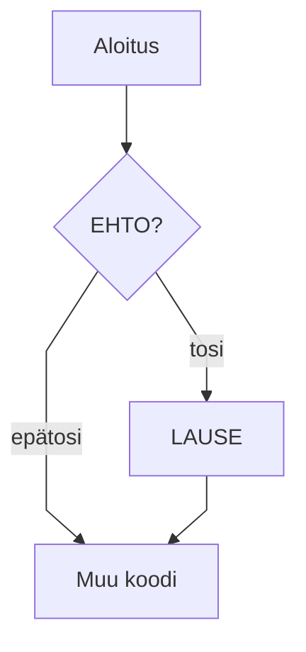

# Muuttujat


Taulukko

| Avainsana | Selitys                           |
| --------- | --------------------------------- |
| public    | näkyvyysmodifikaattori — julkinen |
| static    | staattinen — kuuluu luokalle      |
| void      | ei palauta arvoa                  |


Huomautus

> [!NOTE]
> Huomautus!

Toinen

> [!HUOMAUTUS]
> Huom!

> [!VINKKI]
> Tässä voit tehdä myös näin:
> 
> ```java
> void main() {
>    IO.readln("Lue rivi >");
> }
> ```

Mermaid-tuki



Testi!