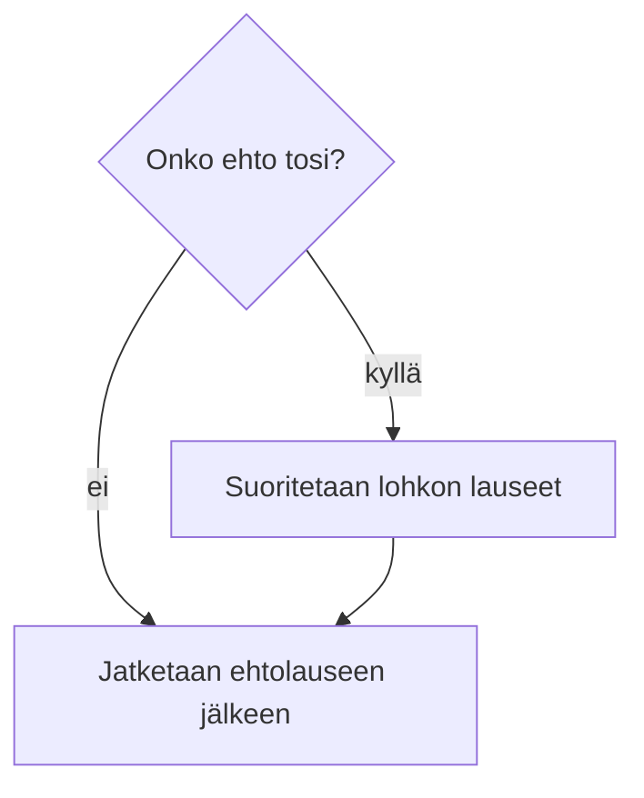
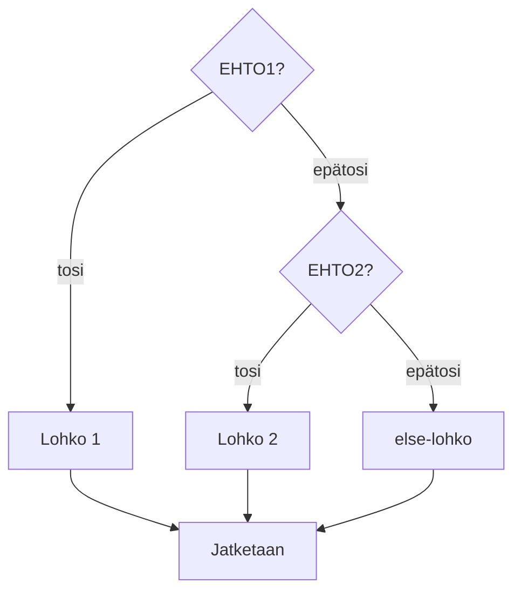

# 🔀 Ehtolauseet

Tähän asti ohjelmamme ovat tehneet joka kerta täsmälleen saman asian. Se on
harvoin tarpeeksi. *Ehtolauseella* ohjelma tekee valinnan: jos ehto on
voimassa, suoritetaan yksi asia, muuten jokin toinen. Valinta on yksi
[kolmesta perusrakenteesta](../osa1/1-mita-ohjelmointi-on.md#algoritmi-eli-ohje),
jotka tekevät ohjelmasta muutakin kuin listan käskyjä.

## Mihin ehtolauseita tarvitaan?

* **Herätyskello.** Jos on arkipäivä, soita. Muuten anna nukkua. Ilman ehtoa
  kello soisi joka aamu tai ei koskaan.
* **Peli.** Jos pallo osuu maaliin, lisää piste ja siirrä pallo keskelle. Jos
  pelaajan elämät ovat nollassa, näytä "Game over". Lähes kaikki, mitä pelissä
  tapahtuu, on jonkin ehdon seurausta.
* **Lomake.** Jos salasana on alle kahdeksan merkkiä, näytä virheilmoitus
  äläkä päästä eteenpäin.
* **Arvosana.** Jos pisteitä on vähintään 90, arvosana on 5; muuten jos
  vähintään 80, arvosana on 4; ja niin edelleen. Tämä on ketju ehtoja, joista
  vain yksi toteutuu.

Ehto on aina *totuusarvoinen lauseke*: jotakin, jonka arvo on `true` tai
`false`. Edellisen luvun [vertailu- ja loogiset
operaattorit](./4-operaattorit.md#vertailuoperaattorit) ovat juuri sitä
varten.

## `if`-lause

`if`-lause suorittaa lohkon lauseet vain, jos ehto on tosi. Muuten lohko
hypätään yli ja suoritus jatkuu sen jälkeen.



Koodissa tämä näyttää seuraavalta.

```csharp,ignore
if (EHTO)
{
    // Suoritetaan, jos ehto on voimassa
}
// Tänne jatketaan joka tapauksessa
```

`EHTO`-sanan kohdalle kirjoitetaan totuusarvon tuottava lauseke. Sulkeet ovat
pakolliset, eikä rivin loppuun tule puolipistettä.

```csharp
using System;

public class Lampotila
{
    public static void Main()
    {
        int lampotila = 27;

        if (lampotila > 25)
        {
            Console.WriteLine("On helle!");
        }
        Console.WriteLine($"Lämpötila on {lampotila} astetta.");
    }
}
```

Kokeile muuttaa lämpötilaa arvoon `15` ja aja ohjelma uudelleen. Ensimmäinen
rivi jää tulostumatta, toinen tulostuu aina.

Ehto voi olla myös suoraan `bool`-muuttuja. Kirjoita `if (peliOhi)`, ei
`if (peliOhi == true)`. Jälkimmäinen toimii, mutta on kuin sanoisi "jos on
totta, että on totta".

## `else`: muuten

Usein halutaan tehdä jotakin myös silloin, kun ehto ei ole voimassa.
`else`-osa suoritetaan täsmälleen silloin, kun `if`-osan ehto on epätosi.
Toinen ja vain toinen lohkoista suoritetaan.

```csharp
using System;

public class ParitonParillinen
{
    public static void Main()
    {
        int luku = 17;

        if (luku % 2 == 0)
        {
            Console.WriteLine($"{luku} on parillinen.");
        }
        else
        {
            Console.WriteLine($"{luku} on pariton.");
        }
    }
}
```

## `else if`: useita vaihtoehtoja

Kun vaihtoehtoja on enemmän kuin kaksi, ehtoja ketjutetaan `else if` -osilla.
Ehdot tarkistetaan järjestyksessä ylhäältä alas, ja *vain ensimmäinen* tosi
haara suoritetaan. Viimeinen `else` on vapaaehtoinen ja suoritetaan, jos mikään
ehto ei ollut tosi.



```csharp
using System;

public class Arvosana
{
    public static void Main()
    {
        int pisteet = 83;
        int arvosana;

        if (pisteet >= 90)
        {
            arvosana = 5;
        }
        else if (pisteet >= 80)
        {
            arvosana = 4;
        }
        else if (pisteet >= 70)
        {
            arvosana = 3;
        }
        else if (pisteet >= 60)
        {
            arvosana = 2;
        }
        else if (pisteet >= 50)
        {
            arvosana = 1;
        }
        else
        {
            arvosana = 0;
        }

        Console.WriteLine($"Pisteet {pisteet}, arvosana {arvosana}");
    }
}
```

Huomaa, että toisen haaran ehdossa ei tarvitse kirjoittaa `pisteet >= 80 &&
pisteet < 90`: jos suoritus on päässyt toiseen haaraan asti, ensimmäinen ehto
oli jo epätosi, joten pisteet ovat varmasti alle 90. Järjestyksellä on siis
väliä. Jos haarat kirjoittaisi käänteisessä järjestyksessä (`>= 50` ensin),
kaikki yli 50 pisteen suoritukset saisivat arvosanan 1.

## Loogiset operaattorit ehdoissa

Ehtoja yhdistetään operaattoreilla `&&` (ja), `||` (tai) ja `!` (ei).

```csharp
using System;

public class Alennus
{
    public static void Main()
    {
        int ika = 20;
        bool onkoOpiskelija = true;

        if (ika < 18 || ika >= 65 || onkoOpiskelija)
        {
            Console.WriteLine("Saat alennuksen.");
        }

        if (ika >= 18 && !onkoOpiskelija)
        {
            Console.WriteLine("Täysi hinta.");
        }
    }
}
```

Totuustaulut kertovat operaattorien tuloksen kaikilla yhdistelmillä:

| `a`     | `b`     | `a && b` | a \|\| b | `!a`    |
| ------- | ------- | -------- | -------- | ------- |
| `true`  | `true`  | `true`   | `true`   | `false` |
| `true`  | `false` | `false`  | `true`   | `false` |
| `false` | `true`  | `false`  | `true`   | `true`  |
| `false` | `false` | `false`  | `false`  | `true`  |

Kaksi tavallista sudenkuoppaa:

* **Matematiikan tapa ei toimi.** `0 < luku < 10` ei ole C#:a. Kirjoita
  `luku > 0 && luku < 10`. Sama koskee muotoa `luku > 0 && < 10`, josta
  puuttuu toinen vertailtava.
* **"Tai" tarkoittaa eri asiaa kuin puheessa.** "Jos luku on 1 tai 2" on
  koodissa `luku == 1 || luku == 2`, ei `luku == 1 || 2`.

## Sisäkkäiset ehtolauseet

Ehtolauseen lohkon sisällä voi olla uusi ehtolause. Näin syntyy päätöspuu.

```csharp
using System;

public class Sisakkain
{
    public static void Main()
    {
        int lampotila = 3;
        bool sataa = true;

        if (lampotila < 5)
        {
            if (sataa)
            {
                Console.WriteLine("Räntää. Ota sadetakki ja pipo.");
            }
            else
            {
                Console.WriteLine("Kylmä mutta kuiva. Ota pipo.");
            }
        }
        else
        {
            Console.WriteLine("Ei tarvitse pipoa.");
        }
    }
}
```

Sisäkkäisyys on tehokasta, mutta yli kolmen tason päätöspuu on jo vaikea
lukea. Silloin kannattaa miettiä, voisiko osan ehdoista yhdistää
`&&`-operaattorilla tai siirtää aliohjelmaan (osa 3).

## `switch`

Kun samaa muuttujaa verrataan moneen kiinteään arvoon, `switch`-rakenne on
usein `else if` -ketjua luettavampi. Jokainen `case` on yksi vaihtoehto, ja
`default` vastaa `else`-osaa. Haara päättyy `break`-lauseeseen.

```csharp
using System;

public class Viikonpaiva
{
    public static void Main()
    {
        int paiva = 6;

        switch (paiva)
        {
            case 1:
                Console.WriteLine("Maanantai");
                break;
            case 6:
            case 7:
                Console.WriteLine("Viikonloppu!");
                break;
            default:
                Console.WriteLine("Arkipäivä");
                break;
        }
    }
}
```

Kaksi `case`-riviä peräkkäin (`case 6:` ja `case 7:`) tarkoittaa, että sama
haara suoritetaan molemmilla arvoilla.

Uudemmissa C#-versioissa `case`-riville voi kirjoittaa myös vertailun:

```csharp
using System;

public class Vertailut
{
    public static void Main()
    {
        int luku = 47;
        switch (luku)
        {
            case < 50:
                Console.WriteLine("Luku on pienempi kuin 50");
                break;
            case > 50:
                Console.WriteLine("Luku on suurempi kuin 50");
                break;
            default:
                Console.WriteLine("Luku on 50");
                break;
        }
    }
}
```

## Tyypillisiä virheitä

**Sijoitus vertailun sijaan.** `if (luku = 5)` yrittää sijoittaa luvun ja
antaa virheen `CS0029: Cannot implicitly convert type 'int' to 'bool'`.
Tarkoitus oli `if (luku == 5)`.

**Puolipiste `if`-rivin lopussa.** Rivi `if (luku > 5);` on laillinen, mutta
puolipiste päättää ehtolauseen tyhjänä, ja seuraava lohko suoritetaan aina.
Rider varoittaa tästä (*Possible mistaken empty statement*). Klikkaa Play ja
katso, mitä ohjelma tulostaa. Korjaa sitten virhe.

```csharp
using System;

public class Puolipiste
{
    public static void Main()
    {
        int luku = 3;
        if (luku > 5);
        {
            Console.WriteLine("Luku on suurempi kuin 5. Vai onko?");
        }
    }
}
```

**Aaltosulut pois.** Jos lohkossa on vain yksi lause, C# sallii aaltosulkujen
jättämisen pois. Tällä kurssilla aaltosulut kirjoitetaan aina, koska ilman
niitä toisen lauseen lisääminen lohkoon menee helposti pieleen: sisennys
näyttää oikealta, mutta vain ensimmäinen lause kuuluu ehtoon.

## Yhteenveto

* `if (ehto) { ... }` suorittaa lohkon vain, kun ehto on tosi; `else`-lohko
  suoritetaan muuten.
* `else if` -ketjusta suoritetaan ensimmäinen tosi haara; järjestyksellä on
  väliä.
* Ehdot yhdistetään operaattoreilla `&&`, `||` ja `!`.
* `switch` sopii, kun yhtä arvoa verrataan moneen vaihtoehtoon.
* Kirjoita `==` vertailuun, älä laita puolipistettä `if`-rivin perään ja
  käytä aina aaltosulkuja.

## 🤔 Testaa tietosi

Päätä vastaus ensin ja avaa se vasta sitten. Pisteitä ei jaeta, mutta hämärät
kohdat paljastuvat.

<visa>

**Totta vai tarua?**

<details data-vastaus="tarua"><summary>1. <code>if (luku = 5)</code> tarkistaa, onko <code>luku</code> viisi.</summary>

**Tarua.** Yksi `=` on sijoitus, vertailu kirjoitetaan `==`. Tämä ei edes
käänny, koska sijoituksen tulos on `int` eikä `bool`. Kääntäjä ilmoittaa
CS0029.

</details>

<details data-vastaus="tarua"><summary>2. <code>else if</code> -ketjusta suoritetaan kaikki haarat, joiden ehto on tosi.</summary>

**Tarua.** Vain ensimmäinen tosi haara suoritetaan, loput ohitetaan. Siksi
järjestyksellä on väliä: arvosanaketjussa on testattava suurin raja ensin.

</details>

<details data-vastaus="totta"><summary>3. <code>else</code>-haaralle ei kirjoiteta ehtoa.</summary>

**Totta.** `else` suoritetaan, kun mikään edeltävä ehto ei ollut tosi. Ehto on
siis "kaikki muu".

</details>

**Monivalinta.** Yksi vaihtoehto on oikein.

**4.** Mitä seuraava koodi tulostaa?

```csharp,ignore
int luku = 2;
if (luku > 5);
{
    Console.WriteLine("Iso luku");
}
```

a) `Iso luku`\
b) Ei mitään\
c) Käännösvirheen\
d) `2`

<details data-vastaus="a"><summary>Näytä vastaus</summary>

**a**, vaikka luku on pieni. Puolipiste `if`-rivin perässä on tyhjä lause, ja
se on koko `if`-lauseen runko. Aaltosulkulohko ei enää kuulu ehtoon, joten se
suoritetaan aina. Kääntäjä antaa varoituksen CS0642, mutta kääntää ohjelman.

</details>

**5.** Muuttujassa `paiva` on 7. Mitä alla oleva `switch` tulostaa?

```csharp,ignore
switch (paiva)
{
    case 1:
        Console.WriteLine("Maanantai");
        break;
    case 6:
    case 7:
        Console.WriteLine("Viikonloppu!");
        break;
    default:
        Console.WriteLine("Arkipäivä");
        break;
}
```

a) `Maanantai`\
b) `Viikonloppu!`\
c) `Arkipäivä`\
d) `Viikonloppu!` ja `Arkipäivä`

<details data-vastaus="b"><summary>Näytä vastaus</summary>

**b.** Peräkkäiset `case 6:` ja `case 7:` jakavat saman haaran. `break`
lopettaa `switch`-lauseen, joten `default`-haaraa ei suoriteta.

</details>

</visa>

## Tehtävät

<!-- Vaiheessa B: "Parillinen vai pariton", "Arvosana", "Karkausvuosi"
     (&&, ||), "Mitä ohjelma tulostaa?" (else if -järjestys), switch-tehtävä. -->
