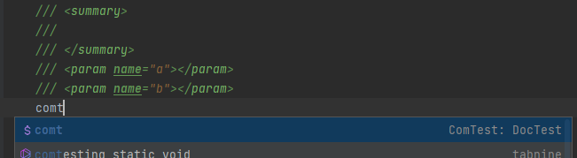

# Aliohjelmien yksikkötestaus ComTest-työkalulla

ComTest on Jyväskylän yliopistossa kehitetty yksikkötestaustyökalu, jolla
pieniä koodinpätkiä, kuten aliohjelmia, voidaan testata erikseen muusta
ohjelmakoodista. Testissä kutsutaan testattavaa aliohjelmaa erilaisilla
syötteillä ja tarkistetaan, että se palauttaa odotetut arvot. Kun testit on
kerran kirjoitettu, ne voi ajaa uudelleen aina koodia muutettuaan ja nähdä
heti, toimiiko aliohjelma edelleen.

ComTest on Riderin lisäosa. Jos et ole vielä asentanut sitä, tee se ensin
[Työkalut-sivun ohjeilla](../tyokalut.md#comtest).

## Miltä ComTest-testi näyttää?

ComTest-testit kirjoitetaan testattavan aliohjelman dokumentaatiokommenttiin
`<example>`- ja `<pre name="test">`-tagien sisään. Alla on testit
`Summa`-aliohjelmalle, joka laskee kahden kokonaisluvun summan:

```csharp,ignore
/// <summary>
/// Laskee kahden kokonaisluvun summan.
/// </summary>
/// <param name="a">ensimmäinen luku</param>
/// <param name="b">toinen luku</param>
/// <returns>lukujen summa</returns>
/// <example>
/// <pre name="test">
/// Summa(2, 3) === 5;
/// Summa(-1, 1) === 0;
/// Summa(0, 0) === 0;
/// </pre>
/// </example>
public static int Summa(int a, int b)
{
    return a + b;
}
```

Jokainen `===`-rivi on yksi testitapaus: vasemmalla puolella on aliohjelman
kutsu ja oikealla puolella arvo, joka kutsun pitää palauttaa. Esimerkiksi
ensimmäinen rivi testaa, että kutsumalla `Summa(2, 3)` tulisi saada arvo `5`.
Testit ovat samalla aliohjelman käyttöesimerkkejä: lukija näkee niistä suoraan,
millaisella syötteillä aliohjelmaa voi kutsua ja mitä se palauttaa.

Kommentit eivät itsessään ole ajettavaa koodia. ComTest lukee ne ja tekee
niiden perusteella varsinaiset testit ohjelmasi rinnalle omaan testiprojektiinsa.

## Ensimmäinen testi vaihe vaiheelta

Testit kannattaa kirjoittaa *ennen* kuin aliohjelma on valmis. Silloin joudut
miettimään etukäteen, mitä aliohjelman pitää palauttaa, ja näet testeistä,
milloin toteutus on valmis. Tehdään `Summa` tällä tavalla.

1. Kirjoita aliohjelmasta ensin tynkä, joka kääntyy mutta palauttaa vielä
    väärän arvon. Lisää se luokan sisään, pääohjelman ulkopuolelle:

    ```csharp,ignore
    public static int Summa(int a, int b)
    {
        return 0;
    }
    ```

2. Siirrä kursori aliohjelman yläpuolelle tyhjälle riville ja kirjoita `///`.
    Rider luo dokumentaatiokommentin rungon. Täydennä siihen, mitä aliohjelma
    tekee, mitä parametrit tarkoittavat ja mitä aliohjelma palauttaa.

3. Lisää dokumentaatiokommentin alle uusi tyhjä rivi, kirjoita sille `comt` ja
    varmista, että ehdotuslistassa on valittuna *comt &ndash; ComTest: DocTest*.
    Paina <kbd>Enter</kbd>, niin kommentin loppuun ilmestyy valmis pohja
    testeille:

    <animation scenes="images/comtest/scenes.js" scene="comt-pohja">

    

    ```csharp,ignore
    /// <example>
    /// <pre name="test">
    ///
    /// </pre>
    /// </example>
    ```

    </animation>

4. Kirjoita testit `<pre name="test">`- ja `</pre>`-rivien väliin:

    ```csharp,ignore
    /// Summa(2, 3) === 5;
    /// Summa(-1, 1) === 0;
    /// Summa(0, 0) === 0;
    ```

    Valitse testeihin erilaisia tapauksia: tavallisia arvoja, negatiivisia
    lukuja ja rajatapauksia, kuten nolla.

5. Tee kommenteista testikoodi valitsemalla *Tests* › *ComTest: Generate Tests
    from Solution*. Ensimmäisellä kerralla ComTest luo ohjelmasi rinnalle
    testiprojektin, joten tässä voi mennä hetki.

    Aja sitten testit valitsemalla *Tests* › *Run All Tests from Solution*.
    Tulokset avautuvat Riderin alareunaan *Unit Tests* -ikkunaan.

    Nyt tuloksen pitää olla punainen *Failed*, koska tynkä palauttaa aina
    nollan. Klikkaa epäonnistunutta testiä, niin näet, mitä arvoa odotettiin ja
    mitä aliohjelma palautti, esimerkiksi `Expected: 5` ja `But was: 0`.

6. Korjaa aliohjelman toteutus:

    ```csharp,ignore
    return a + b;
    ```

7. Aja testit uudelleen valitsemalla *Run All Tests from Solution*. Testejä ei
    tarvitse generoida uudelleen, koska muutit vain toteutusta etkä testejä.
    Nyt *Unit Tests* -ikkunassa pitäisi näkyä vihreä merkki ja teksti *Passed*.

Punainen tulos ensimmäisellä ajokerralla on hyvä merkki: se kertoo, että testit
todella tarkistavat jotain. Jos testit menisivät läpi jo tyngällä, ne eivät
huomaisi virheellistäkään toteutusta.

## Testien ajaminen

Testien ajamiseen tarvitaan Riderin *Tests*-valikosta kaksi komentoa:

- *ComTest: Generate Tests from Solution* tekee kommenteissa olevista
  ComTest-testeistä varsinaisen testikoodin tai päivittää sen, jos testit ovat
  muuttuneet. Tuloksia tämä ei vielä näytä.
- *Run All Tests from Solution* ajaa testikoodin ja näyttää tulokset
  *Unit Tests* -ikkunassa.

Kun olet lisännyt tai muuttanut testejä, valitse siis ensin *Generate Tests* ja
sitten *Run All Tests*. Jos ajat pelkän *Run All Tests* -komennon, Rider ajaa
vanhat testit eikä huomaa kommentteihin tekemiäsi muutoksia. Kun olet muuttanut
vain aliohjelman toteutusta, pelkkä *Run All Tests* riittää.

## Mitä ComTestillä testataan?

ComTest sopii parhaiten aliohjelmille, jotka saavat syötteensä parametreina ja
*palauttavat* tuloksen. Aliohjelmia, jotka lukevat näppäimistöltä
(`Console.ReadLine`) tai tulostavat näytölle (`Console.WriteLine`), ei tällä
opintojaksolla testata. Tämäkin on hyvä syy kirjoittaa laskenta omaksi
aliohjelmakseen ja pitää tulostaminen pääohjelmassa.

ComTestin lähdekoodi on JYU:n GitLabissa:
<https://gitlab.jyu.fi/tie/ohj1/Comtest>. Riderin ja IntelliJ IDEAn lisäosa on
omassa varastossaan: <https://gitlab.jyu.fi/tie/tools/comtest.intellij>.

## Esimerkkejä erilaisista testeistä

Testirivit ovat ComTestin merkintöjä ja tavallista C#-koodia sekaisin: voit
esimerkiksi luoda muuttujan yhdellä rivillä ja tarkistaa sen arvon seuraavalla.
Siksi rivit päätetään puolipisteeseen kuten muukin C#-koodi.

### Merkkijonot

Merkkijonoa verrataan `===`-merkinnällä kuten lukujakin. Muista testata myös
rajatapaukset, kuten tyhjä ja yhden merkin mittainen merkkijono:

```csharp,ignore
/// <summary>
/// Palauttaa merkkijonon alkupuoliskon.
/// </summary>
/// <param name="jono">merkkijono, josta puolikas otetaan</param>
/// <returns>merkkijonon alkupuolisko</returns>
/// <example>
/// <pre name="test">
/// Puolikas("") === "";
/// Puolikas("Abba") === "Ab";
/// Puolikas("Hiiri") === "Hi";
/// Puolikas("A") === "";
/// </pre>
/// </example>
public static string Puolikas(string jono)
{
    return jono.Substring(0, jono.Length / 2);
}
```

### Desimaaliluvut

Desimaalilukuja (`double`) ei voi verrata täsmälleen, koska tietokone esittää ne
likiarvoina: esimerkiksi `0.1 + 0.2` ei ole tarkalleen `0.3`. Käytä siksi
merkintää `~~~`, joka tarkoittaa "lähes yhtä suuri":

```csharp,ignore
/// <example>
/// <pre name="test">
/// Keskiarvo(1.0, 2.0) ~~~ 1.5;
/// Keskiarvo(0.1, 0.2) ~~~ 0.15;
/// Keskiarvo(-1.0, 1.0) ~~~ 0.0;
/// </pre>
/// </example>
public static double Keskiarvo(double a, double b)
{
    return (a + b) / 2;
}
```

Oletuksena luvut saavat erota toisistaan enintään 0,000001. Jos karkeampi
tarkkuus riittää, sen voi vaihtaa `#TOLERANCE`-rivillä ennen testejä:

```csharp,ignore
/// <pre name="test">
/// #TOLERANCE=0.01
/// Keskiarvo(1.0, 2.01) ~~~ 1.5;
/// </pre>
```

### Taulukot ja listat

Taulukoihin tutustutaan vasta seuraavassa osassa, mutta niiden testaaminen on
koottu tähän samaan paikkaan. Taulukkoa voi verrata suoraan toiseen taulukkoon
ja listaa toiseen listaan:

```csharp,ignore
/// <summary>
/// Palauttaa taulukon, jossa on luvut 0, 1, ..., n-1.
/// </summary>
/// <param name="n">lukujen määrä</param>
/// <returns>taulukko luvuista</returns>
/// <example>
/// <pre name="test">
/// Luvut(0) === new int[0];
/// Luvut(1) === new int[]{0};
/// Luvut(3) === new int[]{0, 1, 2};
/// </pre>
/// </example>
public static int[] Luvut(int n)
{
    int[] tulos = new int[n];
    for (int i = 0; i < n; i++) tulos[i] = i;
    return tulos;
}
```

Lista verrataan samalla tavalla. Jos `Luvut` palauttaisi taulukon sijasta
listan (`List<int>`), testirivi olisi `Luvut(3) === new List<int>{0, 1, 2};`.

Lyhyemmin saman voi kirjoittaa merkinnällä `=J=`, joka yhdistää vasemman puolen
alkiot merkkijonoksi pilkulla ja välilyönnillä eroteltuina:

```csharp,ignore
/// Luvut(3) =J= "0, 1, 2";
```

Desimaalilukuja sisältävät taulukot ja listat kannattaa verrata suoraan eikä
`=J=`-merkinnällä, koska merkkijonossa desimaalierotin riippuu koneen
kieliasetuksista (suomessa pilkku, englannissa piste).

### Kaksiulotteiset taulukot

> [!HUOMAUTUS]
> Kaksiulotteiset taulukot ovat kurssin valinnaista lisätietoa, ks. liite
> [Moniulotteiset taulukot](../liitteet/moniulotteiset-taulukot.md).

Kaksiulotteisia taulukoita testataan samaan tapaan kuin yksiulotteisia. Jos
aliohjelma saa taulukon parametrina, luo taulukko ensin muuttujaan omalla
testirivillään. Samaa taulukkoa voi sitten käyttää kaikissa sen jälkeisissä
testeissä:

```csharp,ignore
/// <summary>
/// Palauttaa rivin, jolta haettu luku löytyy ensimmäisen kerran.
/// </summary>
/// <param name="taulukko">taulukko, josta lukua haetaan</param>
/// <param name="luku">haettava luku</param>
/// <returns>rivin indeksi tai -1, jos lukua ei löydy</returns>
/// <example>
/// <pre name="test">
/// int[,] luvut = {{2, 4, 1}, {9, 2, 0}, {5, 6, 1}, {0, 12, 3}};
/// RiviJollaLuku(luvut, 1) === 0;
/// RiviJollaLuku(luvut, 0) === 1;
/// RiviJollaLuku(luvut, 12) === 3;
/// RiviJollaLuku(luvut, 11) === -1;
/// RiviJollaLuku(new int[0, 0], 1) === -1;
/// </pre>
/// </example>
public static int RiviJollaLuku(int[,] taulukko, int luku)
{
    for (int rivi = 0; rivi < taulukko.GetLength(0); rivi++)
    {
        for (int sarake = 0; sarake < taulukko.GetLength(1); sarake++)
        {
            if (taulukko[rivi, sarake] == luku) return rivi;
        }
    }
    return -1;
}
```

Kahdessa viimeisessä testissä lukua ei löydy: ensin taulukosta, jossa sitä ei
ole, ja sitten tyhjästä taulukosta `new int[0, 0]`.

Jos aliohjelma palauttaa kaksiulotteisen taulukon, sitä voi verrata
`===`-merkinnällä suoraan toiseen taulukkoon. Vertailu tarkistaa alkioiden
lisäksi taulukon muodon eli rivien ja sarakkeiden määrän:

```csharp,ignore
/// <summary>
/// Palauttaa taulukon, johon on numeroitu luvut 1, 2, 3, ... riveittäin.
/// </summary>
/// <param name="rivit">rivien määrä</param>
/// <param name="sarakkeet">sarakkeiden määrä</param>
/// <returns>numeroitu taulukko</returns>
/// <example>
/// <pre name="test">
/// Numerotaulukko(0, 0) === new int[0, 0];
/// Numerotaulukko(1, 1) === new int[,]{{1}};
/// Numerotaulukko(2, 3) === new int[,]{{1, 2, 3}, {4, 5, 6}};
/// Numerotaulukko(3, 2) === new int[,]{{1, 2}, {3, 4}, {5, 6}};
/// </pre>
/// </example>
public static int[,] Numerotaulukko(int rivit, int sarakkeet)
{
    int[,] tulos = new int[rivit, sarakkeet];
    int luku = 1;
    for (int rivi = 0; rivi < rivit; rivi++)
    {
        for (int sarake = 0; sarake < sarakkeet; sarake++)
        {
            tulos[rivi, sarake] = luku;
            luku++;
        }
    }
    return tulos;
}
```

Kahdessa viimeisessä testissä on samat luvut 1&ndash;6, mutta eri muodossa.
Jos testi odottaisi väärän muotoista taulukkoa, se epäonnistuisi, ja
virheilmoituksessa näkyisivät molempien taulukoiden koot, esimerkiksi
`Expected is <System.Int32[3,2]>, actual is <System.Int32[2,3]>`.

Ison taulukon kaikkia alkioita ei tarvitse kirjoittaa testiin. Yksittäistä
alkiota voi testata indeksoimalla kutsun palauttamaa taulukkoa:

```csharp,ignore
/// Numerotaulukko(10, 10)[9, 9] === 100;
```

`=J=`-merkintä ei toimi kaksiulotteisille taulukoille. Esimerkiksi testi
`Numerotaulukko(2, 3) =J= "1, 2, 3, 4, 5, 6";` epäonnistuu, koska taulukosta ei
tule alkioiden luetteloa vaan merkkijono `System.Int32[,]`.

### Aliohjelma, joka muuttaa parametriaan

Jos aliohjelma ei palauta mitään vaan muuttaa parametrina saamaansa taulukkoa,
testissä kutsutaan ensin aliohjelmaa ja tarkistetaan sitten taulukon sisältö:

```csharp,ignore
/// <summary>
/// Vaihtaa taulukon keskimmäisen sanan.
/// </summary>
/// <param name="sanat">taulukko, jonka sana vaihdetaan</param>
/// <param name="uusi">uusi keskimmäinen sana</param>
/// <example>
/// <pre name="test">
/// string[] sanat = {"kissa", "koira", "kotka", "norsu"};
/// VaihdaKeskimmainen(sanat, "hiiri");
/// sanat =J= "kissa, hiiri, kotka, norsu";
///
/// sanat = new string[]{"kissa"};
/// VaihdaKeskimmainen(sanat, "kettu");
/// sanat =J= "kettu";
///
/// sanat = new string[]{};
/// VaihdaKeskimmainen(sanat, "kettu");
/// sanat.Length === 0;
/// </pre>
/// </example>
public static void VaihdaKeskimmainen(string[] sanat, string uusi)
{
    if (sanat.Length == 0) return;
    int keski = (sanat.Length - 1) / 2;
    sanat[keski] = uusi;
}
```

### Monta tapausta taulukkona

Kun samaa kutsua testataan monilla arvoilla, testit voi kirjoittaa taulukoksi.
Ensin kirjoitetaan testin malli, jossa vaihtuvat kohdat ovat `$`-alkuisia nimiä,
ja tyhjän rivin jälkeen taulukko, jonka jokaisesta rivistä tulee yksi testi:

```csharp,ignore
/// <pre name="test">
/// Puolikas($jono) === $tulos;
///
///   $jono   | $tulos
///  ------------------
///   ""      | ""
///   "Abba"  | "Ab"
///   "Hiiri" | "Hi"
///   "A"     | ""
/// </pre>
```

Otsikkorivillä `|`-merkin ja sarakkeen nimen välissä pitää olla vähintään yksi
välilyönti.

## Tehtävät

<!-- Tehtävät lisätään vaiheessa B. -->
