# Debuggaus 

Tässä esitellään lyhyesti debuggauksen tarkoitus ja Riderin tärkeimmät debuggaustoiminnot. Vaikka jokaisessa kehitysympäristössä on omat debuggaustapansa, ovat periaatteet hyvin pitkälti yhteisiä eri ympäristöjen välillä.

Tämä sivu kuuluu myös Ohjelmointi 1 -kurssin [debuggausnäytteen](../debuggausnayte.md) esitietoihin. Lue tämä sivu huolellisesti ennen debuggausnäytteeseen tulemista.

## Miksi pitää debugata? 

Jos ohjelmassa on jotakin vikaa (ohjelmointivirhe eli *bug*), debuggeri on usein helpoin vaihtoehto vian löytämiseksi (virheenjäljitys eli *debug*). Ohjelmaa voi debugata myös lisäämällä sinne tänne ylimääräisiä tulostuslauseita, mutta debuggerin avulla ohjelmakoodiin ei tarvitse tehdä muutoksia. Debuggerin avulla ohjelma voidaan myös pysäyttää haluttuun kohtaan ja tutkia muuttujien senhetkisiä arvoja, mahdollisesti jopa muuttaa niitä ennen kuin ohjelman suorittamista taas jatketaan. Tämä ei ole mahdollista tulostuslause-tyylisessä debuggauksessa.

Ohjelmointia opetellessa debuggeri on myös oiva väline askeltaa silmukoita, ehtoja ja aliohjelmia ja näin havainnollistaa ohjelman kulkua itselleen.

 ## Debuggaustila Riderissa 
 
*Debuggaustila* käynnistetään painamalla Run <i class="bi bi-chevron-right"></i> Debug tai leppäkertun kuvaa. Tällöin ohjelma voidaan pysäyttää ns. keskeytyskohtien avulla ja tutkia ohjelman tilaa. Jos ohjelmassa ei ole yhtään keskeytyskohtaa, vaikuttaa debugtilassa ajo samanlaiselta kuin "normaalissa" suoritustilassa. 

Jos ohjelma tuntuu olevan totaalisen jumissa, voidaan sen ajo pysäyttää ja katsoa, missä kohti ohjelmaa ollaan menossa ja näin ehkä voidaan ratkaista, mistä ohjelman jumi johtuu.

Rider työkalupalkki:<br>
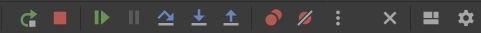
 
Kannattaa harjoitella käyttämään näppäinoikoteitä debuggaustilassa, sillä ne nopeuttavat debuggausta huomattavasti. Riderin näppäinoikoteitä saa tarkistettua ja muutettua `Configure <i class="bi bi-chevron-right"></i> Settings <i class="bi bi-chevron-right"></i> Keymap` tai `File <i class="bi bi-chevron-right"></i> Settings <i class="bi bi-chevron-right"></i> Keymap`.

## Keskeytyskohta (breakpoint) 

Voit laittaa ohjelmaan *keskeytyskohdan* (engl. *breakpoint*), jonka tarkoituksena on keskeyttää ohjelman suoritus haluttuun kohtaan. Toisin sanoen, ohjelma suoritetaan alusta siihen saakka, kunnes tullaan keskeytyskohtaan, johon suoritus sitten pysähtyy. 

Riderissa keskeytyskohta asetetaan klikkaamalla sitä rivinumeroa, johon keskeytyskohta halutaan asettaa. Keskeytyskohtaa EI voi asettaa Riderissä tyhjälle riville, kommenttiriveille eikä funktion tai luokan esittelyriville. 

Keskeytyskohtia voi olla ohjelmassa useita. Keskeytyskohdan saa pois klikkaamalla sitä uudestaan.

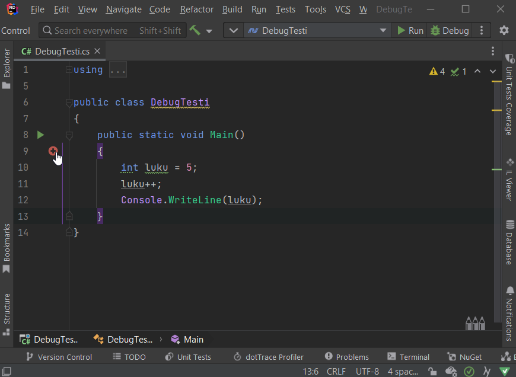

## Debuggaustilan käynnistäminen 

Ohjelma käynnistyy debuggaustilaan painamalla joko F5, klikkaamalla oikean ylälaidassa olevaa Debug painiketta tai valitsemalla valikosta *Run* <i class="bi bi-chevron-right"></i> *Debug*. Tällöin ohjelman suoritus "pysähtyy" ensimmäiseen asettamaasi keskeytyskohtaan. 

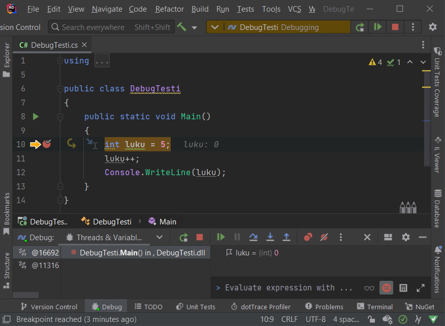

Huomaa, että keskeytyskohdan osoittaman punaisen pallon vieressä on nyt myös keltainen nuoli, joka näyttää *seuraavaksi* suoritettavan rivin. Toisin sanoen, ohjelman alkuosa on suoritettu rivi riviltä normaaliin tapaan, ja suoritus pysähtyy keskeytyskohtaan siten, että seuraavaksi suoritusvuorossa on tutkittava rivi, jolle keskeytyskohta on asetettu. Korostan: tätä keltaisen nuolen osoittamaa asiaa *ei* ole vielä suoritettu.

On mahdollista suorittaa ohjelma myös ilman debuggausta (Ctrl + F5 tai valitsemalla Run). Tällöin keskeytyskohdat jätetään huomiotta. Toisaalta silloin myös esimerkiksi mahdollisia poikkeuksia ei käsitellä Riderin avulla.

## Askellus (Step into, Step over) 

Koodia voidaan *askeltaa* rivi kerrallaan. Tällöin ohjelman suoritus etenee debuggaustilassa lause kerrallaan eteenpäin. Askellukseen on kaksi erilaista tapaa:

 * Step into (F11), jos lause on aliohjelmakutsu, askelletaan myös kyseisen aliohjelman koodi
 * Step over (F10), aliohjelmakutsujen koodi suoritetaan kerralla ilman askellusta, eli tavallaan hypätään aliohjelman yli

*Step over* -toimintoa kannattaa käyttää sellaisen aliohjelmakutsun kohdalla, jonka sisäistä logiikka ei ole tarkoitus tarkastella. Esimerkiksi `Console.WriteLine`- aliohjelmakutsun kohdalla kannattaa mieluummin valita *Step over* kuin *Step into*, sillä meitä ei oikeastaan kiinnosta tuon aliohjelman toiminta.

## Resume 

Resume-toiminto jatkaa ohjelman suorittamista normaaliin tapaan. Mikäli ohjelmassa on myöhemmin keskeytyskohta, ohjelman suoritus keskeytyy siihen.

## Debuggaustilan lopettaminen (ohjelman ajon lopettaminen) 

Debuggauksen voi lopettaa painamalla Shift + F5 tai valikosta Run <i class="bi bi-chevron-right"></i> Stop debugging.

## Muuttuja-arvot (locals) 

Debuggaus‐näkymän **Threads & Variables**-paneelissa (tai välilehdellä) näkyy tällä hetkellä näkyvissä olevat muuttujat ja niiden arvot.

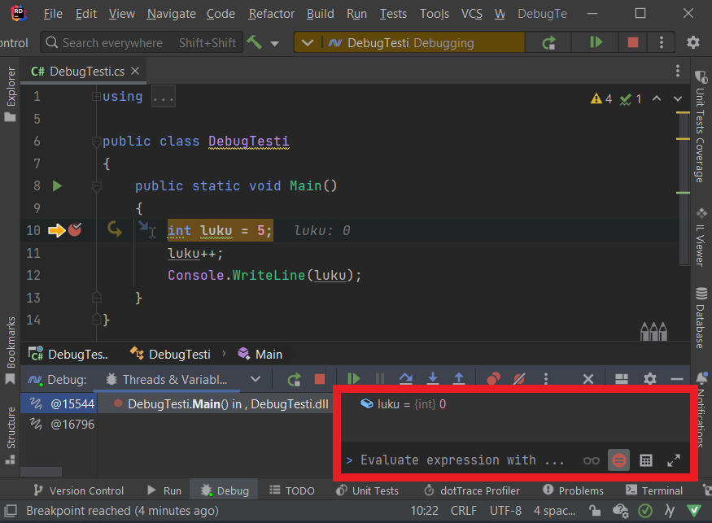

**Locals**-paneelissa voi myös muokata muuttujien arvoja ajonaikaisesti. Esimerkiksi muuttujan `luku`-arvoa voi muokata kaksoisklikkaamalla **Value**-sarakkeen kohdalta numeroa ja kirjoittamalla uuden luvun vanhan tilalle. Tämän jälkeen kannattaa painaa Enteriä, jotta editori ottaa muutoksen. **Riderissa** muuttujan arvoa voi locals-ikkunassa muokata painamalla F2 tai klikkaamalla hiiren oikealla ja valistemalla *Set Value*.

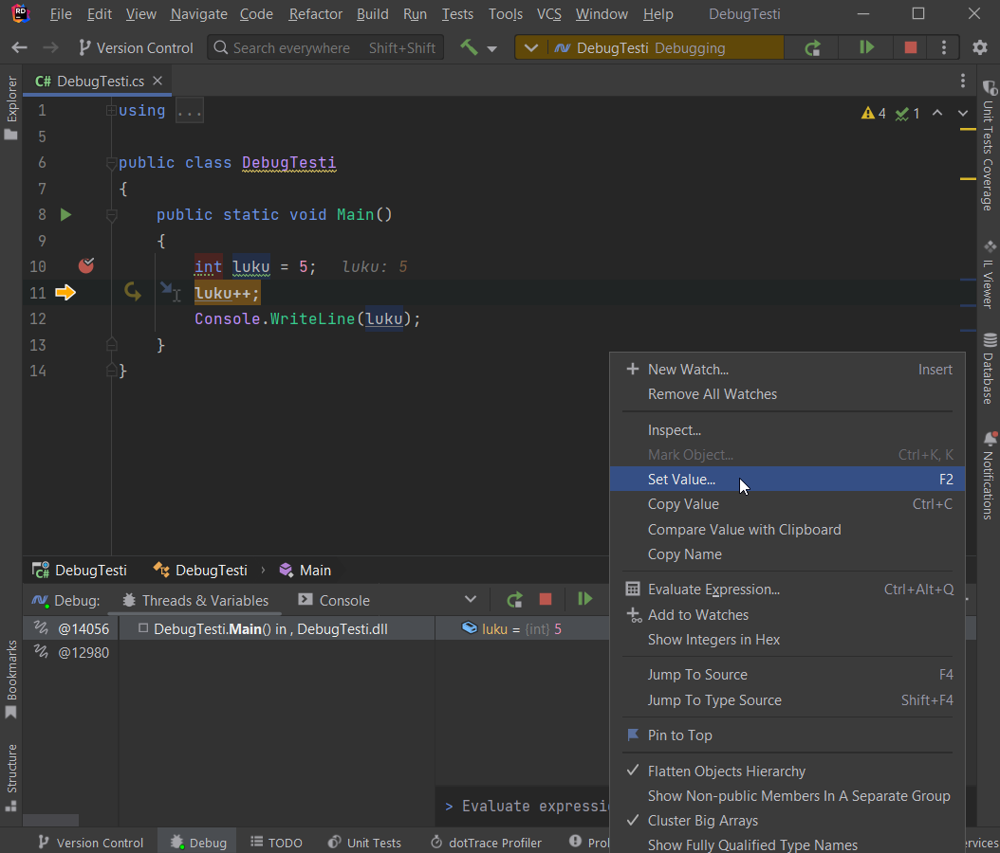

> [!HUOMAUTUS]
>`Double`-tyyppisen muuttujan arvoa muutettaessa on arvoksi asetettava desimaaliluku, esimerkiksi `3.0`. Mikäli asetat arvoksi kokonaisluvun, esimerkiksi `3`, debuggeri antaa virheilmoituksen *"Error: Size of source and of dest differ"*.

## Watch 

Paikallisten muuttujien lisäksi voidaan suorituksen aikana seurata itse valittuja muuttujia **Add to Watches** toiminnolla. Yksittäisten muuttujien lisäksi voidaan tarkastella lausekkeita, esimerkiksi `taulukko[i] > suurin` (tuottaisi `true` tai `false`).

 1. Aseta keskeytyskohta haluamaasi paikkaan ja aloita debuggaus. 
 2. Etsi koodista se muuttuja (tai lauseke), jonka tilaa haluat tarkkailla ajon aikana. Valitse se (maalaamalla esimerkiksi hiirellä), klikkaa sitten hiiren oikealla ja valitse **Add to Watches**. Alla olevassa kuvassa lisätään `suurin`-muuttuja locals/watch-paneeliin.

    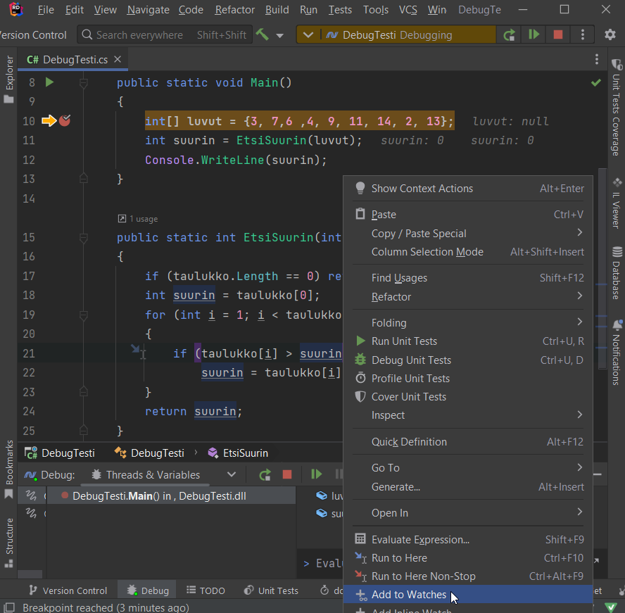

    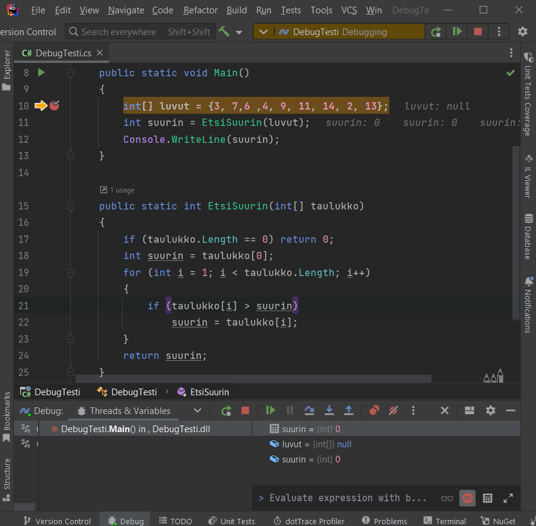

 3. Voit lisätä eri "watcheja" haluamasi määrän. Alla lisätään myös `i`, `taulukko[i]` ja `taulukko[i] > suurin` watch-paneeliin.

Huomaa, että watch-paneeliin lisäämäsi muuttuja (tai lauseke) ei välttämättä ole olemassa (ts. ei ole luotu tai ei "näy" sillä hetkellä), joten luonnollisestikaan tilaa ei voida tällöin tutkia. Alla olevassa kuvassa suoritus on menossa vasta rivillä 10.

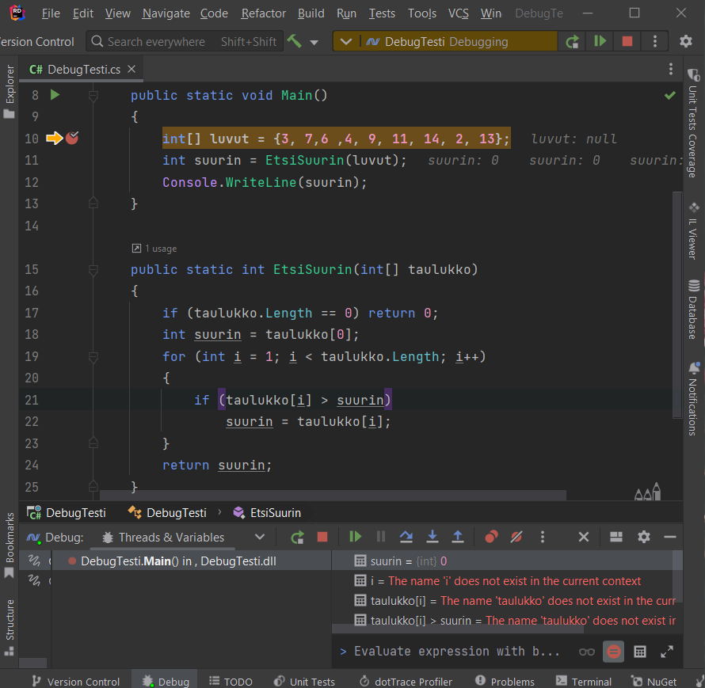
 
Tässä esimerkissä `i`, `taulukko[i]` ja `taulukko[i] > suurin` ovat paikallisia muuttujia (lausekkeita)  `EtsiSuurin`-lohkossa ja tulevat näkyviin kun ohjelman suoritus etenee sinne saakka.

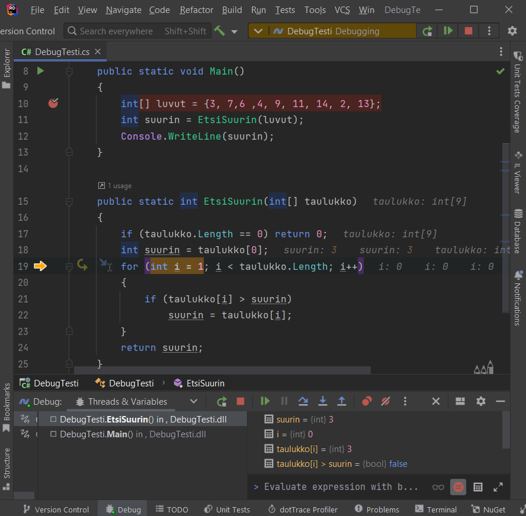

Nyt watch-ikkunasta on helppo tarkastella esimerkiksi taulukon arvoja sitä mukaa kun silmukka etenee.

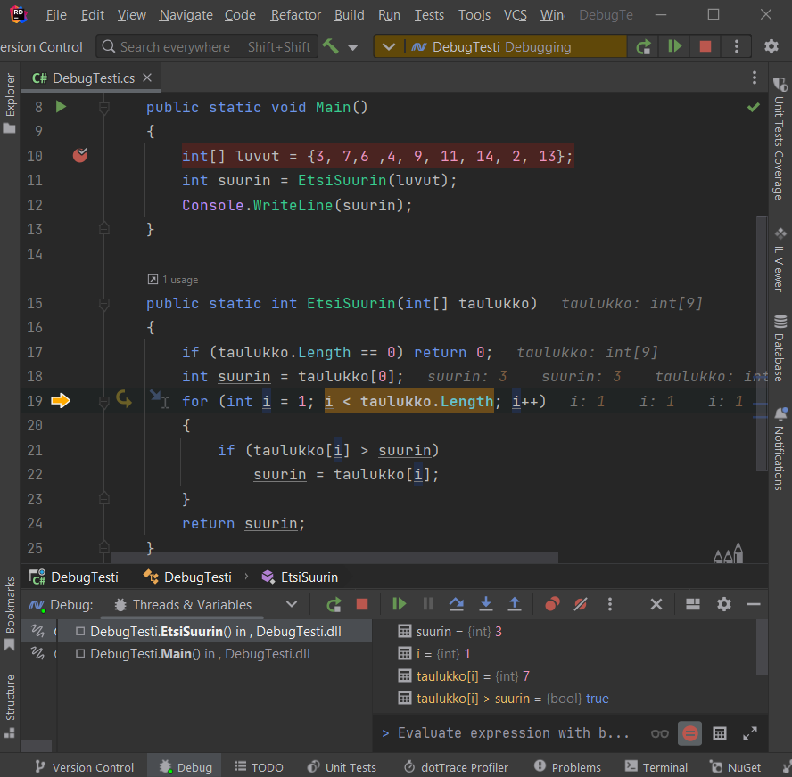

## Muuttujan arvon muuttaminen 

Tarvittaessa muuttujan arvoa voi muuttaa esim Locals-ikkunassa klikkaamalla
arvoa ja sitten antamalla sille uuden arvon.

## Ehdollinen keskeytyskohta 

Debuggerin avulla voidaan lisätä myös keskeytyskohdalle keskeytymisen ehto. Tällaista keskeytyskohtaa kutsutaan nimellä ehdollinen keskeytyskohta. Sen avulla debuggeri keskeyttää ohjelman suorittamisen vain, kun keskeytyskohtaan annettu ehto toteutuu. Ehto voi olla mikä tahansa totuusarvoinen lauseke, esimerkiksi muuttujan tietty arvo. 

Ehdollinen keskeytyskohta on kätevä esimerkiksi tilanteessa, jossa on pitkä silmukka, joka halutaan pysäyttää vain jossain tietyssä kohdassa. Jos ohjelma pysähtyisi silmukan jokaisella kierroksella, olisi hyvin työlästä ajaa ohjelmaa haluttuun pisteeseen. Ehdon voi lisätä seuraavasti:

 1. Siirry haluamallesi riville koodissa
 2. Siirry rivinumeron koodiin väliin ja klikkaa siihen breakpoint (näkyy punaisena täplänä)
 3. Paina breakpointin kohdalla hiiren oikeaa näppäintä saadaksesi esiin valikon
 4. Lisää Condition tekstikenttään lauseke, joka saa ajon aikana arvon `true` tai `false`, *esimerkiksi*
    ```csharp
    luku == 4
    ```
    Sen sijaan 
    ```csharp
    int luku = 4
    ``` 
    ei ole ehto, eikä kenttään voi myöskään laittaa `if`-sanaa. Kun lauseke saa arvon `true` debuggeri keskeyttää ohjelman suorittamisen. Muutamia muita esimerkkejä ehdoista:
    
    ```csharp
    i > 3
    luvut[i+2] != 3
    pallot[i] == null
    ```
 7. Aloita debuggaus
 8. Kun pysähtyy, tarkastele *Locals-* ja *Watch*-ikkunoista muuttujien arvoja ja jatka tarvittaessa *Step into*, *Step over* tai *Resume*.

## Hit Count 
Hit Countilla voit laittaa ehdon niin, että kun näin monennen kerran tullaan keskeytyskohtaan, niin silloin pysähdytään.

## Kutsupino (call stack) 

Jos saa ison ohjelman tutkittavakseen ja pitää korjata jotakin kohtaa eikä tiedä mistä kyseiseen kohtaan tullaan, niin jälleen debuggeri on avuksi. Laita keskeytyskohta tutkittavaan kohtaan, sitten ohjelma käyntiin. Kun ohjelma pysähtyy laittamaasi keskeytyskohtaan, niin kutsupinosta (*call stack*) voidaan katsoa reitti, mistä pysäytyskohtaan on päädytty.

Jos kutsupinoa ei näy Debug-näkymässä, sen saa esille valitsemalla klikkaamalla paneelin oikeassa yläreunassa olevaa ikkunan näköistä kuvaketta: *Layout settings* <i class="bi bi-chevron-right"></i> *Threads Frames* <i class="bi bi-chevron-right"></i> *Side by side*. 

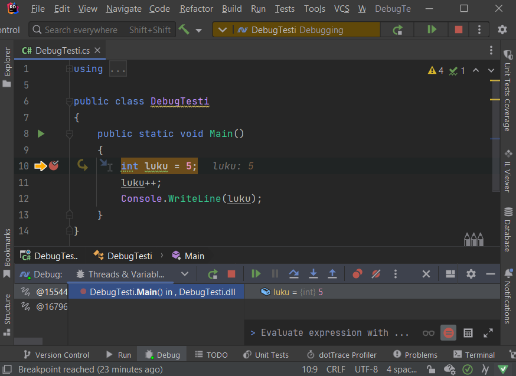

Riderin kutsupinossa ei valitettavasti näy lähdekoodin rivinumeroita siitä, miltä riviltä kutsuun on lähdetty.  Mutta klikkaamalla kutsupinossa hiiren oikealla, voidaan ottaa pinon sisältä leikepöydälle ja sitten tarkastella sitä rivinumeroineen jossakin editorissa.

## Ongelmia debuggaustilan käynnistymisessä? 

### class com.intellij.util.ui.components cannot be cast 

Mikäli saat **debuggauksen aikana Riderissa poikkeuksen**, esim.

```
class com.intellij.util.ui.components.BorderLayoutPanel 
cannot be cast to class com.intellij.ui.OnePixelSplitter
```

kokeile asetusten resetointia seuraavien ohjeiden mukaisesti

> [!VAROITUS]
> Näin tekemällä menetät kaikki asetuksesi, kuten näppäinoikotiet sekä teemat. Ota asetuksistasi halutessasi varmuuskopiot *File* <i class="bi bi-chevron-right"></i> *Manage IDE Settings* <i class="bi bi-chevron-right"></i> *Export Settings*.

 1. Paina Shift+Shift (eli kaksi kertaa Shift-painiketta) *tai* Ctrl+T,
 2. Kirjoita "*Restore Default settings*" ja valitse ko. toiminto
 3. Rider käynnistyy uudestaan, valitse haluamasi asetukset.

### Rider clr load callback is already in error state. A debug component is not installed 

Jos saat yllä mainitun virheilmoituksen kun yrität käynnistää debuggerin niin ongelmana on todennäköisesti, että Mac-koneelle on asennettu väärä versio Riderista.

Joudut siis asentamaan Riderin uudestaan:

1. Mene sivulle: [https://www.jetbrains.com/rider/](https://www.jetbrains.com/rider/)
2. Klikkaa *Download*
3. Valitse omalle koneellesi sopiva versio ja lataa se
4. Asenna Rider uudelleen