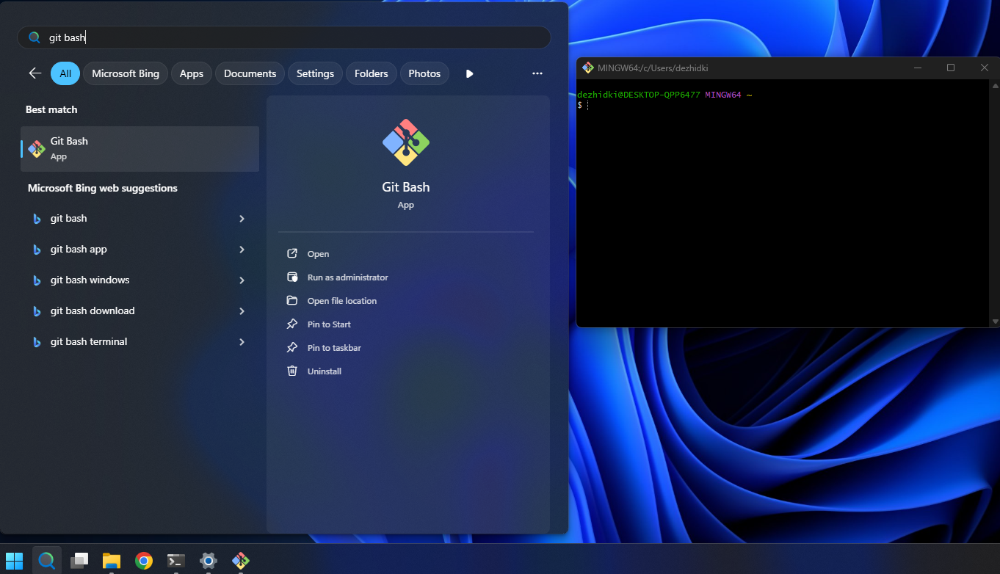

# Työkaluohjeet

**Ohjelmointi 1** -opintojaksolla käytämme alla olevia työkaluja. Tässä
dokumentissa opastetaan, miten nämä työkalut asennetaan.

- **[.NET](#net)** &ndash; *ohjelmistoviitekehys* (engl. *framework*), tarvitaan
  C#-ohjelmien kehittämiseen ja valmiiden ohjelmien ajamiseen.
- **[Visual Studio Code](#vscode)** &ndash; *editori*, jolla kirjoitetaan,
  käännetään, ajetaan ja debugataan ohjelmia. 
- **[C# Dev Kit](#csdevkit)** &ndash; VS Coden *laajennus*, joka tuo
  editoriin C#-tuen. 
- **[JyPeli](#jypeli)** &ndash; *pelimoottori*, joka on Jyväskylän yliopistossa kehitetty
  C#-kirjasto pelien tekemiseen.
- **[Git](#git)** &ndash; *versiohallintaohjelma*, joka mahdollistaa koodin versioinnin
  ja yhteistyön koodaajien välillä. Tätä voisi kutsua koodaajien Google
  Docsiksi. Gitiä tarvitset mahdollisesti vasta harjoitustyön yhteydessä, joten
  sitä ei tarvitse asentaa vielä opintojakson alussa.

Yllä olevat ohjelmat löytyvät valmiiksi asennettuna [Agoran mikroluokissa](https://navi.jyu.fi/space/m118987) (Alban puoleinen pääty, 1. ja 2. kerros). Jos sinulla on oma tietokone, suosittelemme vahvasti, että asennat ohjelmat lisäksi niille tietokoneille, joilla aiot suorittaa opintojakson.

## Käyttöjärjestelmä ja vaatimukset 

Tällä sivulla olevat ohjeet riippuvat käyttöjärjestelmästä. 
Valitse käyttöjärjestelmä alta.

### [Windows](#tab/win)
 
Valitsit Windows -käyttöjärjestelmän. Alla olevat ohjeet on testattu Windows
11:llä. Windows 10:llä toimisesta ei ole varmuutta.

***

### [macOS](#tab/macos)
 
Valitsit macOS-käyttöjärjestelmän. Alla olevat ohjeet on testattu seuraavilla käyttöjärjestelmillä:

- macOS 10.15 Catalina
- macOS 13 Ventura
- macOS 14 Sonoma

***

### [Linux](#tab/linux)
 
Valitsit Linux-käyttöjärjestelmän. Alla olevat ohjeet on testattu seuraavilla käyttöjärjestelmillä:

- Arch Linux (`6.16.1-arch1-1`)
- Linux Mint 22.1 (`Linux 6.8.0-51-generic`)
- Linux Ubuntu 24.04.3 LTS
- Debian 13

***

### [Chrome OS](#tab/chromeos)

Kurssin ohjelmointiympäristö **ei ole tuettu** Chrome OS -käyttöjärjestelmässä.
Vaikka työkalujen asentaminen saattaakin onnistua, emme voi taata, että kaikki
työkalut toimivat käyttökelpoisesti tai edes oikein. Suosittelemme vahvasti käyttämään
joko Windows-, macOS- tai Linux-käyttöjärjestelmää.

***

## Pikakurssi komentorivin käyttöön 
 
Tämän sivun asennusohjeet vaativat komentorivin avaamista ja käyttöä.

Jos et ikinä ennen käyttänyt komentoriviä, katso pikainen johdatus komentorivin
käyttöön alta.

<details closed> <summary>Pikainen johdatus komentorivin käyttöön (Avaa klikkaamalla)</summary>
 
**Mikä on komentorivi?**

*Komentorivi* on (tämän ohjeen puitteissa) tietokoneohjelma, jolla tietokonetta
voi ohjata tekstillä. Esimerkiksi, kun Windowsissa jonkun kansion sisällön
katsominen onnistuu graafisesti avaamalla Resurssienhallinta (macOS:lla Finder),
sama asia onnistuu komentorivillä kirjoittamalla tekstimuotoinen *komento*, joka
tulostaa näkyviin kansion sisällön.

Vaikka olet ehkä aiemmin käyttänyt komentoriviä harvoin jos koskaan,
ohjelmoinnin yhteydessä komentorivi on varsin hyödyllinen työkalu. Syitä on
monia, kuten toiston ja automaation helpottaminen. Tämän ohjeen kannalta
olennainen syy on, että ohjelmien asentaminen onnistuu nykyään jopa helpommin
komentorivillä kuin etsimällä sopiva asennusohjelma verkosta.

Komentorivistä käytetään myös nimityksiä *pääte* ja *terminaali*. Englanniksi
komentorivistä käytetään nimityksiä *command line*, *terminal* ja *shell*.
Kaikki nämä tarkoittavat samaa asiaa: ohjelmaa, jolla tietokonetta voi ohjata
kirjoittamalla komentoja tekstinä.

***

**Miten avaan komentoriviin omalla tietokoneellani?**

Toimintatapa vaihtelee eri käyttöjärjestelmillä. Samalla käyttöjärjestelmällä
voi olla myös useita komentoriviohjelmia. Alla olevilla ohjeilla saata ainakin
kaikki tarvittavat työkalut asennettua.

### [Windows](#tab/win)

1. Paina *Käynnistä*-painikkeen vieressä olevaa *Haku-ikonia*
2. Kirjoita hakupalkkiin *PowerShell*
3. Valitse löytyvistä tuloksista *Windows PowerShell*

Tämä avaa PowerShell-komentorivin, joka on eräs Windowsilla oleva komentorivipääte.

***

### [macOS](#tab/macos)

1. Avaa *Launchpad*
2. Kirjoita ylhäällä olevaan hakupalkkiin *Pääte* (tai *Terminal* jos käyttöjärjestelmän kieli on englanti)
3. Avaa hakutuloksena löytyvä *Pääte* tai *Terminal*-sovellus

Tämä avaa Pääte-sovelluksen, joka on macOS:n sisäänrakennettu pääte.

***

### [Linux](#tab/linux)

Käytä jakelun omaa päätettä. Pääte yleensä löytyy sanalla *Terminal* tai
*Terminal Emulator*. Tämä usein avaa bash-päätteen, joka on sopiva 
tämän ohjeen kannalta.

***

**Miten käytän komentoriviä?**

Kun näet tällä sivulla alla olevan tapaisen laatikon:

```bash
ls
```

Tulee sinun kirjoittaa laatikossa oleva komento ja suorittaa se komentorivillä.
Toimi seuraavasti:

1. Klikkaa komentorivi aktiiviseksi ikkunaksi.
2. Kirjoita laatikossa oleva komento komentoriviin näppäimistöllä.
3. **Tarkista, että kirjoitit komennon täysin oikein.** Huomaa, että kirjainkoolla, välilyönneillä ja muilla merkeillä on merkitystä komennon kannalta!
4. **Kun olet varmistanut, että kirjoitit komennon oikein**, paina Enter-näppäintä.

Riippuen komennosta komentoriviin voi ilmestyä tuloste, virhe tai ei mitään.
Jotkin ohjelmat eivät tulosta mitään tekstiä onnistumisen merkiksi.
Kun komennon suoritus on valmis, komentorivin uudelle riville ilmestyy uusi komentokehote.

**Kokeile** kirjoittaa ja suorittaa yllä oleva esimerkkikomento.
Komento listaa hakemistossa olevien tiedostojen ja kansioiden nimiä (`ls` on lyhenne sanalle "**l**i**s**t").

Kun tällä sivulla näet laatikon, jossa on useita rivejä, kuten

```bash
echo "Kissa"
```

```bash
ls
```

Toimi seuraavasti:

1. Tee yllä mainitut vaiheet 1–4 *vain ensimmäisellä rivillä* olevalle komennolle (eli tässä `echo "Kissa"`)
2. Tee yllä mainitut vaiheet 1–4 *vain toisella rivillä* olevalle komennolle (eli `ls`)
3. Jatka rivien suorittamista kunnes olet suorittanut kaikki laatikossa olevat rivit

Toisin sanoen, tällä sivulla jokainen yksittäinen komento on aseteltu omalle rivilleen. Tarkoitus on, että suoritat jokaisen rivin yksi kerrallaan siinä järjestyksessä, jossa ne on laatikossa kirjoitettu.

**Kokeile** kirjoittaa ja suorittaa yllä olevassa laatikossa olevat komennot. Kirjoita ja suorita ensin komento `echo "Kissa"` ja sen jälkeen komento `ls`. Muista, että tietokone suorittaa komennon vasta, kun painat Enter-painiketta.

**Voinko kopioida komentoja kirjoittamisen sijaan?**

Kyllä voit. Tällä ohjesivulla komentojen kopiointi onnistuu klikkaamalla kopioitavasta komennosta
kerran ja painamalla `Ctrl`+`C` (Windows, Linux) tai `Command`+`C` (macOS).

Komennon liittäminen komentoriville riippuu käyttöjärjestelmästä:

- *Windows*: Valitse PowerShell-komentorivi aktiiviseksi ja paina `Ctrl`+`V` (tai klikkaa hiiren oikea painike)
- *macOS*: Valitse Pääte aktiiviseksi ja paina `Command`+`V`
- *Linux*: Valitse komentorivi aktiiviseksi ja paina `Ctrl`+`Shift`+`V` TAI `Shift`+`Insert`. Tarkista pääteohjelmasi ohjeista oikea näppäinoikotie

> [!VAROITUS]
> Älä **ikinä** kopioi ja liitä komentoriville mitään komentoja, joihin et luota etkä
> tiedä, mitä ne oikeasti tekevät. Komentorivien komennot ovat usein peruuttamattomia: jos vahingossa poistat jonkun tiedoston,
> poisto on usein lopullinen eikä sitä voi peruuttaa. Esimerkiksi tekoälyn ehdottamiin komentoihin tulee suhtautua aina varauksella.
> Tällä sivulla mainitut komennot on testattu toimivaksi ja turvalliseksi vastuuopettajan toimesta.

</details>

## Valmistelu 

### [Windows](#tab/win)

 1. Varmista, että tietokoneesi on ajan tasalla (Windows Update:ssa ei uusia
    päivityksiä) ja että näytönohjaimen ajurit ovat asennettu.
 1. Avaa PowerShell-komentorivi (*Haku-ikoni* › Kirjoita *PowerShell*
    › *Windows PowerShell*).
 2. Kokeile, että `winget`-komento on asennettu ja toimii. Suorita seuraava komento:

    ```bash
    winget -v
    ```
    
    Tuloksena pitäisi tulostua `winget`-työkalun versio. Jos sen sijaan saat
    virheen, jossa lukee *'winget' is not recognized as the name of a cmdlet,
    function, script file, or operable program*, tarkoittaa tämä, että sinulla
    todennäköisesti ei ole `winget`-työkalua asennettuna. Kokeile siinä
    tapauksessa seuraavat ratkaisut:
    
    - Tarkista, että käyttöjärjestelmäsi on ajan tasalla
    - Kokeile ladata ja asentaa `winget`-käsin: [Lataa
      asennusohjelma](https://github.com/microsoft/winget-cli/releases/download/v1.11.430/Microsoft.DesktopAppInstaller_8wekyb3d8bbwe.msixbundle). 
      Asennuksen jälkeen sulje ja käynnistä PowerShell uudelleen.

***

### [macOS](#tab/macos)

1. Avaa Pääte tai Terminal (*Launchpad* › *Pääte*/*Terminal*)
2. Asenna ensin macOS:n kehitystyökalut suorittamalla alla oleva komento:

    ```bash
    xcode-select --install
    ```
    
    Komennon suorittamisen jälkeen saatat saada seuraavanlaisen ilmoituksen:
    *Komento "xcode-select" vaatii komentorivikehitystyökalut. Haluatko asentaa
    työkalut nyt?* (Englanniksi: *The 'xcode-select' command requires the
    command line developer tools. Would you like to install the tools now?*)
    
    Jos sellainen ilmoitus ilmestyy, valitse *Asenna*/*Install* ja odota
    työkalujen asentumista. Hyväksy tarvittaessa käyttöehdot. Kun asennus on
    valmis, saat *Ohjelmisto asennettiin*/*The software was installed*
    -dialogin. Klikkaa silloin *Valmis*.
    
    Jos saat virheen, jossa lukee `command line tools are already installed`, sinulla
    on jo tarvittavat työkalut asennettuna ja voit jatkaa seuraavaan vaiheeseen.  
3. Asenna Homebrew-ohjelmahallintatyökalu seuraavalla komennolla (saat kopioitua
   komennon oikean reunan kuvakkeesta):

    ```bash
    /bin/bash -c "$(curl -fsSL https://raw.githubusercontent.com/Homebrew/install/HEAD/install.sh)"
    ```
    
    *Anna työkalun latautua rauhassa.*
    
    Kirjoita macOS-käyttäjäsi salasana, kun *Password*-kenttä ilmestyy.
    *Huomaa, että salasanan kirjoittaminen ei tuota mitään näkyvää tulostetta komentoriville,
    ei edes `*`-merkkejä.* Paina Enter-painiketta, kun olet kirjoittanut salasanan.
    
    Ennen asennusta Homebrew vielä tulostaa varmistusdialogin, jonka lopussa lukee
    
    ```
    Press RETURN/ENTER to continue or any other key to abort:
    ```
    
    Paina siinä tapauksessa Enter-näppäintä ja odota ohjelman asentumista.
4. Suorita seuraavat komennot (huom: 1 komento per rivi, 4 komentoa yhteensä):

    ```bash
    BREW_PREFIX=$( [[ $(uname -m) == arm64 ]] && echo /opt/homebrew || echo /usr/local )
    ```
    ```bash
    echo >> ~/.zprofile
    ```
    ```bash
    echo "eval \"\$(${BREW_PREFIX}/bin/brew shellenv)\"" >> ~/.zprofile
    ```
    ```bash
    eval "$(${BREW_PREFIX}/bin/brew shellenv)"
    ```
    
    Nämä komennot tekevät seuraavat asiat:
    
    - Komento 1 tarkistaa, onko tietokone Apple Silicon tai Intel -pohjainen.
    - Komento 2 lisää tyhjän rivin komentoriviasetuksiin
    - Komento 3 muokkaa komentorivin asetuksia niin, että jatkossa Homebrew ladataan aina avatessa uusi Pääte
    - Komento 4 lataa Homebrewin nykyiseen komentoriviin

5. Testaa, että Homebrew toimii suorittamalla komento:

    ```bash
    brew --version
    ```
    
    Jos asennus suoritettiin onnistuneesti, näet seuraavanlaisen tulosteen:
    
    ```
    Homebrew X.X.X
    ```
    
    Versionumero `X.X.X` voi olla mikä tahansa; olennaista on, että tuloste ilmestyy näkyviin.

***

### [Linux](#tab/linux)
 
Alla olevat ohjeet olettavat, että sinulla on kokemusta ohjelmien asentamisesta
sinun käyttämälläsi Linux-jakelulla.
Linux-ohjeet toimivat täten ohjenuorana; käytä tarvittaessa omaa harkintaa.

 1. Tarkista, että sinulla on tarvittavat grafiikkakirjastot asennettuna. 
   JyPeli ainakin tarvitsee GLFW-kirjaston, joka löytyy eri jakeluista valmiina pakkauksena:
     - Ubuntu, Debian, openSUSE: `libglfw3`
     - Arch, Fedora: `glfw`
 2. Vaikka osa työkaluista löytyy jakelujen pakkaustehallinnasta, jotkin graafiset ohjelmat (erityisesti VS Code)
   eivät ole yleensä julkaistu jakelukohtaisissa repoissa.
   *Suosittelemme* käyttämään jakelusta riippumatonta pakkaustenhallintaa, 
   kuten [Snap](https://snapcraft.io/docs/installing-snapd) tai [Flatpak](https://flatpak.org/). Tällä sivulla olevat ohjeet käyttävät ensisijaisesti Snapia tai jakelukohtaisia
   pakkauksia, jos niitä on.
 3. Kun olet asentanut tarvittavat esipakkaukset, käynnistä uusi tyhjä pääte.

*** 

## .NET {#net}

### [Windows](#tab/win)
 
1. Avaa PowerShell-komentorivi ellei se ole jo auki.
2. Suorita alla oleva komento (saat kopioitua
   komennon oikean reunan kuvakkeesta):

    ```bash
    winget install -e --id=Microsoft.DotNet.SDK.10
    ```

    Odota komennon suorittamista loppuun ja anna tarvittaessa asennusoikeus.
    Jos näet komentorivillä kysymyksen, kuten:

    ```
    Do you agree to all the source agreements terms?
    [Y] Yes [N] No:
    ```

    Paina komentorivillä `y`-näppäintä ja sen jälkeen `Enter`-näppäintä.
    
    Tarkista lopuksi, että komentorivillä olevassa tulosteessa on teksti `Successfully installed`.
3. Sulje kaikki auki olevat komentorivit ja avaa uusi PowerShell-komentorivi
4. Testaa, että .NET on asennettu suorittamalla komento:

    ```bash
    dotnet --list-sdks
    ```
    
    Jos asennus onnistui, näet seuraavanlaisen tulosteen:
    
    ```txt
    10.0.XXX [C:\Program Files\dotnet\sdk]
    ```
    
    Huomaa, että `XXX` on joku numero; olennaista, että versiona lukee `10.0` ja että virhettä ei tule.

*** 

### [macOS](#tab/macos)

1. Avaa Pääte ellei se ole jo
2. Asenna .NET suorittamalla alla oleva komento:
    
    ```bash
    brew install --cask dotnet-sdk10
    ```
    
    Anna asennuksen suoriutua loppuun asti. Sinulta saatetaan pyytää
    macOS-käyttäjän salasanaa `Password:`-kentässä. Kirjoita silloin
    salasana paikalle ja paina Enter-näppäintä.
    (Mikäli vastaan tulee tilanne että edelliset komennot menevät läpi mutta
    dotnet ei kuitenkaan ole asentunut, voit seurata [Microsoftin asennusohjeita](https://learn.microsoft.com/en-us/dotnet/core/install/macos))

3. Sulje kaikki auki olevat komentorivit ja avaa uusi Pääte

4. Testaa, että .NET on asennettu suorittamalla komento:

    ```bash
    dotnet --list-sdks
    ```
    
    Jos asennus onnistui, näet seuraavanlaisen tulosteen:
    
    ```txt
    10.0.XXX [/usr/local/share/dotnet/sdk]
    ```
    
    Huomaa, että `XXX` on joku numero; olennaista, että versiona lukee `10.0` ja että virhettä ei tule.

*** 

### [Linux](#tab/linux) 
 
1. Avaa jakelusi pääteohjelma ellei se ole jo
2. Asenna .NET SDK -pakkaus: `dotnet-sdk-10.0`. Pakkauksen nimi on yleensä sama
   kaikissa yleisillä jakeluissa (Ubuntu, Debian, Fedora, Arch jne.)
3. Asennuksen jälkeen sulje ja avaa pääte uudelleen
4. Testaa, että .NET on asennettu suorittamalla komento:

    ```bash
    dotnet --list-sdks
    ```
    
    Jos asennus onnistui, näet seuraavanlaisen tulosteen:
    
    ```txt
    10.0.XXX [/usr/local/share/dotnet/sdk]
    ```
    
    Huomaa, että `XXX` on joku numero; olennaista, että versiona lukee `10.0` ja että virhettä ei tule.

*** 

## Visual Studio Code {#vscode}

Visual Studio Code (lyhyesti VS Code) on Microsoftin ilmainen
ohjelmointiympäristö. Asenna ensin VS Code ja sen jälkeen C#-tuen antava
laajennus.

### [Windows](#tab/win)
 
1. Avaa PowerShell-komentorivi ellei se ole jo auki.
2. Asenna VS Code suorittamalla seuraava komento:

    ```bash
    winget install -e --id=Microsoft.VisualStudioCode --override '/SILENT /mergetasks="!runcode,addcontextmenufiles,addcontextmenufolders"'
    ```
    
    Odota komennon suorittamista loppuun ja anna tarvittaessa asennusoikeus.
    Jos näet komentorivillä kysymyksen, kuten:
    
    ```
    Do you agree to all the source agreements terms?
    [Y] Yes [N] No:
    ```
    
    Paina komentorivillä `y`-näppäintä ja sen jälkeen `Enter`-näppäintä.
    
    Tarkista lopuksi, että komentorivillä olevassa tulosteessa on teksti `Successfully installed`.

3. Sulje kaikki auki olevat komentorivit ja avaa uusi PowerShell-komentorivi

4. Kokeile käynnistää VS Code suorittamalla komento:

    ```bash
    code
    ```
    Jos VS Code avautuu, olet onnistuneesti asentanut sen!
    Jatkossa pääset VS Codeen myös klikkaamalla käynnistä-palkin *Hae-ikonia* › Kirjoita *Visual Studio Code* › Valitse *Visual Studio Code*.

***

### [macOS](#tab/macos)

 1. Avaa Pääte ellei se ole jo
2. Asenna VS Code suorittamalla alla oleva komento:

    ```bash
    brew install --cask visual-studio-code
    ```
    
    Anna asennuksen suoriutua loppuun asti. Sinulta saatetaan pyytää
    macOS-käyttäjän salasanaa `Password:`-kentässä. Kirjoita silloin
    salasana paikalle ja paina Enter-näppäintä.

3. Tarkista, että VS Code toimii. Avaa Launchpad ja käynnistä sieltä *Visual Studio Code*.

    Jos VS Code avautuu, olet onnistuneesti asentanut sen!

***

### [Linux](#tab/linux)
 
1.  Avaa jakelusi pääteohjelma ellei se ole jo
2.  Asenna Visual Studio Code. Asennustapa vaihtelee jakelun mukaan:

    - Arch: Asenna [`visual-studio-code-bin`](https://aur.archlinux.org/packages/visual-studio-code-bin)-pakkaus AUR:sta. Voit asentaa sen
      käsin tai käyttämällä [yay](https://github.com/Jguer/yay)-työkalua:
      
        ```bash
        yay -S visual-studio-code-bin
        ```
      
    - Muut jakelut: Suosittelemme asentamaan [code-snapin](https://snapcraft.io/code) käyttäen `snap`-työkalua:
    
        ```bash
        snap install code --classic
        ```
      
        Vaihtoehtoisesti voit asentaa VS Coden käsin seuraamalla [virallisia asennusohjeita](https://code.visualstudio.com/docs/setup/linux#_install-vs-code-on-linux)
      
3. Tarkista, että VS Code toimii. Käynnistä VS Code joko sovellusvalikosta tai `code`-komennolla. 
    Jos VS Code avautuu, olet onnistuneesti asentanut sen!

***

Ensimmäisellä käynnistyksellä VS Code pyytää kirjautumaan sisään GitHub-,
Google- tai Microsoft-tunnuksella. Kirjautumista ei tarvita: se liittyy vain
Copilot-tekoälyavustimeen, joka kytketään pois [alempana](#vscode-ai). Valitse
*Continue without signing in*. Myös tämän jälkeen avautuvan Welcome-sivun voi
sulkea.

## C# Dev Kit -laajennus {#csdevkit}

VS Code ei sellaisenaan ymmärrä C#:a. Tuki tulee Microsoftin *C# Dev Kit*
-laajennuksesta (engl. *extension*): koodin täydennys, virheiden alleviivaus,
**▷**-painike ohjelmien ajamiseen ja komento uuden Jypeli-pelin luomiseen.
Laajennus on ilmainen opiskelukäytössä.

1. Avaa komentorivi (PowerShell, Pääte tai vastaava) ellei se ole jo auki, ja
   asenna laajennus suorittamalla komento:

    ```bash
    code --install-extension ms-dotnettools.csdevkit
    ```

    Tulosteen lopussa pitäisi lukea `Extension 'ms-dotnettools.csdevkit' ... was
    successfully installed`. Komento asentaa samalla laajennukset *C#* ja
    *.NET Install Tool*, joita C# Dev Kit tarvitsee.

    Jos saat virheen, jossa lukee *'code' is not recognized* tai
    *command not found: code*, katso [ongelmatilanteet](#ongelmatilanteita-ja-niiden-ratkaisuja).

2. Käynnistä VS Code. Jos se oli auki, sulje se ensin ja avaa uudelleen.
   Ensimmäisellä käynnistyksellä laajennus viimeistelee asennustaan hetken;
   odota, kunnes oikean alakulman ilmoitukset lakkaavat.

3. Laajennus avaa opastussivun *Get Started with C# Dev Kit*, jonka ensimmäinen
   askel on *Connect account*. Tiliä ei tarvita. Sulje sivu sen alareunan painikkeella
   *Mark Done*. Vasemman alakulman tilikuvakkeeseen jää merkki *Sign in with
   Microsoft to use C# Dev Kit*; sekin on sama pyyntö, ja sen voi jättää
   huomiotta. VS Code saattaa myös ehdottaa GitHub Copilotin käyttöönottoa tai
   muita laajennuksia. Niitäkään ei tarvita; voit sulkea ilmoitukset.

3. Tarkista, että laajennus on paikallaan: valitse *View* › *Extensions*.
   *Installed*-luettelossa näkyvät *C# Dev Kit*, *C#* ja *.NET Install Tool*.

## JyPeli {#jypeli}

1. Avaa komentorivi (PowerShell, Pääte tai vastaava) ellei se ole jo auki.
2. Asenna JyPeli-projektipohjat (engl. *templates*) suorittamalla alla oleva komento:

    ```bash
    dotnet new install Jypeli.Templates
    ```

    Kun asennus on valmis, näet jotakin tekstiä mallia:

    ```
    Success: Jypeli.Templates installed the following templates:
    ```


## Kokeile, että kaikki toimii {#kokeilu}

Kokeillaan nyt, että kaikki toimii yhdessä tekemällä kokeilupeli VS Codella.

 1. Luo kotikansioosi kansio `Kokeilu`.
 2. Avaa VS Codessa kansio `Kokeilu`: *File* › *Open Folder…*. macOS saattaa
    kysyä, saako VS Code käyttää Tiedostot-kansion tiedostoja (*would like
    to access files in your Documents folder*); valitse *Salli* (*Allow*).
 3. Kun VS Code kysyy, luotatko kansion tekijöihin (*Do you trust the
    authors of the files in this folder?*), valitse *Yes, I trust the
    authors*. Jos kysymys jää huomaamatta, VS Code avaa kansion rajoitetussa
    tilassa (*Restricted Mode* alapalkissa), jossa C#-laajennus ei toimi.
    Napsauta silloin alapalkin *Restricted Mode* -tekstiä, valitse *Trust*
    ja sulje avautunut *Workspace Trust* -välilehti ruksista. 
 4. Lataa lopuksi ikkuna uudelleen: avaa komentopaletti (*View* › *Command
    Palette…* tai **Ctrl+Shift+P** (Windows) / **Cmd+Shift+P** (macOS)) ja valitse
    **Developer: Reload Window**. Ilman tätä C#-laajennus ei lähde käyntiin.
 5. Avaa komentopaletti, kirjoita `new project` ja valitse
    **.NET: New Project...**
 6. Valitse luettelosta pohja **Fysiikkapeli**. Voit hakea pohjaa kirjoittamalla
    hakukenttään `Fysiikkapeli`.
 7. Anna pelille nimi `Testipeli` ja valitse sijainniksi **Default
    directory**. Jos VS Code kysyy solution-tiedoston muotoa, valitse
    **.slnx**. Valitse lopuksi **Create project**.
 8. Avaa *Explorer*-näkymästä (vasen reuna) tiedosto `Testipeli/Testipeli.cs`
    ja paina oikean yläkulman **▷**-painiketta. Ensimmäinen käännös kestää
    hetken. Sen jälkeen aukeaa peli-ikkuna.

Jos peli-ikkuna aukesi, kaikki on kunnossa. Sulje peli ja VS Code. Voit
halutessasi nyt poistaa `Kokeilu`-kansion: sitä ei tarvita enää.

## VS Coden asetukset {#vscode-settings}

VS Coden asetukset ovat tekstitiedostossa `settings.json`. Avaa se
komentopaletista (*View* › *Command Palette…*): kirjoita `user settings json` ja
valitse **Preferences: Open User Settings (JSON)**. Asetukset kirjoitetaan
aaltosulkeiden `{` ja `}` väliin, ja rivit erotetaan pilkulla.

### Tekoälyominaisuudet pois {#vscode-ai}

VS Codessa on sisäänrakennettu GitHub Copilot -tekoälyavustin: keskustelupaneeli
ja koodin täydennys, joka ehdottaa useamman rivin valmista koodia himmennettynä
tekstinä. Kurssilla koodi kirjoitetaan itse, jotta oppisit, miten se syntyy.
Kytke ominaisuudet pois lisäämällä asetustiedostoon rivi

```json
"chat.disableAIFeatures": true
```

Asetus poistaa tekoälytäydennykset käytöstä ja piilottaa keskustelupaneelin
sekä otsikkopalkin Chat-valikon. Jos valikko näkyy yhä tallentamisen jälkeen,
valitse komentopaletista **Developer: Reload Window**.

### Suositellut asetukset

Lisää samaan tiedostoon myös alla olevat rivit. Koko tiedosto näyttää tämän
jälkeen tältä:

```json
{
    "chat.disableAIFeatures": true,
    "editor.formatOnSave": true,
    "editor.acceptSuggestionOnEnter": "off",
    "dotnet.completion.showCompletionItemsFromUnimportedNamespaces": false,
    "workbench.startupEditor": "none"
}
```

- `editor.formatOnSave`: koodi sisennetään ja muotoillaan automaattisesti, kun
  tiedosto tallennetaan.
- `editor.acceptSuggestionOnEnter`: Enter tekee aina rivinvaihdon, ja
  täydennysehdotus hyväksytään Tab-näppäimellä. Näin ehdotus ei tule
  hyväksytyksi vahingossa.
- `dotnet.completion.showCompletionItemsFromUnimportedNamespaces`:
  täydennysluettelossa näkyvät vain käytössä olevien nimiavaruuksien luokat,
  jolloin luettelo pysyy lyhyempänä.
- `workbench.startupEditor`: VS Code aukeaa ilman Welcome-sivua.

Tallenna tiedosto (**Ctrl+S**, macOS: **Cmd+S**). Asetukset tulevat voimaan heti.

## Git 

> [!HUOMAUTUS]
> Gitiä ei tarvitse asentaa vielä opintojakson alussa. Tarvitset Gitiä
> mahdollisesti vasta harjoitustyön yhteydessä, joten voit palata tähän kohtaan
> myöhemmin.

### [Windows](#tab/win)
 
1. Avaa PowerShell-komentorivi ellei se ole jo auki.
2. Asenna Git for Windows suorittamalla alla oleva komento:

    ```bash
    winget install -e --id=Git.Git --custom '/COMPONENTS="ext,ext\shellhere,ext\guihere"'
    ```
    
    Odota komennon suorittamista loppuun ja anna tarvittaessa asennusoikeus.
    Jos näet komentorivillä kysymyksen, kuten:
    
    ```
    Do you agree to all the source agreements terms?
    [Y] Yes [N] No:
    ```
    
    Paina komentorivillä `y`-näppäintä ja sen jälkeen `Enter`-näppäintä.
    
    Tarkista lopuksi, että komentorivillä olevassa tulosteessa on teksti `Successfully installed`.
    
3. Sulje kaikki auki olevat komentorivit ja avaa uusi PowerShell-komentorivi
4. Testaa, että `git`-komento on asennettu suorittamalla komento:

    ```bash
    git --version
    ```
    
    Jos asennus onnistui, näet seuraavanlaisen tulosteen:
    
    ```
    git version X.XX.XX
    ```
    
    Tekstin `X.XX.XX` tilalla näkyy git-työkalun tarkka versio.
5. Testaa, vielä, että Git Bash on asennettu. Mene *Haku-ikoni* › Kirjoita *Git Bash* › Valitse *Git Bash*.

    Jos kaikki toimii, pitäisi avautua Git Bash -komentorivi:   

    <animation scenes="images/git-ht-ohje/scenes.js" scene="avaa-windows">

    

    </animation>

*** 

### [macOS](#tab/macos)
 
1. Avaa Pääte ellei se ole jo
2. Git-työkalun pitäisi olla jo valmiiksi asennettu jos teit Valmistelu-vaiheessa olevat asiat. Tarkista, että Git toimii suorittamalla seuraava komento:

    ```bash
    git --version
    ```
    
    Jos asennus onnistui, näet seuraavanlaisen tulosteen:
    
    ```
    git version X.XX.XX
    ```
    
    Tekstin `X.XX.XX` tilalla näkyy git-työkalun tarkka versio.

*** 

### [Linux](#tab/linux)
 
1. Avaa jakelusi pääteohjelma ellei se ole jo
2. Asenna Git-pakkaus: `git`. Pakkauksen nimi on yleensä sama
   kaikissa yleisillä jakeluissa (Ubuntu, Debian, Fedora, Arch jne.)
3. Asennuksen jälkeen sulje ja avaa pääte uudelleen
4. Testaa, että `git`-komento on asennettu suorittamalla komento:

    ```bash
    git --version
    ```
    
    Jos asennus onnistui, näet seuraavanlaisen tulosteen:
    
    ```
    git version X.XX.XX
    ```
    
    Tekstin `X.XX.XX` tilalla näkyy git-työkalun tarkka versio.

*** 

## Mitä seuraavaksi?

Onneksi olkoon! Työkalujen käyttö käydään läpi luennoilla sekä kirjan sivulla
[Ohjelmointiympäristö kuntoon](osa1/4-ohjelmointiymparisto-kuntoon.md), joka
kertoo, miten konsoliohjelmat ja Jypeli-pelit järjestetään kansioihin ja
ajetaan.

## Ongelmatilanteita ja niiden ratkaisuja 

Alla on lueteltu joitain yleisimpiä ongelmatilanteita, joita asennuksen tai työkalujen käytön yhteydessä voi tulla vastaan. Jos löydät ongelman, jota ei ole listattu alla, 

- tule pääteohjauksiin. Ajat ja paikat löytyvät [kotisivulta](index.md#tuki-ja-palaute)), 
- laita viestiä [Teamsissa](index.md#teams-jy) (Kysymyksiä ja apua -kanava) tai
- laita viestiä opettajille: <ohj1-opet@jyu.onmicrosoft.com>. 

<details closed><summary> Silk.NET.Core.Loader.SymbolLoadingException' occurred in Silk.NET.Core.dll: 'Native symbol not found (Symbol: glfwWindowHintString)</summary>
 
Yllä olevan virheviestin syynä on todennäköisimmin että sinulla ei ole GLFW asennettuna, 
tai se on liian vanha. Monen Linux-distron mukana tulee versio 3.2, mutta Jypeli
vaatii vähintään version 3.3.

Asenna uusin GLFW-versio käyttämäsi paketinhallinnan avulla.

</details>

<details closed><summary> System.PlatformNotSupportedException: GLFW is not supported on this platform...</summary>
 
Voi olla että tietokoneellasi ei ole näytönohjaimen ajureita asennettuna.
Mene *Windowsin asetukset* › *Päivitykset* › *Valinnaiset* (päivitä-nappulan alapuolella)
-> Ajurit.
Asenna sieltä jotenkin näyttöön liittyvä ajuri, esimerkiksi "Intel Display Driver"

Jos ajuria ei löydy ja käytät kannettavaa, todennäköisesti sinulla on integroitu
näytöonohjain, jolloin ajuri voi löytyä prosessorin valmistajan (Intel tai AMD)
sivulta. Hae ajurit Googlesta esimerkiksi hakusanalla `Intel graphics driver`
tai `AMD graphics driver` prosessorin valmistajasta riippuen.

Seuraavista työkaluista voi olla hyötyä:

- Intel: [Driver support & Assistant tool](https://www.intel.com/content/www/us/en/support/detect.html)
- AMD: [Auto detect and install drivers](https://www.amd.com/en/support/download/drivers.html)

</details>

<details closed> <summary>dotnet not found / command not found: dotnet </summary>

Katso [.NET-asennusohje](#net) ja muista avata uusi komentorivi asennuksen
jälkeen.

</details>

<details closed><summary>A fatal error occurred. The folder [/usr/share/dotnet/host/fxr] does not exist </summary>

Jos komentoriviltä tulee (Linux):

    A fatal error occurred. The folder [/usr/share/dotnet/host/fxr] does not exist 

niin ks: <https://stackoverflow.com/questions/73753672/a-fatal-error-occurred-the-folder-usr-share-dotnet-host-fxr-does-not-exist>

</details>

<details closed><summary>'code' is not recognized / command not found: code</summary>

Komentorivi ei löydä VS Coden `code`-komentoa.

- **Windows:** sulje kaikki komentorivit ja avaa uusi PowerShell. Asennus
  lisää komennon vain uusiin komentoriveihin.
- **macOS:** käynnistä VS Code Launchpadista, avaa komentopaletti
  (**Cmd+Shift+P**) ja valitse **Shell Command: Install 'code' command in
  PATH**. Avaa sen jälkeen uusi Pääte.
- **Linux:** käynnistä VS Code sovellusvalikosta. Jos `code`-komento puuttuu
  yhä, tarkista jakelusi pakkauksen ohjeet.

</details>

<details closed><summary>Unable to execute C# Dev Kit command</summary>

Avattu kansio on rajoitetussa tilassa (*Restricted Mode*), jossa C# Dev Kit ei
tee mitään. Valitse virheilmoituksesta *Manage Workspace Trust*, paina
*Trust* ja sulje avautunut *Workspace Trust* -välilehti ruksista. Saman voi
tehdä napsauttamalla alapalkin *Restricted Mode* -tekstiä. Valitse sen jälkeen
komentopaletista **Developer: Reload Window**: laajennus käynnistyy vasta
uudelleenlatauksen jälkeen. Yritä sitten uudelleen.

</details>

<details closed><summary>Jypeli-pohjat eivät näy .NET: New Project -luettelossa</summary>

Tarkista päätteessä komennolla

```bash
dotnet new list
```

että luettelossa on *Fysiikkapeli* ja muut Jypeli-pohjat. Jos niitä ei ole,
asenna pohjat [JyPeli-kohdan](#jypeli) ohjeella. Jos pohjat ovat luettelossa
mutta eivät näy VS Codessa, sulje VS Code kokonaan ja avaa se uudelleen:
laajennus lukee pohjat käynnistyessään.

</details>

<details closed><summary>Näppäinkomennot eivät toimi</summary>

Jotkin näppäinoikotiet eivät toimi sellaisenaan muilla kuin yhdysvaltalaisilla
näppäimistöillä. Valitse toimimattomille komennoille uudet oikotiet kohdasta
*File* › *Preferences* › *Keyboard Shortcuts* (macOS: *Code* › *Settings* ›
*Keyboard Shortcuts*).

</details>
