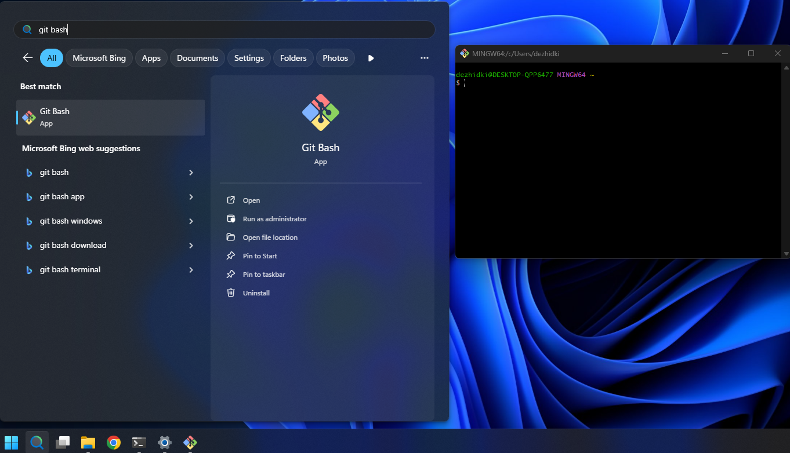
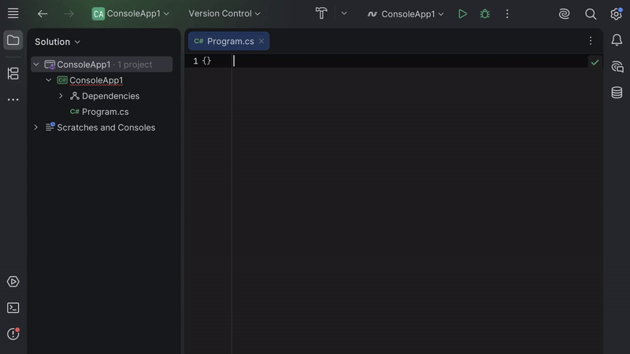
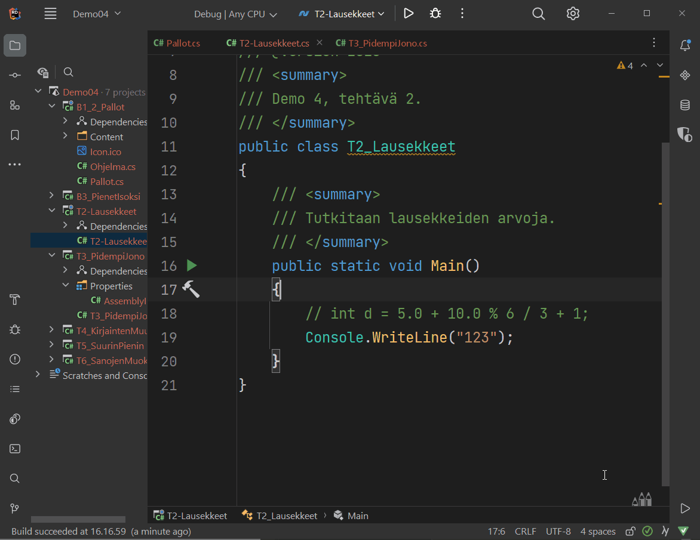

# Työkaluohjeet
 
**Ohjelmointi 1** -opintojaksolla käytämme alla olevia työkaluja. Tässä
dokumentissa opastetaan, miten nämä työkalut asennetaan. 

- **[.NET](#net)** &ndash; *ohjelmistoviitekehys* (engl. framework), tarvitaan
  C#-ohjelmien kehittämiseen ja valmiiden ohjelmien ajamiseen. 
- **[Git](#git)** &ndash; *versiohallintaohjelma*, joka mahdollistaa koodin versioinnin
  ja yhteistyön koodaajien välillä. Tätä voisi kutsua koodaajien Google
  Docsiksi.
- **[JetBrains Rider](#jetbrains-rider)** &ndash; *integroitu kehitysympäristö*, jolla voi
  kirjoittaa, kääntää, ajaa ja debugata ohjelmia. Rider on erityisesti .NET- ja
  C#-ohjelmille tarkoitettu IDE. Käytämme ilmaista Community Edition -versiota.
- **[Tekstieditori](#tekstieditori)** &ndash; ohjelma, jolla voi muokata tekstipohjaisia
  tiedostoja, kuten lähdekoodia avaamatta IDE-ohjelmistoa. Suosittelemme
  esimerkiksi *Visual Studio Code* tai *Notepad++*. Microsoft Word tai Google
  Docs **ei ole** opintojaksolle soveltuva tekstieditori.
- **[JyPeli](#jypeli)** &ndash; *pelimoottori*, joka on Jyväskylän yliopistossa kehitetty
  C#-kirjasto pelien tekemiseen.
- **[ComTest](#comtest)** &ndash; *yksikkötestigeneraattori*, joka on aputyökalu, jonka
  avulla kirjoitetulle koodille voidaan kirjoittaa testejä helposti luettavalla
  merkintätavalla.

Yllä olevat ohjelmat löytyvät valmiiksi asennettuna [Agoran mikroluokissa](https://navi.jyu.fi/space/m118987) (Alban puoleinen pääty, 1. ja 2. kerros). Jos sinulla on oma tietokone, suosittelemme vahvasti, että asennat ohjelmat lisäksi niille tietokoneille, joilla aiot suorittaa opintojakson.

## Käyttöjärjestelmä ja vaatimukset 

Tällä sivulla olevat ohjeet riippuvat käyttöjärjestelmästä. 
Valitse käyttöjärjestelmä alta.

### [Windows](#tab/win)
 
Valitsit Microsfot Windows -käyttöjärjestelmän. Alla olevat ohjeet on testattu seuraavilla käyttöjärjestelmillä:

- Windows 11
- Windows 10

***

### [macOS](#tab/macos)
 
Valitsit macOS-käyttöjärjestelmän. Alla olevat ohjeet on testattu seuraavilla käyttöjärjestelmillä:

- macOS 10.15 Catalina
- macOS 13 Ventura
- macOS 14 Sonoma

***

### [Linux](#tab/linux)
 
Valitsit Linux-käyttöjärjestelmän. Alla olevat ohjeet on testattu seuraavilla käyttöjärjestelmillä:

- Arch Linux (`6.16.1-arch1-1`)
- Linux Mint 22.1 (`Linux 6.8.0-51-generic`)
- Linux Ubuntu 24.04.3 LTS
- Debian 13

Valitse käyttöjärjestelmäsi yllä olevilla painikkeilla.

Huomaa, että muilla käyttöjärjestelmillä voi esiintyä pieniä poikkeuksia.
Mikäli ohjeet eivät toimi, ilmoita siitä opettajille: ohj1-opet@jyu.onmicrosoft.com.
Vastaavasti, jos saat ohjeet toimimaan käyttöjärjestelmällä, jotka eivät ole
yllä mainitussa listassa, kerro käyttöjärjestelmäsi, niin päivitämme listan.

***

## Pikakurssi komentorivin käyttöön 
 
Tämän sivun asennusohjeet vaativat komentorivin avaamista ja käyttöä.

Opintojaksolla komentorivin käyttöä käsitellään tarkemmin opintojakson aikana;
jos luet nämä ohjeet aivan opintojakson alussa, komentorivi saattaa kuulostaa
vielä hämärältä asialta.

Jos et ikinä ennen käyttänyt komentoriviä, katso pikainen johdatus komentorivin
käyttöön alta.

<details closed> <summary>Pikainen johdatus komentorivin käyttöön (Avaa klikkaamalla)</summary>
 
**Mikä on komentorivi?**

*Komentorivi* (engl. command line) tai *pääte* (engl. terminal) on (tämän ohjeen
puitteissa) tietokoneohjelma, jolla tietokonetta voi ohjata tekstillä.
Esimerkiksi, kun Windowsissa jonkun kansion sisällön katsominen onnistuu
graafisesti avaamalla Resurssinhallinta (tai macOS:lla vastaavasti Finder), sama
asia onnistuu komentorivillä kirjoittamalla *komento* (engl. command), joka
tulostaa näkyviin kansion sisällön.

Komentorivillä työskentely on yleistä ohjelmoinnin yhteydessä. Syitä on monia,
kuten toiston ja automaation helpottaminen. Tämän ohjeen kannalta olennainen syy
on, että ohjelmien asentaminen onnistuu nykyään jopa helpommin komentorivillä
kuin etsimällä sopiva asennusohjelma verkosta.

***

**Miten avaan komentoriviin omalla tietokoneellani?**

Toimintatapa vaihtelee eri käyttöjärjestelmillä. Samalla käyttöjärjestelmällä
voi olla myös useita komentoriviohjelmia. Alla olevilla ohjeilla saata ainakin
kaikki tarvittavat työkalut asennettua.

### [Windows](#tab/win)

1. Paina *Käynnistä*-painikkeen vieressä olevaa *Haku-ikonia*
2. Kirjoita hakupalkkiin *PowerShell*
3. Valitse löytyvistä tuloksista *Windows PowerShell*

Tämä avaa PowerShell-komentorivin, joka on eräs Windowsilla oleva komentorivipääte.

***

### [macOS](#tab/macos)

1. Avaa *Launchpad*
2. Kirjoita ylhäällä olevaan hakupalkkiin *Pääte* (tai *Terminal* jos käyttöjärjestelmän kieli on englanti)
3. Avaa hakutuloksena löytyvä *Pääte* tai *Terminal*-sovellus

Tämä avaa Pääte-sovelluksen, joka on macOS:n sisäänrakennettu pääte.

***

### [Linux](#tab/linux)

Käytä jakelun omaa päätettä. Pääte yleensä löytyy sanalla *Terminal* tai
*Terminal Emulator*. Tämä usein avaa bash-päätteen, joka on sopiva 
tämän ohjeen kannalta.

***

**Miten käytän komentoriviä?**

Kun näet tällä sivulla alla olevan tapaisen laatikon:

```bash
ls
```

Tulee sinun kirjoittaa laatikossa oleva komento ja suorittaa se komentorivillä.
Toimi seuraavasti:

1. Klikkaa komentorivi aktiiviseksi ikkunaksi.
2. Kirjoita laatikossa oleva komento komentoriviin näppäimistöllä.
3. **Tarkista, että kirjoitit komennon täysin oikein.** Huomaa, että kirjainkoolla, välilyönneillä ja muilla merkeillä on merkitystä komennon kannalta!
4. **Kun olet varmistanut, että kirjoitit komennon oikein**, paina Enter-näppäintä.

Riippuen komennosta komentoriviin voi ilmestyä tuloste, virhe tai ei mitään.
Jotkin ohjelmat eivät tulosta mitään tekstiä onnistumisen merkiksi.
Kun komennon suoritus on valmis, komentorivin uudelle riville ilmestyy uusi komentokehote.

**Kokeile** kirjoittaa ja suorittaa yllä oleva esimerkkikomento.
Komento listaa hakemistossa olevien tiedostojen ja kansioiden nimiä (`ls` on lyhenne sanalle "**l**i**s**t").

Kun tällä sivulla näet laatikon, jossa on useita rivejä, kuten

```bash
echo "Kissa"
```

```bash
ls
```

Toimi seuraavasti:

1. Tee yllä mainitut vaiheet 1-4 *vain ensimmäisellä rivillä* olevalle komennolle (eli tässä `echo "Kissa"`)
2. Tee yllä mainitut vaiheet 1-4 *vain toisella rivillä* olevalle komennolle (eli `ls`)
3. Jatka rivien suorittamista kunnes olet suorittanut kaikki laatikossa olevat rivit

Toisin sanoen, tällä sivulla jokainen yksittäinen komento on aseteltu omalle rivilleen. Tarkoitus on, että suoritat jokaisen rivin yksi kerrallaan siinä järjestyksessä, jossa ne on laatikossa kirjoitettu.

**Kokeile** kirjoittaa ja suorittaa yllä olevassa laatikossa olevat komennot. Kirjoita ja suorita ensin komento `echo "Kissa"` ja sen jälkeen komento `ls`. Muista, että tietokone suorittaa komennon vasta, kun painat Enter-painiketta.

**Voinko kopioida komentoja kirjoittamisen sijaan?**

Kyllä voit. Tällä ohjesivulla komentojen kopiointi onnistuu klikkaamalla kopioitavasta komennosta
kerran ja painamalla `Ctrl`+`C` (Windows, Linux) tai `Command`+`C` (macOS).

Komennon liittäminen komentoriville riippuu käyttöjärjestelmästä:

- *Windows*: Valitse PowerShell-komentorivi aktiiviseksi ja paina `Ctrl`+`V` (tai klikkaa hiiren oikea painike)
- *macOS*: Valitse Pääte aktiiviseksi ja paina `Command`+`V`
- *Linux*: Valitse komentorivi aktiiviseksi ja paina `Ctrl`+`Shift`+`V` TAI `Shift`+`Insert`. Tarkista pääteohjelmasi ohjeista oikea näppäinoikotie

> [!VAROITUS]
> Älä **ikinä** kopioi ja liitä komentoriville mitään komentoja, joihin et luota etkä
> tiedä, mitä ne oikeasti tekevät. Komentorivien komennot ovat usein peruuttamattomia: jos vahingossa poistat jonkun tiedoston,
> poisto on usein lopullinen eikä sitä voi peruuttaa. Esimerkiksi tekoälyn ehdottamiin komentoihin tulee suhtautua aina varauksella.
> Tällä sivulla mainitut komennot on testattu toimivaksi ja turvalliseksi vastuuopettajan toimesta.

</details>

## Valmistelu 

### [Windows](#tab/win)

 1. Varmista, että tietokoneesi on ajan tasalla (Windows Update:ssa ei uusia
    päivityksiä) ja että näytönohjaimen ajurit ovat asennettu.
 1. Avaa PowerShell-komentorivi (*Haku-ikoni* <i class="bi bi-chevron-right"></i> Kirjoita *PowerShell*
    <i class="bi bi-chevron-right"></i> *Windows PowerShell*).
 2. Kokeile, että `winget`-komento on asennettu ja toimii. Suorita seuraava komento:

    ```bash
    winget -v
    ```
    
    Tuloksena pitäisi tulostua `winget`-työkalun versio. Jos sen sijaan saat
    virheen, jossa lukee *'winget' is not recognized as the name of a cmdlet,
    function, script file, or operable program*, tarkoittaa tämä, että sinulla
    todennäköisesti ei ole `winget`-työkalua asennettuna. Kokeile siinä
    tapauksessa seuraavat ratkaisut:
    
    - Tarkista, että käyttöjärjestelmäsi on ajan tasalla
    - Kokeile ladata ja asentaa `winget`-käsin: [Lataa
      asennusohjelma](https://github.com/microsoft/winget-cli/releases/download/v1.11.430/Microsoft.DesktopAppInstaller_8wekyb3d8bbwe.msixbundle). 
      Asennuksen jälkeen sulje ja käynnistä PowerShell uudelleen.

***

### [macOS](#tab/macos)

1. Avaa Pääte tai Termimal (*Launchpad* <i class="bi bi-chevron-right"></i> *Pääte*/*Terminal*)
2. Asenna ensin macOS:n kehitystyökalut suorittamalla alla oleva komento:

    ```bash
    xcode-select --install
    ```
    
    Komennon suorittamisen jälkeen saatat saada seuraavanlaisen ilmoituksen:
    *Komento "xcode-select" vaatii komentorivikehitystyökalut. Haluatko asentaa
    työkalut nyt?* (Englanniksi: *The 'xcode-select' command requires the
    command line developer tools. Would you like to install the tools now?*)
    
    Jos sellainen ilmoitus ilmestyy, valitse *Asenna*/*Install* ja odota
    työkalujen asentumista. Hyväksy tarvittaessa käyttöehdot. Kun asennus on
    valmis, saat *Ohjelmisto asennettiin*/*The software was installed*
    -dialogin. Klikkaa silloin *Valmis*.
    
    Jos saat virheen, jossa lukee `command line tools are already installed`, sinulla
    on jo tarvittavat työkalut asennettuna ja voit jatkaa seuraavaan vaiheeseen.  
3. Asenna Homebrew-ohjelmahallintatyökalu seuraavalla komennolla:

    ```bash
    /bin/bash -c "$(curl -fsSL https://raw.githubusercontent.com/Homebrew/install/HEAD/install.sh)"
    ```
    
    *Anna työkalun latautua rauhassa.*
    
    Kirjoita macOS-käyttäjäsi salasana, kun *Password*-kenttä ilmestyy.
    *Huomaa, että salasanan kirjoittaminen ei tuota mitään näkyvää tulostetta komentoriville,
    ei edes `*`-merkkejä.* Paina Enter-painiketta, kun olet kirjoittanut salasanan.
    
    Ennen asennusta Homebrew vielä tulostaa varmistusdialogin, jonka lopussa lukee
    
    ```
    Press RETURN/ENTER to continue or any other key to abort:
    ```
    
    Paina siinä tapauksessa Enter-näppäintä ja odota ohjelman asentumista.
4. Suorita seuraavat komennot (huom: 1 komento per rivi, 4 komentoa yhteensä):

    ```bash
    BREW_PREFIX=$( [[ $(uname -m) == arm64 ]] && echo /opt/homebrew || echo /usr/local )
    ```
    ```bash
    echo >> ~/.zprofile
    ```
    ```bash
    echo "eval \"\$(${BREW_PREFIX}/bin/brew shellenv)\"" >> ~/.zprofile
    ```
    ```bash
    eval "$(${BREW_PREFIX}/bin/brew shellenv)"
    ```
    
    Nämä komennot tekevät seuraavat asiat:
    
    - Komento 1 tarkistaa, onko tietokone Apple Silicon tai Intel -pohjainen.
    - Komento 2 lisää tyhjän rivin komentoriviasetuksiin
    - Komento 3 muokkaa komentorivin asetuksia niin, että jatkossa Homebrew ladataan aina avatessa uusi Pääte
    - Komento 4 lataa Homebrewin nykyiseen komentoriviin

5. Testaa, että Homebrew toimii suorittamalla komento:

    ```bash
    brew --version
    ```
    
    Jos asennus suoritettiin onnistuneesti, näet seuraavanlaisen tulosteen:
    
    ```
    Homebrew X.X.X
    ```
    
    Versionumero `X.X.X` voi olla mikä tahansa; olennaista on, että tuloste ilmestyy näkyviin.

***

### [Linux](#tab/linux)
 
Alla olevat ohjeet olettavat, että sinulla on kokemusta ohjelmien asentamisesta
sinun käyttämälläsi Linux-jakelulla.
Linux-ohjeet toimivat täten ohjenuorana; käytä tarvittaessa omaa harkintaa.

 1. Tarkista, että sinulla on tarvittavat grafiikkakirjastot asennettuna. 
   JyPeli ainakin tarvitsee GLFW-kirjaston, joka löytyy eri jakeluista valmiina pakkauksena:
     - Ubuntu, Debian, openSUSE: `libglfw3`
     - Arch, Fedora: `glfw`
 2. Vaikka osa työkaluista löytyy jakelujen pakkaustehallinnasta, jotkin graafiset ohjelmat (erityisesti Rider ja VS Code)
   eivät ole yleensä julkaistu jakelukohtaisissa repoissa.
   *Suosittelemme* käyttämään jakelusta riippumatonta pakkaustenhallintaa, 
   kuten [Snap](https://snapcraft.io/docs/installing-snapd) tai [Flatpak](https://flatpak.org/). Tällä sivulla olevat ohjeet käyttävät ensisijaisesti Snapia tai jakelukohtaisia
   pakkauksia, jos niitä on.
 3. Kun olet asentanut tarvittavat esipakkaukset, käynnistä uusi tyhjä pääte.

*** 

## .NET {#net}

### [Windows](#tab/win)
 
1. Avaa PowerShell-komentorivi ellei se ole jo auki.
2. Suorita alla oleva komento

    ```bash
    winget install -e --id=Microsoft.DotNet.SDK.10
    ```

    Odota komennon suorittamista loppuun ja anna tarvittaessa asennusoikeus.
    Jos näet komentorivillä kysymyksen, kuten:

    ```
    Do you agree to all the source agreements terms?
    [Y] Yes [N] No:
    ```

    Paina komentorivillä `y`-näppäintä ja sen jälkeen `Enter`-näppäintä.
    
    Tarkista lopuksi, että komentorivillä olevassa tulosteessa on teksti `Successfully installed`.
3. Sulje kaikki auki olevat komentorivit ja avaa uusi PowerShell-komentorivi
4. Testaa, että .NET on asennettu suorittamalla komento:

    ```bash
    dotnet --list-sdks
    ```
    
    Jos asennus onnistui, näet seuraavanlaisen tulosteen:
    
    ```txt
    10.0.XXX [C:\Program Files\dotnet\sdk]
    ```
    
    Huomaa, että `XXX` on joku numero; olennaista, että versiona lukee `10.0` ja että virhettä ei tule.

*** 

### [macOS](#tab/macos)

1. Avaa Pääte ellei se ole jo
2. Asenna .NET suorittamalla alla olevat komennot (huom: yhteensä 2 komentoa):
    
    ```bash
    brew tap isen-ng/dotnet-sdk-versions
    ```
    ```bash
    brew install --cask dotnet-sdk10
    ```
    
    Anna asennuksen suoriutua loppuun asti. Sinulta saatetaan pyytää
    macOS-käyttäjän salasanaa `Password:`-kentässä. Kirjoita silloin
    salasana paikalle ja paina Enter-näppäintä.
    (Mikäli vastaan tulee tilanne että edelliset komennot menevät läpi mutta
    dotnet ei kuitenkaan ole asentunut, voit seurata [Microsoftin asennusohjeita](https://learn.microsoft.com/en-us/dotnet/core/install/macos))

3. Sulje kaikki auki olevat komentorivit ja avaa uusi Pääte

4. Testaa, että .NET on asennettu suorittamalla komento:

    ```bash
    dotnet --list-sdks
    ```
    
    Jos asennus onnistui, näet seuraavanlaisen tulosteen:
    
    ```txt
    10.0.XXX [/usr/local/share/dotnet/sdk]
    ```
    
    Huomaa, että `XXX` on joku numero; olennaista, että versiona lukee `10.0` ja että virhettä ei tule.

*** 

### [Linux](#tab/linux) 
 
1. Avaa jakelusi pääteohjelma ellei se ole jo
2. Asenna .NET SDK -pakkaus: `dotnet-sdk-10.0`. Pakkauksen nimi on yleensä sama
   kaikissa yleisillä jakeluissa (Ubuntu, Debian, Fedora, Arch, jne.)
3. Asennuksen jälkeen sulje ja avaa pääte uudelleen
4. Testaa, että .NET on asennettu suorittamalla komento:

    ```bash
    dotnet --list-sdks
    ```
    
    Jos asennus onnistui, näet seuraavanlaisen tulosteen:
    
    ```txt
    10.0.XXX [/usr/local/share/dotnet/sdk]
    ```
    
    Huomaa, että `XXX` on joku numero; olennaista, että versiona lukee `10.0` ja että virhettä ei tule.

*** 

## Git 

### [Windows](#tab/win)
 
1. Avaa PowerShell-komentorivi ellei se ole jo auki.
2. Asenna Git for Windows suorittamalla alla oleva komento:

    ```bash
    winget install -e --id=Git.Git --custom '/COMPONENTS="ext,ext\shellhere,ext\guihere"'
    ```
    
    Odota komennon suorittamista loppuun ja anna tarvittaessa asennusoikeus.
    Jos näet komentorivillä kysymyksen, kuten:
    
    ```
    Do you agree to all the source agreements terms?
    [Y] Yes [N] No:
    ```
    
    Paina komentorivillä `y`-näppäintä ja sen jälkeen `Enter`-näppäintä.
    
    Tarkista lopuksi, että komentorivillä olevassa tulosteessa on teksti `Successfully installed`.
    
3. Sulje kaikki auki olevat komentorivit ja avaa uusi PowerShell-komentorivi
4. Testaa, että `git`-komento on asennettu suorittamalla komento:

    ```bash
    git --version
    ```
    
    Jos asennus onnistui, näet seuraavanlaisen tulosteen:
    
    ```
    git version X.XX.XX
    ```
    
    Tekstin `X.XX.XX` tilalla näkyy git-työkalun tarkka versio.
5. Testaa, vielä, että Git Bash on asennettu. Mene *Haku-ikoni* <i class="bi bi-chevron-right"></i> Kirjoita *Git Bash* <i class="bi bi-chevron-right"></i> Valitse *Git Bash*.

    Jos kaikki toimii, pitäisi avautua Git Bash -komentorivi:   

    

*** 

### [macOS](#tab/macos)
 
1. Avaa Pääte ellei se ole jo
2. Git-työkalun pitäisi olla jo valmiiksi asennettu jos teit Valmistelu-vaiheessa olevat asiat. Tarkista, että Git toimii suorittamalla seuraava komento:

    ```bash
    git --version
    ```
    
    Jos asennus onnistui, näet seuraavanlaisen tulosteen:
    
    ```
    git version X.XX.XX
    ```
    
    Tekstin `X.XX.XX` tilalla näkyy git-työkalun tarkka versio.

*** 

### [Linux](#tab/linux)
 
1. Avaa jakelusi pääteohjelma ellei se ole jo
2. Asenna Git-pakkaus: `git`. Pakkauksen nimi on yleensä sama
   kaikissa yleisillä jakeluissa (Ubuntu, Debian, Fedora, Arch, jne.)
3. Asennuksen jälkeen sulje ja avaa pääte uudelleen
4. Testaa, että `git`-komento on asennettu suorittamalla komento:

    ```bash
    git --version
    ```
    
    Jos asennus onnistui, näet seuraavanlaisen tulosteen:
    
    ```
    git version X.XX.XX
    ```
    
    Tekstin `X.XX.XX` tilalla näkyy git-työkalun tarkka versio.

*** 

## JetBrains Rider {#jetbrains-rider}

### [Windows](#tab/win)
 
1. Avaa PowerShell-komentorivi ellei se ole jo auki.
2. Asenna JetBrains Rider suorittamalla alla oleva komento:

    ```bash
    winget install --interactive -e --id=JetBrains.Rider
    ```

    Ohjelman lataamisen jälkeen avautuu asennusohjelma.
    Etene asennusohjelmassa eteenpäin *Next*-painikkeella.
    Kohdassa *Installation Options* valitse seuraavat ruksit päälle:
    
    - Add "Open Folder as Project"
    - Install JetBrains ETW Host Service
    - Add Rider executables to Microsoft Defender exclusions
    - Create Associations: .sln, .cs, .csproj
    
    Etene asennusohjelmassa ja anna ohjelman asentua. 
3. Kun pääset asennusohjelman loppuun, valitse *Run JetBrains Rider* ja paina *Finish*.
   Testaa, että ohjelma toimii.

    Ensimmäisellä kerralla käynnistys saattaa kestää, sillä järjestelmä tarkistaa sovelluksen.
    Järjestelmä saattaa myös kysyä, *Rider on internetistä ladattu sovellus. Avataanko se?*.
    Siinä tapauksessa voi valita *Avaa*.
    
    Hyväksy mahdolliset Riderin käyttöehdot.

4. Kun JetBrains Rider kysyy lisenssiä, valitse **Free Non-Commercial License**.

5. Valitse *Register*-linkki ja rekisteröidy JetBrains-käyttäjäksi.
   Valitse *Continue with email* ja tee itsellesi tunnus.

6. Kun olet rekisteröitynyt, avaa Rider ja valitse *Log in for Non-Commercial License*.
    
    Kun olet kirjautunut, hyväksy vielä lisenssin ehdot ja valitse
    *Start Non-Commercial license*.

6. Suorita asetusten asettaminen loppuun. Suositellut asetukset:

    - Teema: Valitse haluamasi teema
    - Näppäimistöasettelu: *Suosittelemme* vaihtoehtoja Visual Studio tai VS Code
    - Pluginit: valitse *Continue without Plugins*

7. Kun olet valmis ja pääset *Welcome to JetBrains Rider* -ikkunaan, ohjelman
   asennus on onnistunut.

8. Poistetaan oikoluku. Ollessasi *Welcome*-ikkunassa, valitse alhaalta
   *Configure*. Kirjoita hakukenttään "spell" ja mene *Spelling* <i class="bi bi-chevron-right"></i> *.NET
   languages* ja klikkaa pois valinta *Enable spell checking* -kohdasta.

9. Laitetaan opintojakson suositellut koodin muotoilu- ja analyysiasetukset.
   Lataa [asetuspaketti
(settings.zip)](https://gitlab.jyu.fi/tie/ohj1/2024s/esimerkit/-/raw/main/mallit/RiderSettings/settings.zip?r=1) 
    - Valitse *Welcome*-ikkunassa vasemmasta alalaidasta *Configure* <i class="bi bi-chevron-right"></i> *Import Settings...*
    - Etsi ja valitse äsken haettu tiedosto
    - Klikkaa OK, sitten Import and Restart

Jos et halua ladata asetuksia tiedostosta, voit [asettaa ne manuaalisesti](#rider-settings).

*** 

### [macOS](#tab/macos)
 
1. Avaa Pääte ellei se ole jo
2. Asenna JetBrains Rider suorittamalla alla oleva komento:

    ```bash
    brew install --cask rider
    ```

    Anna asennuksen suoriutua loppuun asti. Sinulta saatetaan pyytää
    macOS-käyttäjän salasanaa `Password:`-kentässä. Kirjoita silloin
    salasana paikalle ja paina Enter-näppäintä.

3. Tarkista, että Rider toimii. Avaa Launchpad ja käynnistä sieltä *Rider*.

    Ensimmäisellä kerralla käynnistys saattaa kestää, sillä järjestelmä tarkistaa sovelluksen.
    Järjestelmä saattaa myös kysyä, *Rider on internetsitä ladattu appi. Avataanko se?*.
    Siinä tapauksessa voi valita *Avaa*.
    
    Hyväksy mahdolliset Riderin käyttöehdot.

4. Kun JetBrains Rider kysyy lisenssiä, valitse **Free Non-Commercial License**.

5. Valitse *Register*-linkki ja rekisteröidy JetBrains-käyttäjäksi.
   Valitse *Continue with email* ja tee itsellesi tunnus.

6. Kun olet rekisteröitynyt, avaa Rider ja valitse *Log in for Non-Commercial License*.
    
    Kun olet kirjautunut, hyväksy vielä lisenssin ehdot ja valitse
    *Start Non-Commercial license*.

7. Suorita asetusten asettaminen loppuun. Suositellut asetukset:

    - Teema: Valitse haluamasi teema
    - Näppäimistöasettelu: *Suosittelemme* vaihtoehtoja Visual Studio tai VS Code
    - Pluginit: valitse *Continue without Plugins*

8. Kun olet valmis ja pääset *Welcome to JetBrains Rider* -ikkunaan, ohjelman
   asennus on onnistunut.

9. Poistetaan oikoluku. Ollessasi *Welcome*-ikkunassa, valitse alhaalta
   *Configure*. Kirjoita hakukenttään "spell" ja mene *Spelling* <i class="bi bi-chevron-right"></i> *.NET
   languages* ja klikkaa pois valinta *Enable spell checking* -kohdasta.

10. Laitetaan opintojakson suositellut koodin muotoilu- ja analyysiasetukset.
   Lataa [asetuspaketti
(settings.zip)](https://gitlab.jyu.fi/tie/ohj1/2024s/esimerkit/-/raw/main/mallit/RiderSettings/settings.zip?r=1).
HUOM! Lataa tiedosto <kbd>Ctrl</kbd> + klikkaamalla <i class="bi
bi-chevron-right"></i> Lataa linkitetty tiedosto nimellä. Muutoin tiedosto ei
tallennu oikein. 
    - Valitse *Welcome*-ikkunassa vasemmasta alalaidasta *Configure* <i class="bi bi-chevron-right"></i> *Import Settings...*
    - Etsi ja valitse äsken haettu tiedosto
    - Klikkaa OK, sitten Import and Restart

Jos et halua ladata asetuksia tiedostosta, voit [asettaa ne manuaalisesti](#rider-settings).

***

### [Linux](#tab/linux)
 
1. Avaa jakelusi pääteohjelma ellei se ole jo
2. Asenna Rider. Asennustapa vaihtelee jakelun mukaan:

    - Arch: Asenna [`rider`](https://aur.archlinux.org/packages/rider)-pakkaus AUR:sta.
      Voit asentaa sen käsin tai käyttämällä [yay](https://github.com/Jguer/yay)-työkalua:
      
      ```bash
      yay -S rider
      ```
      
    - Muut jakelut: Suosittelemme asentamaan [Rider-snapin](https://snapcraft.io/rider) käyttäen `snap`-pakkaustenhallintaa:
    
        ```bash
        snap install rider --classic
        ```
        
        Vaihtoehtoisesti voit asentaa Riderin käsin seuraamalla [virallisia asennusohjeita](https://www.jetbrains.com/help/rider/Installation_guide.html#standalone_linux)

3. Tarkista, että Rider toimii. Käynnistä JetBrains Rider (joko sovellusvalikosta tai `rider`-komennolla).
    Ensimmäisellä kerralla käynnistys saattaa kestää, sillä järjestelmä tarkistaa sovelluksen.
    Järjestelmä saattaa myös kysyä, *Rider on internetsitä ladattu appi. Avataanko se?*.
    Siinä tapauksessa voi valita *Avaa*.
    
    Hyväksy mahdolliset Riderin käyttöehdot.
4. Kun JetBrains Rider kysyy lisenssiä, valitse **Free Non-Commercial License**.
5. Valitse *Register*-linkki ja rekisteröidy JetBrains-käyttäjäksi.
   Valitse *Continue with email* ja tee itsellesi tunnus.

6. Kun olet rekisteröitynyt, avaa Rider ja valitse *Log in for Non-Commercial License*.
    
    Kun olet kirjautunut, hyväksy vielä lisenssin ehdot ja valitse
    *Start Non-Commercial license*.
7. Suorita asetusten asettaminen loppuun. Suositellut asetukset:
    - Teema: Valitse haluamasi teema
    - Näppäimistöasettelu: *Suosittelemme* vaihtoehtoja Visual Studio tai VS Code
    - Pluginit: valitse *Continue without Plugins*
8. Kun olet valmis ja pääset *Welcome to JetBrains Rider* -ikkunaan, ohjelman
   asennus on onnistunut.

9. Poistetaan oikoluku. Ollessasi *Welcome*-ikkunassa, valitse alhaalta
   *Configure*. Kirjoita hakukenttään "spell" ja mene *Spelling* <i class="bi bi-chevron-right"></i> *.NET
   languages* ja klikkaa pois valinta *Enable spell checking* -kohdasta.

10. Laitetaan opintojakson suositellut koodin muotoilu- ja analyysiasetukset.
   Lataa [asetuspaketti
(settings.zip)](https://gitlab.jyu.fi/tie/ohj1/2024s/esimerkit/-/raw/main/mallit/RiderSettings/settings.zip?r=1)
(Linuxissa voi joutua vaihtamaan tarkentimen `.jar` latauksen jälkeen)
    - Valitse *Welcome*-ikkunassa vasemmasta alalaidasta *Configure* <i class="bi bi-chevron-right"></i> *Import Settings...*
    - Etsi ja valitse äsken haettu tiedosto
    - Klikkaa OK, sitten Import and Restart

Jos et halua ladata asetuksia tiedostosta, voit [asettaa ne manuaalisesti](#rider-settings).


*** 

## Riderin tekoälyasetusten kytkeminen pois päältä {#rider-ai}

Riderissa on parikin erilaista tekoälypohjaista täydennysominaisuutta: *AI
Asisstant* ja *Inline Completion*. Näiden
avulla Rider yrittää täydentää kirjoitettua koodia. Esimerkki Riderin
tekoälypohjaisesta koodin täydennyksestä, jossa parin sanan kirjoittamisen jälkeen Rider ehdottaa useamman rivin valmista koodia himmennettynä tekstinä: 



Voit kytkeä nämä ominaisuudet pois päältä seuraavasti.

1. AI Assistantin kytkeminen pois
   - Settings <i class="bi bi-chevron-right"></i> Plugins
   - Valitse Installed-välilehti
   - Etsi *AI Assistant* ja poista plugin käytöstä (Disable) tai poista se kokonaan (Uninstall)
2. Inline Completion -täydennyksen kytkeminen pois
   - Avaa Rider *Welcome to JetBrains Rider* -näkymään
   - Valitse vasemmasta alalalaidasta Configure <i class="bi bi-chevron-right"></i> Settings
   - Mene asetuksissa kohtaan Editor <i class="bi bi-chevron-right"></i> General <i class="bi bi-chevron-right"></i> Inline Completion
   - Ota ruksi **pois** kohdasta *Enable local Full Line completion suggestions*
   - Tallenna asetukset *Save*-painikkeella

## Tekstieditori 

Tälle opintojaksolle riittää mikä tahansa tekstieditori, joka <u>ei</u> ole toimistosovellus, eli ei Google Docs, Microsoft Word, tai muu asiakirjojen laadintaan tarkoitettu sovlelus. Vaihtoehtoja on monta. Ihmisillä on hyvin erilaisia preferenssejä tekstieditorien suhteen, joten kannattaa kokeilla erilaisia vaihtoehtoja ja valita itselle mieluisin.

Koska jokin tekstieditori täytyy valita, käytämme tässä ohjeessa Visual Studio Codea (VS Code). Se on suosittu, ilmainen, ja monipuolinen tekstieditori, jota voi laajentaa monin tavoin, jopa IDE-tasoiseksi työkaluksi lisäosien avulla. Jos haluat käyttää jotain muuta tekstieditoria, voit toki tehdä niin, mutta ohjeet on kirjoitettu VS Coden käyttöä ajatellen.

### [Windows](#tab/win)
 
1. Avaa PowerShell-komentorivi ellei se ole jo auki.
2. Asenna VS Code suorittamalla seuraava komento:

    ```bash
    winget install -e --id=Microsoft.VisualStudioCode --override '/SILENT /mergetasks="!runcode,addcontextmenufiles,addcontextmenufolders"'
    ```
    
    Odota komennon suorittamista loppuun ja anna tarvittaessa asennusoikeus.
    Jos näet komentorivillä kysymyksen, kuten:
    
    ```
    Do you agree to all the source agreements terms?
    [Y] Yes [N] No:
    ```
    
    Paina komentorivillä `y`-näppäintä ja sen jälkeen `Enter`-näppäintä.
    
    Tarkista lopuksi, että komentorivillä olevassa tulosteessa on teksti `Successfully installed`.

3. Sulje kaikki auki olevat komentorivit ja avaa uusi PowerShell-komentorivi

3. Kokeile käynnistää VS Code suorittamalla komento:

    ```bash
    code
    ```
    Jos VS Code avautuu, olet onnistuneesti asentanut sen!
    Jatkossa pääset VS Codeen myös klikkaamalla käynnistä-palkin *Hae-ikonia* <i class="bi bi-chevron-right"></i> Kirjoita *Visual Studio Code* <i class="bi bi-chevron-right"></i> Valitse *Visual Studio Code*.

***

### [macOS](#tab/macos)

 1. Avaa Pääte ellei se ole jo
2. Asenna VS Code suorittamalla alla oleva komento:

    ```bash
    brew install --cask visual-studio-code
    ```
    
    Anna asennuksen suoriutua loppuun asti. Sinulta saatetaan pyytää
    macOS-käyttäjän salasanaa `Password:`-kentässä. Kirjoita silloin
    salasana paikalle ja paina Enter-näppäintä.

3. Tarkista, että VS Code toimii. Avaa Launchpad ja käynnistä sieltä *Visual Studio Code*.

    Jos VS Code avautuu, olet onnistuneesti asentanut sen!


***

### [Linux](#tab/linux)
 
1.  Avaa jakelusi pääteohjelma ellei se ole jo
2.  Asenna Visual Studio Code. Asennustapa vaihtelee jakelun mukaan:

    - Arch: Asenna [`visual-studio-code-bin`](https://aur.archlinux.org/packages/visual-studio-code-bin)-pakkaus AUR:sta. Voit asentaa sen
      käsin tai käyttämällä [yay](https://github.com/Jguer/yay)-työkalua:
      
      ```bash
      yay -S visual-studio-code-bin
      ```
      
    - Muut jakelut: Suosittelemme asentamaan [code-snapin](https://snapcraft.io/code) käyttäen `snap`-työkalua:
    
      ```bash
      snap install code --classic
      ```
      
      Vaihtoehtoisesti voit asentaa VS Coden käsin seuraamalla [virallisia asennusohjeita](https://code.visualstudio.com/docs/setup/linux#_install-vs-code-on-linux)
      
3. Tarkista, että VS Code toimii. Käynnistä VS Code joko sovellusvalikosta tai `code`-komennolla. 
    Jos VS Code avautuu, olet onnistuneesti asentanut sen!

***
 
## JyPeli 

1. Avaa käyttöjärjestelmäsi komentorivi (PowerShell, Pääte tai vastaava).
2. Asenna JyPeli-projektipohjat (engl. *templates*) suorittamalla alla oleva komento:

    ```bash
    dotnet new install Jypeli.Templates
    ```
    
    Kun asennus on valmis, näet jotakin tekstiä mallia:
    
    ```
    Success: Jypeli.Templates installed the following templates:
    ```
3. Kokeile, että JyPeli toimii luomalla tasohyppelypeliprojekti ja suorittamalla se.
   Suorita alla olevat komennot (huom: yhteensä neljä komentoa):

    ```bash
    cd ~
    ```
    ```bash
    dotnet new Tasohyppelypeli -o TasohyppelypeliTesti
    ```
    ```bash
    cd TasohyppelypeliTesti
    ```
    ```bash
    dotnet run
    ```
    
    Erityisesti viimeisen komennon suorittaminen voi hieman kestää. 
    Komennot tekevät seuraavat asiat:
    
     - Komento 1 muuttaa aktiivisen hakemiston kotihakemistoksi
     - Komento 2 tekee uuden C#-projektin, jonka pohja otetaan JyPeli tasohyppelypeliesimerkistä
     - Komento 3 siirtää komentorivin projektikansion sisälle
     - Komento 4 kääntää ja käynnistää pelin. 

    Tuloksena pitäisi avautua pelattava tasohyppelypeli.
    
    Voit kokeilla peliä tai sulkea sen.

## ComTest {#comtest}

ComTest on Riderin lisäosa, jonka avulla tällä opintojaksolla kirjoitetaan yksikkötestejä.

 1. Avaa JetBrains Rider ja odota, kunnes pääset *Welcome to JetBrains Rider* -näkymään
 2. Klikkaa ikkunan vasemmassa alalaidassa oleva *Configure* <i class="bi bi-chevron-right"></i> *Plugins*
 3. Valitse *Marketplace*-välilehti ja hae hakusanalla `ComTest`
 4. Valitse Comtest Runner -pluginin kohdalta *Install*
     
 5. Paina *Save*
 6. Sulje JetBrains Rider

## Mitä seuraavaksi? 
 
Onneksi olkoon! Asennettujen työkalujen käyttöä käydään läpi luennoilla sekä
muun uassa mmateriaalin luvussa [1.3 Ohjelmointiympäristö
kuntoon](osa1/2-ohjelmointiymparisto-kuntoon.md).

Jos olet *tutkinto-opiskelija*, sinulla on oikeus hankkia [JetBrains Student Pack](https://www.jetbrains.com/academy/student-pack/), joka sisältää käyttöoikeuden kaikkiin JetBrains IDE-ohjelmiin. Tällä opintojaksolla Riderin *Non-commercial license* -lisenssi riittää, mutta erityisesti ohjelmoinnista kiinnostuneelle Student Packista voi olla hyötyä myöhemmissä opinnoissa.

## Ongelmatilanteita ja niiden ratkaisuja 

Alla on lueteltu joitain yleisimpiä ongelmatilanteita, joita asennuksen tai työkalujen käytön yhteydessä voi tulla vastaan. Jos löydät ongelman, jota ei ole listattu alla, 

- tule pääteohjauksiin. Ajat ja paikat löytyvät [kotisivulta](index.md#tuki-ja-palaute)), 
- laita viestiä [Teamsissa](index.md#teams-jy) (Kysymyksiä ja apua -kanava) tai
- laita viestiä opettajille: <ohj1-opet@jyu.onmicrosoft.com>. 

<details closed><summary> Silk.NET.Core.Loader.SymbolLoadingException' occurred in Silk.NET.Core.dll: 'Native symbol not found (Symbol: glfwWindowHintString)</summary>
 
Yllä olevan virheviestin syynä on todennäköisimmin että sinulla ei ole GLFW asennettuna, 
tai se on liian vanha. Monen Linux-distron mukana tulee versio 3.2, mutta Jypeli
vaatii vähintään version 3.3.

Asenna uusin GLFW-versio käyttämäsi paketinhallinnan avulla.

</details>

<details closed><summary> System.PlatformNotSupportedException: GLFW is not supported on this platform...</summary>
 
Voi olla että tietokoneellasi ei ole näytönohjaimen ajureita asennettuna.
Mene Windowsin asetukset <i class="bi bi-chevron-right"></i> Päivitykset <i class="bi bi-chevron-right"></i> Valinnaiset (päivitä-nappulan alapuolella)
-> Ajurit.
Asenna sieltä jotenkin näyttöön liittyvä ajuri, esimerkiksi "Intel Display Driver"

Jos ajuria ei löydy ja käytät kannettavaa, todennäköisesti sinulla on integroitu
näytöonohjain, jolloin ajuri voi löytyä prosessorin valmistajan (Intel tai AMD)
sivulta. Hae ajurit Googlesta esimerkiksi hakusanalla `Intel graphics driver`
tai `AMD graphics driver` prosessorin valmistajasta riippuen.

Seuraavista työkaluista voi olla hyötyä:

- Intel: [Driver support & Assistant tool](https://www.intel.com/content/www/us/en/support/detect.html)
- AMD: [Auto detect and install drivers](https://www.amd.com/en/support/download/drivers.html)

</details>

<details closed><summary>Rider pyytää asentamaan .NETia vaikka olen asentanut sen jo </summary>

Voi olla, että Rider ei löydä oikeaa .NET-versiota.

Kokeile seuraavaa:

- Avaa Rider aloitusnäkymä (jos Rider on auki, laita se kiinni ja avaa uudelleen).
- Avaa asetukset menemällä *Configure* (vasemmassa alalaidassa) <i class="bi bi-chevron-right"></i> *Settings*
- Mene kohtaan *Build, Execution, Deployment*  <i class="bi bi-chevron-right"></i> *Toolset and Build*
- Klikkaa kohdan *.NET CLI executable path* -kentän alasvetovalikkoa:

    

Jos alasvetovalikon listassa näkyy useampi vaihtoehto, kokeile valita jotain
toista vaihtoehtoa kuin nykyinen arvo. Paina lopuksi *Save* ja kokeile luoda
uusi solution. Jos virhe toistuu, kokeile jotain toista valintaa.

</details>

<details closed><summary> Rider on hidas tai antaa erilaisia oikeusvirheitä </summary>
 
Erityisesti Windows-laitteilla Rider tai C#-ohjelmien ajaminen voi olla hidasta
haittaohjelmien torjuntaohjelman erityisen tiukkojen tarkistusääntöjen vuoksi.

Mikäli sinulla on käytössä Microsoft Defender, Rider yleensä kysyy, haluatko
Riderin säätävän sen asetukset automaattisesti. Muiden tuotteiden tapauksessa
asetukset tulee säätää itse. 

[Katso Riderin viralliset toimintaohjeet haittaohjelmien torjuntaohjelmien säätämiseksi.](https://rider-support.jetbrains.com/hc/en-us/articles/360006365380-How-Antivirus-Software-Affects-Rider-s-Performance-on-Windows)

</details>

<details closed> <summary>Rider-lisenssin uudelleenaktivointi  </summary>
 
Lisenssi täytyy mahdollisesti aika ajoin uudelleenaktivoida kohdasta Help ->
Manage licenses <i class="bi bi-chevron-right"></i> Activate.

</details> 

<details closed> <summary>dotnet not found / command not found: dotnet </summary>

Katso .NET-asennusohjeet Työkalut-ohjeesta.

</details>

<details closed><summary>A fatal error occurred. The folder [/usr/share/dotnet/host/fxr] does not exist </summary>

Jos komentoriviltä tulee (Linux):

    A fatal error occurred. The folder [/usr/share/dotnet/host/fxr] does not exist 

niin ks: <https://stackoverflow.com/questions/73753672/a-fatal-error-occurred-the-folder-usr-share-dotnet-host-fxr-does-not-exist>

</details>

<details closed><summary>Näppäinkomennot eivät toimi</summary>
 
Jotkin editorin näppäinoikotiet ei toimi sellaisenaan muilla kuin 
Yhdysvaltalaisilla näppäimistöillä. On siis tarpeen valita toimimattomille 
suosikkikomennoillesi uudet näppäinoikotiet asetuksista:
`File → Settings → Keymap → Editor actions`.

</details>

## Valinnaista lisätietoa: Koodin muotoilu- ja analyysiasetukset {#rider-settings}

Seuraavassa on muutamia esimerkkejä varoituksista, joita settings.zipissä on
otettu pois päältä. Näistä varoituksista on enemmänkin haittaa kuin hyötyä tämän
kurssin kannalta. Ajatus on, että on parempi, että varoituksia tulee vain niistä
asioista, jotka on oikeasti syytä ottaa huomioon. Kun opit ohjelmointia lisää,
on noista edistyneemmistä varoituksistakin enemmän hyötyä. Kannattaa avata
Riderissa joku solution, jos säädät seuraavia käsin.

- **Huomatus nimiavaruudesta:** Kurssilla ei aina käytetä nimiavaruuksia: 
  kirjoita asetusten hakukentään `inspection severity` ja mene asetuksissa `Editor/Inspection Settings/Inspection
Severity/C#` valitsemalla `Inspection Severity` alla olevista kielistä C#. Pitäisi tulla näkyviin uusi valikko C#:n kielikohtaisia asetuksia.
Kirjoita tämän uuden valikon omaan hakuun `namespace` ja ota ruksi pois kohdasta 
`Namespace does not correspond to file location`, joka löytyy uudesta valikossa `Constraints violations`-
alaotsikon alta.
- **Luokasta ole luotu oliota:** Kurssilla luokkia käytetään (myös) tallentamaan
  joukko staattisia aliohjelmia, joten tämä varoitus ei ole relevantti. Samaan tapaan 
kuin edellisessä kohdassa, mene ensin C#:n kielikohtaisiin asetuksiin: `Editor/Inspection Settings/Inspection Severity/C#` ja kirjoita avautuvan valikon hakukentään `instantiated` ja ota ruksi pois kohdasta `Non-private accessibility`, joka on alaotsikon `Potential Code Quality Issues` ja `Class is never instantiated`-asetuksen alla.
- **Metodi voisi olla private:** Yleiskäyttöiseksi tarkoitetut funktiot kannattaa tehdä julkisiksi, mutta koska niitä ei ole vielä mistään kutsuttu, Rider huomauttaa tästä. 
Mene taas C#:n kielikohtaisten asetusten valikkoon `Editor/Inspection Settings/Inspection Severity/C#` edellisen kohdan tavoin.
Hae `member` ja etsi `Common Practices and Code Improvements` alaotsikon alta `Member can be made private`-asetuksen
alla oleva asetus `Non-private accessibility`, josta ota ruksi pois.
- **Luokkaa ei ole määritelty nimiavaruudessa:** Koska kurssilla ei aina käytetä nimiavaruuksia:
  Jos koodissa on jossakin kohti alleviivattuna `class`-sanan jälkeinen nimi, niin mene
sen nimen alkuun,
  paina nimeä ja vasemmalle syttyy vasaran kuva. Klikkaa vasaraa ja valitse valikosta `Inspection:
'Declare types in namespaces'/Configure inspection severity/Do not show` kuten kuvassa alla: 

Tämän `Context Actions`-valikon saa auki myös klikkaamalla hiiren oikealla painikkeella alleviivattua
kohtaa ja valitsemalla valikosta `Show Context Actions`. Joissain tapauksissa valikon saa auki rivinumeroiden 
vieressä olevasta hehkulampun kuvasta.`Context Actions`-valikon saa auki kursorin kohdalla 
myös painamalla `Alt + Enter`. Tällä samalla menetelmällä on helppo säätää pois häiritseviä alleviivauksia, 
**mutta ensin on varmistuttava, että kyseinen asetus/alleviivaus/vihje ei ole itselle tarpeellinen tai huomionarvoinen**.
- **`var`-sanan käyttö:** Pyritään oppimaan tyyppien merkitystä. Toimi kuten edellä
silloin kun ehdotetaan esimerkiksi `int ika` tyyppisessä lausessa `int` sanan kohdalle
että `use var`, eli poista tämä huomautus käytöstä.

- `Editor/General/Code Completion` poista ruksi "Preselect the best match to
insert it by pressing dot, parantheses, and other keys"
- `Editor/Inlay Hints` poista ruksi "Enable Inlay Hints in .NET languages"

## Valinnaista lisätietoa: Suositeltavat käyttöliittymän asetukset 

Tässä on lueteltu muutamia asetuksia, joita luentojen esimerkeissä käytetään tai on käytetty. Jokainen voi toki rakennella ympäristöstään haluamansa, mutta näistä voi olla sinulle hyötyä jos haluat seurata täsmälleen luennolla käytettyjä asetuksia. 

**Siirrä alaosan paneelit yhteen reunaan.**  Tämän
ansiosta esimerkiksi tulosteita on helpompi tarkastella hieman leveämmässä näkymässä. Joissakin tilanteissa
(esimerkiksi debugatessa) joitakin paneeleja voi olla hyvä siirtää tarvittaessa oikeallekin. Voit
myös piilottaa turhia paneeleja näkyviltä kun klikkaat hiiren oikealla kuvakkeen päällä ja sitten Hide.

**Paneeleita voi "unpinnata"** eli piilottaa näkyvistä silloin kun ne eivät ole aktiivisia. Klikkaa paneelista kolmea pistettä ja valitse View Mode <i class="bi bi-chevron-right"></i> Dock Unpinned. Jos unpinnaat esimerkiksi Debug-paneelin, voit ajaa ConsoleMain-sovelluksen (Debug-tilassa), ja painaa ajon jälkeen Esc-näppäintä. Paneeli sulkeutuu ja fokus siirtyy takaisin editoriin. (Ei tarvitse koskea hiireen, JES! :))

**Piilota onnistuneen käännöksen ilmoitus.** Tämä ilmoitus on lähinnä vain tiellä. Valitse Settings <i class="bi bi-chevron-right"></i> Notifications <i class="bi bi-chevron-right"></i> Build messages <i class="bi bi-chevron-right"></i> No popup. Suosittelen myös poistamaan valinnan kohdasta *Show in tool window*, koska harvemmin on tarvetta tietää tarkkoja kellonaikoja milloin käännös on onnistunut tai epäonnistunut. 

**Koko ruudun tilan** saat käyntiin View <i class="bi bi-chevron-right"></i> Appearance <i class="bi bi-chevron-right"></i> Enter Full Screen. Minulla näppäinoikotie on Ctrl+Shift+Enter, mutta 
kuten mitä tahansa näppäinoikoteitä, tätäkin voi muuttaa kohdasta Settings <i class="bi bi-chevron-right"></i> Keymap. Myös *Distraction Free Mode* on mielestäni mukava, vaikkakin se piilottaa jotain 
hyviäkin käyttöliittymäelementtejä, kuten koodialueiden supistamiseen liittyvät pikkukolmiot. 

**Debug/release-valikon näyttäminen New UI:ssa.** Jos käytät uutta käyttöliittymävaihtoehtoa (Settings New UI), kannattaa ns. debug/release-käännösvalikko ottaa käyttöön [tässä ohjeessa kuvatulla tavalla](https://youtrack.jetbrains.com/issue/RIDER-83004/No-Edit-Solution-Configuration-and-Build-button-in-new-UI).

**Ulkoisen konsoli-ikkunan käyttäminen**: Jos haluat konsoliohjelman aukeavan
ulkoiseen konsoliin katso 
[How to launch console app in external
window?](https://rider-support.jetbrains.com/hc/en-us/community/posts/115000162270-How-to-launch-console-app-in-external-window-)

> [!VINKKI]
> Pro tip: Jos käytät Rideria usealla tietokoneella, voit synkronoida asetuksesi
> valitsemalla *File* <i class="bi bi-chevron-right"></i> *Manage IDE Settings*
> <i class="bi bi-chevron-right"></i> *Settings sync*.
